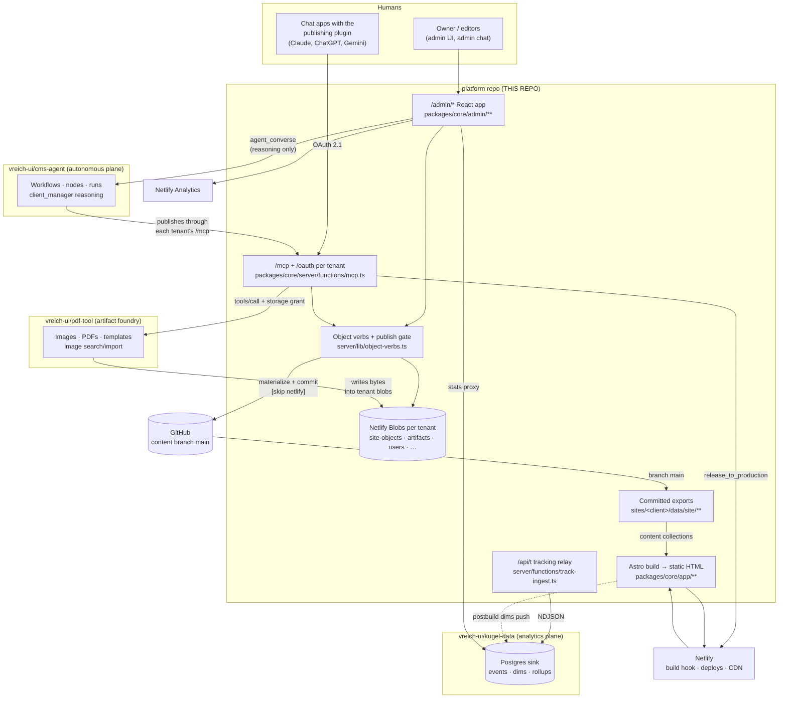
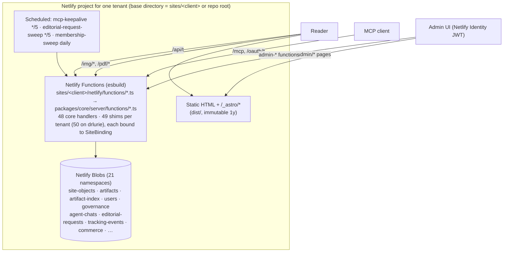

# Architecture — the `platform` repo

> **Status:** verified against commit `6789644` (2026-09-05). Code is truth; every claim cites a file path. Status tags: `[CURRENT]` `[INHERITED]` `[DEPRECATED]` `[EXPERIMENTAL]` `[GENERATED]` `[CANONICAL]` `[DOC-ONLY]`.
> This is the map. Detail lives in [`CONTENT_ARCHITECTURE.md`](CONTENT_ARCHITECTURE.md) · [`CMS_INTEGRATION.md`](CMS_INTEGRATION.md) · [`TRACKING_ARCHITECTURE.md`](TRACKING_ARCHITECTURE.md) · [`DEPLOYMENT.md`](DEPLOYMENT.md) · [`DATA_CONTRACTS.md`](DATA_CONTRACTS.md) · [`KNOWN_ISSUES.md`](KNOWN_ISSUES.md) · [`GLOSSARY.md`](GLOSSARY.md). Agents start at [`AI_CONTEXT.md`](AI_CONTEXT.md). Humans start at [`OVERVIEW.md`](OVERVIEW.md).

## 1. What this repository is

`platform` is the **publishing surface** of the Kugel system: a white-label, multi-tenant, agent-first CMS engine plus the static sites it renders. It began as the AstroWind Astro/Tailwind template and has been rebuilt, in place, into a monorepo with two kinds of code:

| Layer | Path | What it is |
|---|---|---|
| **Engine (fleet law)** | `packages/core/` | Object store + verbs, schemas, materializers, publish/release, per-tenant MCP + OAuth server, admin React app, Astro app shell, renderer, tracking library, plugin export, membership, editorial requests, agent-chat runtime, provisioning CLI |
| **Tenants** | `sites/<client>/` | Per-client data + bindings + a thin Astro entry: `config/` (SiteBinding, policies, identity), `data/site/**` (committed exports, `[GENERATED]`), `seeds/`, `app/pages/**`, `netlify/functions/*` shims, `netlify.toml`, `config.yaml` |
| **Root deployment of `drlurie`** | `netlify.toml`, `netlify/**`, `astro.config.ts`, `package.json` scripts | The first tenant is root-deployed; these root files are *drlurie's*, not "the platform's" (`astro.config.ts:1-11`) |
| **Inherited template** | `vendor/integration/**`, `packages/core/app/{layouts,components/{blog,common,ui,widgets},utils/{blog,permalinks,images*,frontmatter}}`, `sites/*/config.yaml`, `tailwind.config.js` | AstroWind code still on the live path (config loader, layouts, blog listing utilities). See §10 for what is live vs dead |

Four tenants exist today (`sites/*/config/site-identity.ts`): **drlurie** (`drluriescience.netlify.app`, root-deployed, the worked example and the only tenant with traffic), **platform** (`kugel-platform.netlify.app`, the project's own site/wiki — a tenant like any other), **zilberman** (`zilbermanfilmfoundation.netlify.app`), **fernwell** (`kugel-fernwell.netlify.app`, the repeatability proof). Each is its own Netlify project selected by base directory ([`DEPLOYMENT.md`](DEPLOYMENT.md) §Netlify projects).

## 2. Where `platform` sits in the Kugel system



Roles, in one line each (evidence in [`CMS_INTEGRATION.md`](CMS_INTEGRATION.md)):

- **platform owns the content.** The per-tenant object store in Netlify Blobs is the source of truth; everything else is derived. Agents and humans change content only through the object verbs (`packages/core/server/lib/object-verbs.ts:handleObjectVerb`), reached over `/mcp`, `/api/plugin/*`, the admin functions, or the publish-key REST endpoint.
- **CMS-Agent reasons; platform executes.** The admin chat sends turns to CMS-Agent (`agent_converse`, `client_manager.turn.v1`) and runs every tool *locally* through the same handler bodies `/mcp` uses (`packages/core/server/lib/agent/{engine,loop,tools}.ts`). CMS-Agent's autonomous workflows publish into a tenant by calling that tenant's `/mcp` like any other client. Editorial-request status is *derived* from CMS-Agent run state by the sweep (`server/lib/requests/derive-status.ts`) — never set by hand.
- **pdf-tool makes binaries; platform keeps the references.** Images/PDFs are minted by pdf-tool using a short-lived storage grant this tenant issues (`server/lib/pdf-tool-storage-grant.ts`) and written straight into the tenant's `artifacts` blob store; bodies carry only public paths `/img/{id}/{sha256}.ext` (`CONTENT_ARCHITECTURE.md` §8).
- **kugel-data keeps the numbers.** Reader events go browser → `/api/t` → NDJSON relay → kugel-data Postgres; `/admin/analytics` is a proxy over its `/stats` plus Netlify Analytics ([`TRACKING_ARCHITECTURE.md`](TRACKING_ARCHITECTURE.md)). No tracking data flows back into objects or CMS-Agent today.

## 3. Runtime architecture of one tenant



- **Static site.** `output: 'static'` (`packages/core/app/site-astro-config.ts`); every reader-facing content change requires a build. React is loaded only on the `/admin/*` islands and the public `/plugin/install` page (`packages/core/app/routes/plugin/install.astro:30`); no reader-facing content route ships a React island. Tailwind, sitemap, MDX (registered, unused), `astro-compress` (images off), the vendored AstroWind integration, shell routes, retirement redirects and Identity e-mail templates are the integrations (`site-astro-config.ts:95-190`).
- **The shell is injected, not copied.** `/admin/*`, `/plugin/install`, `/rss.xml`, `/search.json` are injected into every tenant by `packages/core/app/shell-routes.ts:SHELL_ROUTES`; a site may override only `rss.xml`/`search.json` (`OVERRIDABLE_SHELL_ROUTES`).
- **Per-tenant seam = `SiteBinding`.** `sites/<client>/config/site-binding.ts` supplies env-var *names*, blob namespace prefix, `dataRoot` (export tree) and identity to otherwise identical function bodies (`packages/core/server/lib/site-binding.ts`). The Astro side gets the same seam through Vite aliases `~/` (shell), `~/assets/` (site assets), `@core/`, `@site/` (`site-astro-config.ts:180-193`).
- **Auth surfaces.** Netlify Identity JWT + roles (`owner|admin|publisher|editor|viewer`, `server/lib/{roles,users-store}.ts`) for the admin; OAuth 2.1 (`server/functions/mcp-oauth.ts`, `server/lib/oauth-server.ts`) or per-agent keys (`server/lib/agent-keys.ts`) or the shared `MCP_HTTP_AUTH_TOKEN` for `/mcp`; `x-publish-key` for the REST verb endpoint and scripts. Every membership verb — reads included — requires a human principal (`server/lib/membership/verbs.ts:332`, 403 `membership_requires_human`).

## 4. Content architecture (summary)

Full treatment: [`CONTENT_ARCHITECTURE.md`](CONTENT_ARCHITECTURE.md).

| Rung | Artifact | Tag | Writer |
|---|---|---|---|
| 1 | Object record `objects/<type>/by-id/<id>.json` in blob store `site-objects` | `[CANONICAL]` | object verbs |
| 2 | Export JSON `sites/<client>/data/site/**` (`private.*` stripped, `__generated` marker) | `[GENERATED]` | `object_publish` → materializers → GitHub Git Data API commit `[skip netlify]` |
| 3 | `dist/` HTML | `[GENERATED]` | `astro build` on `release_to_production` |
| — | `sites/<client>/seeds/*.mjs` | genesis input, not authoritative afterwards | humans/drivers |
| — | `src/data/post/*.md` | `[DEPRECATED]`, empty | nothing |

Thirteen governed object types (`packages/core/schema/object-record-v1.ts:objectTypes`): `page, section, navigation, taxonomy, site, template, section_template, theme, product, content_item, tracking_config, editorial_voice, visual_standard`. Articles are `content_item` objects: envelope (`slug, title, image, taxonomy, seo, sources, claims, scores, lineage…`) + `nodes[]`, each node `{id, kind, public, private?, commercial?, rendering?, visibility?}` with `public.body` as plain text or `rich_text.v1` (a zod mirror of Contentful Rich Text, rendered by `@contentful/rich-text-html-renderer` — load-bearing, not vestigial). One renderer serves the public page and the admin canvas (`packages/core/lib/article-object/render-nodes.ts`). Reader-projection safety is enforced twice (renderer + validator `object-validate.ts:contentItemReaderProjection`).

## 5. Publishing inputs

| Input | Enters through | Auth | Notes |
|---|---|---|---|
| Publishing plugin in a chat app (Claude / ChatGPT / Gemini) | `/mcp` (Claude), `/api/plugin/*` Actions façade (ChatGPT) | OAuth 2.1 bound to a tenant member | The intended human-driven path; charter = tool classes minus `PLUGIN_TOOL_DENYLIST` (`server/lib/plugin/build-tools.ts`) |
| CMS-Agent workflow run | tenant `/mcp` | bearer / agent key | Correlated by an editorial request `req_<flow>_<topic>_<yyyymmdd>_<nn>` (`server/lib/requests/store.ts`) |
| Admin UI + admin chat | `admin-object.ts`, `admin-agent-chat.ts` | Netlify Identity JWT | `object_create` for `content_item` is refused from admin chat (ART-1, `mcp-tool-definitions-2.ts:92`) |
| Seeds / drivers / scripts | `object-store.ts` REST | `x-publish-key` | Genesis + reconcile drills (`scripts/site-genesis-drive.mjs`, `scripts/home-conversion-roundtrip.mjs`) |

Every input converges on `handleObjectVerb`. **Only implemented mechanisms are current:** object verbs over MCP/REST → materialized exports → engine-owned git commit → separate build-hook release. Workflow-JSON mutation, `publish-article.ts`, `save_json_blob_*` and Clerk auth were deleted on 2026-07-29 and have no successor (`netlify/functions/mcp.ts:9-22`).

## 6. Publish vs release — the two-step go-live

```
object_publish  → gate → validate → materialize → GitHub commit "[skip netlify]" → stamp receipt
                                                    (export on main; NOTHING LIVE)
release_to_production → POST NETLIFY_BUILD_HOOK_URL once → poll deploys → ancestry check
                                                    (one build ships every accumulated export)
```

A `publish_receipt` proves the export commit, never the deploy (`server/lib/mcp-tool-handlers.ts:3324`). Release targets branch HEAD, so whoever releases ships everyone's pending exports; retries can double-build ([`KNOWN_ISSUES.md`](KNOWN_ISSUES.md), publishing-race entries).

## 7. CMS integration surfaces (summary)

Full catalogue with producer · consumer · contract · transport · authority · auth · direction · failure: [`CMS_INTEGRATION.md`](CMS_INTEGRATION.md).

| Surface | Path | Direction |
|---|---|---|
| MCP server (97 tools) | `server/functions/mcp.ts`, `server/lib/mcp-tool-definitions{,-2,-membership}.ts`, `mcp-tool-handlers.ts` | in |
| OAuth 2.1 AS/RS | `server/functions/mcp-oauth.ts`, `server/lib/oauth-{server,store}.ts` | in |
| Object verbs REST | `server/functions/object-store.ts` (publish key), `admin-object.ts` (JWT) | in |
| Publish → GitHub | `server/lib/object-publish.ts`, `object-git-committer.ts` | out |
| Release → Netlify | `server/lib/production-release.ts`, `server/lib/netlify-deploys.ts`, `server/functions/deploy-status.ts` | out |
| CMS-Agent client | `server/lib/agent/cms-agent-client.ts`; sweep `server/functions/editorial-request-sweep*.ts` | out |
| pdf-tool bridge + storage grant | `server/lib/pdf-tool-client.ts`, `pdf-tool-storage-grant.ts`, `packages/core/lib/pdf/*` | out (pdf-tool writes back into blobs) |
| Artifact ingress | `server/functions/artifact-upload.ts`, `admin-artifact-upload-intent.ts`, `save-artifact.ts` `[DEPRECATED]`; URL ingest is a lib, not a function (`server/lib/artifact-url-ingest.ts`) | in |
| Publishing plugin export | `server/lib/plugin/*`, `server/functions/{plugin-actions,plugin-install,admin-plugin-manifest}.ts` | out (manifests), in (Actions) |
| Admin functions (`admin-*`) | `server/functions/admin-*.ts` | in |
| Commerce | `create-checkout-session`, `stripe-webhook`, `get-purchase`, `claim-free`, `save-commerce-event`, `save-opt-in` | in/out |
| Tracking relay | `server/functions/track-ingest.ts` → kugel-data | out |
| Netlify Analytics | `server/lib/netlify-analytics.ts` | in |

## 8. Project-specific behaviour

- **drlurie** is root-deployed and the only tenant with: its own `rss.xml.ts`/`search.json.ts`, a shop (`sites/drlurie/app/pages/shop/*`, Stripe module), `verify_article_images` (the sanctioned `OPTIONAL_HANDLER_TOOLS` exception, root `netlify/functions/verify-article-images.ts` only), five legacy 301s in root `netlify.toml`, 139 orphaned legacy upload assets under `sites/drlurie/assets/**/uploads/` `[DEPRECATED]`, and 24 site pages — 12 of which are one-line `<PageObjectRenderer objectId="page_…"/>` wrappers, i.e. object-driven, not hardcoded.
- **platform** hosts the project manual as page objects (`scripts/platform-manual-drive.mjs`, `[DEPRECATED]` one-off driver) and uses list pathname `library` instead of `learn/library`.
- **zilberman** was minted through the capture spike (`packages/core/cli/capture/**` `[EXPERIMENTAL]`); its `approval-policy.ts` lacks the `editorial_voice: require-approval` pin the other three carry.
- **fernwell** exists to prove core changes propagate fleet-wide (parity laws P1–P5, `docs/cms-architecture/16-genesis-parity-plan.md`).
- Policy seams are per tenant and committed: `sites/<client>/config/{approval,creation,media,membership}-policy.ts`, `policy-bindings.ts`; `publishing-policy.ts` (autonomyMode) is defined in core but registered by no tenant, so it is always the fail-closed default.

## 9. Tracking (summary)

Full treatment: [`TRACKING_ARCHITECTURE.md`](TRACKING_ARCHITECTURE.md). Own tracker: `tracking_event.v1` (`packages/core/schema/tracking-event-v1.ts`), 18 closed event kinds, cookieless by default (daily `vhash`, 30-min `shash`; persistent `vid` only under consent), same-origin `/api/t` relay with props allowlist, at-most-once NDJSON to kugel-data, blob mirror on failure. Postbuild pushes `object_version`/`producer`/`node_strategy` dimensions from exports. Read side: `/admin/analytics` = proxy over kugel-data `/stats` + Netlify Analytics. **No feedback path into objects or CMS-Agent exists yet**; §15 of the tracking doc lists the identifiers that would close the content → publication → exposure → engagement → conversion → revenue → agent-decision chain.

## 10. Classification — what future agents must not confuse

| Class | Paths | Rule |
|---|---|---|
| **INHERITED, live** | `vendor/integration/**` (config loader → `astrowind:config`), `packages/core/app/layouts/{Layout,PageLayout}.astro`, `app/components/{blog/*,common/*,ui/* (most)}`, `widgets/{Header,Footer}.astro` (via `PageLayout`/`PageObjectRenderer`) and `widgets/BlogHighlightedPosts.astro` (via `blog/RelatedPosts.astro`), `app/utils/{blog,permalinks,images,images-optimization,frontmatter,utils}.ts`, `sites/*/config.yaml`, `tailwind.config.js`, `sites/*/app/pages/[...blog]/**` | Template code that the object model now *feeds*. Treat as fleet law; do not re-derive architecture from it |
| **INHERITED, dead** | `packages/core/app/components/widgets/*` (19 of 22 — every widget except `Header`, `Footer`, `BlogHighlightedPosts`; `BlogLatestPosts` is imported only by the orphaned `homes/personal.astro`), `sites/drlurie/app/pages/homes/*`, `layouts/MarkdownLayout.astro`, `utils/directories.ts`, `sites/drlurie/public/decapcms/`, root `Social/`, `Dockerfile`, `docker-compose.yml`, `nginx/`, `vercel.json`, `sandbox.config.json`, `.stackblitzrc`, `.vscode/astrowind/`, `vscode.tailwind.json`, `LICENSE.md` (onWidget MIT), `package.json` name `@onwidget/astrowind` | Unreferenced template residue. Never cite as architecture |
| **CORE, current** | `packages/core/{schema,lib,server,admin,components,cli/*.mjs,app/{admin,routes,components/{cms,tracking},content,site-astro-config.ts,shell-routes.ts,site-redirects-integration.ts}}` | The engine |
| **TENANT** | `sites/<client>/{config,seeds,app/pages,netlify,site.config.ts,astro.config.ts,netlify.toml}` | Per-client bindings + routes |
| **DEPLOYMENT** | root `netlify.toml`, `netlify/**`, `.github/workflows/actions.yaml`, `sites/*/netlify.toml`, `tsconfig*.json`, `eslint.config.js` | Root = drlurie |
| **GENERATED** | `sites/*/data/site/**` (all carry `__generated` except `redirects.json`), `dist/`, `.tmp/`, `packages/core/cli/capture/reports/*` | Never hand-edit; written by the publish verb |
| **CANONICAL data** | Blob object store (not in git); `sites/*/seeds/*.mjs` (genesis only); test fixtures | Seeds drift — `sites/drlurie/seeds/sync-site-seed.mjs` exists for that reason |
| **DEPRECATED, still wired** | `server/functions/run-publisher-agent.ts` (OpenAI Agents runner, no caller), `save-artifact.ts` (base64 legacy), `admin-traffic.ts` shim, `netlify/lib/{admin-auth,netlify-deploys}.ts`, `schema/schema-v1.ts` + `article-content-helpers.ts` + `lib/contentSourceBody.ts` + `lib/article-content/to-markdown.ts` (dead chain), `server/lib/taxonomy-enforcement.ts` (orphaned), `src/data/post/`, `sites/drlurie/assets/**/uploads/**` | Retirement decisions listed in `KNOWN_ISSUES.md` |
| **EXPERIMENTAL** | `packages/core/cli/capture/**` (W12 capture spike), `server/lib/agent/provider.ts` (`providerEngine` test harness), `claude/_to_delete/**`, `docs/mcp-debug/`, `docs/ping.md`, `src/chatkit/widgets/*`, `cc-brief.md` | Not on any build or request path |
| **DOC-ONLY** | `docs/cms-architecture/**` plans, `docs/agents/mcp-article-body-v1.md`, `docs/history/**` | Intent and history, not implementation |

## 11. Future extension points (implemented seams, no new design)

| Seam | Where | What it already allows |
|---|---|---|
| New governed object type | `packages/core/schema/object-record-v1.ts:objectTypes` + `schema/bodies/<type>-v1.ts` + `server/lib/materializers/<type>.ts` + patch-op family in `schema/object-patch-ops.ts` + `packages/core/app/content/collections.ts` | The 13 existing types follow exactly this pattern |
| New section component | `packages/core/components/sections/*.astro` + `packages/core/lib/registry/components/index.ts` + `schema/bodies/section-v1.ts` | 25 registered today |
| New page type | `packages/core/lib/registry/page-types.ts` (`structural-capacity.ts`) | `standard`, `listing`, `content_detail`… |
| New MCP tool | `server/lib/mcp-tool-definitions*.ts` + `mcp-tool-handlers.ts` + governance `toolClass` + pinned tests (`mcp-tool-definitions.test.ts`, `tests/netlify/plugin-manifest.test.ts`) | Tool count and tier are test-pinned |
| Per-tenant optional tool | `OPTIONAL_HANDLER_TOOLS` in `server/functions/mcp.ts:96` | Today only `verify_article_images`, and half-built: the function ships only in drlurie's root `netlify/functions/`, and the `/api/plugin/*` façade still refuses it 403 `tool_not_in_plugin_charter` even though the plugin charter admits it ([`KNOWN_ISSUES.md`](KNOWN_ISSUES.md) #29) |
| New tenant | `packages/core/cli/create-site.mjs` → `scripts/site-genesis-drive.mjs` → `fleet:parity` / `fleet:capability` | Parity laws P1–P5 |
| Tracking adapter / provider | `packages/core/lib/tracking/adapters/*.ts` + CSP hosts in every `netlify.toml` (`tests/netlify/csp-drift.test.ts`) | ga4, meta, plausible, google-ads, taboola, outbrain, mgid — every third-party provider is disabled on every tenant today. Only `own` is declared enabled, and only by drlurie (`sites/drlurie/data/site/tracking.json`); the loader nonetheless ships on every tenant that has a `tracking_config` export ([`KNOWN_ISSUES.md`](KNOWN_ISSUES.md) #14) |
| Tracking event kind / prop | `schema/bodies/tracking-config-v1.ts:TRACKING_EVENT_KINDS`, `schema/tracking-event-v1.ts:trackingPropsSchema`, `TRACKING_PROPS_ALLOWLIST` | Closed enums; kugel-data must evolve additively in step |
| Feedback loop into learning | none implemented; `feedback_ingest_tracking` exists on CMS-Agent's surface with zero call sites here; kugel-data `/rollups` already emits the producer-grain vector | See `TRACKING_ARCHITECTURE.md` §15 |
| Policy providers | `packages/core/lib/{approval,creation,media,publishing}-policy.ts` via `sites/<client>/config/policy-bindings.ts` | `publishing-policy` (autonomyMode) has no registered provider anywhere |
| Schema migrations | `packages/core/server/migrations/registry.ts` (`MIGRATIONS` ships empty) + `scripts/ci/schema-migration-gate.mjs` | Framework is CI-gated and unexercised |
| Mail | `server/lib/mail/{index,resend,send}.ts` (`MAIL_PROVIDER`) | Notifications for editorial requests |
| Separation into per-client repos | designed, not built: `docs/cms-architecture/13-separation-plan.md` | `[DOC-ONLY]` |

## 12. Verification

At commit `6789644`: `npm ci` ✓ · `astro check` 0 errors/0 warnings (50 hints) · `eslint` clean · `npm test` 5188/5188 · `npm run build` 107 pages (drlurie) · `astro build --config sites/platform/astro.config.ts` 76 pages to `sites/platform/dist`. Log: [`DEPLOYMENT.md`](DEPLOYMENT.md) §Verification run log. Known caveat: `check:astro` and the CI `fleet` matrix only ever exercise drlurie's config ([`KNOWN_ISSUES.md`](KNOWN_ISSUES.md)).
