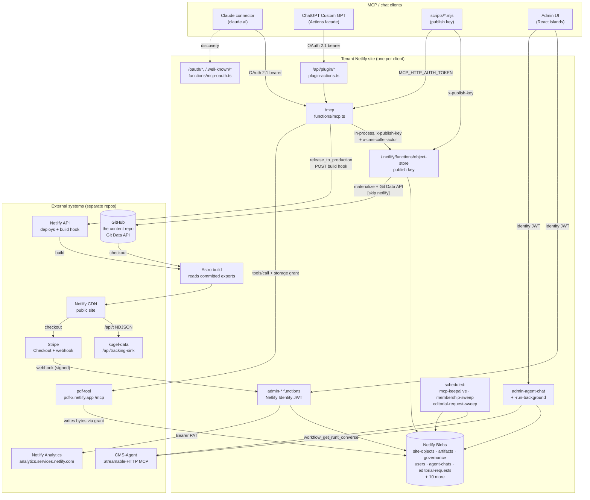
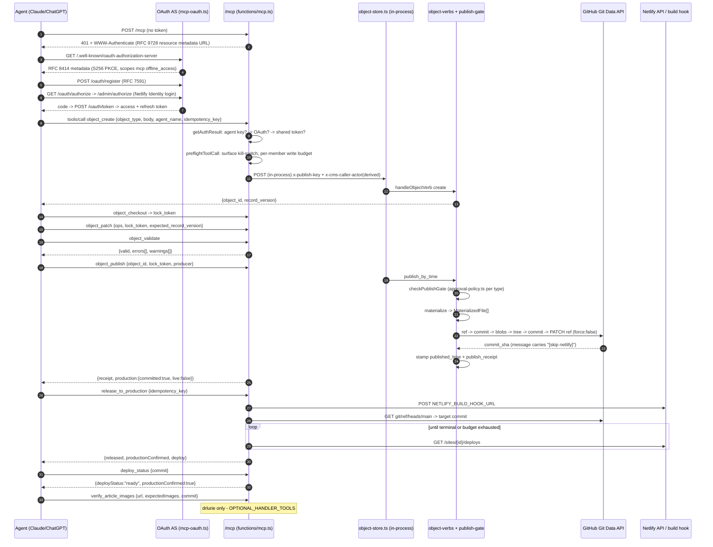

# CMS Integration Interfaces

> **Status:** verified against the `platform` repo commit `6789644` (2026-09-05). Code is truth; every claim cites a file path. Claims that could not be verified from code are quarantined under **Unverified / open**. Status tags: `[CURRENT]` `[INHERITED]` `[DEPRECATED]` `[EXPERIMENTAL]` `[GENERATED]` `[CANONICAL]` `[DOC-ONLY]`.
> Companion docs: [`ARCHITECTURE.md`](ARCHITECTURE.md) · [`AI_CONTEXT.md`](AI_CONTEXT.md) · [`DATA_CONTRACTS.md`](DATA_CONTRACTS.md) · [`KNOWN_ISSUES.md`](KNOWN_ISSUES.md) · [`GLOSSARY.md`](GLOSSARY.md).

## Purpose

This repo is a **white-label, multi-tenant, agent-first publishing engine**. Four tenants
(`drlurie`, `platform`, `zilberman`, `fernwell`) each deploy the *same* `packages/core` server
layer to their *own* Netlify project, with a per-site `SiteBinding`
(`packages/core/server/lib/site-binding.ts`) supplying identity and env-var names.

Almost everything interesting about this system happens **at its edges**: an agent calling `/mcp`,
a commit landing on GitHub, a build hook firing, a PDF being minted in another Netlify site, a
chat turn being reasoned by a different service entirely. This document is the catalogue of those
edges — what crosses each one, who owns the data, how it authenticates, and what happens when it
breaks.

**Reading order for an agent picking this up cold:** the [integration map](#integration-map), then
[Publishing mechanisms](#publishing-mechanisms--what-is-implemented) (which settles "how does
content actually go live"), then the [interface catalogue](#interface-catalogue).

**Every interface below is documented with eight fields:** producer · consumer · contract/schema ·
transport · authority · authentication · direction · failure behavior.

---

## Integration map



**Reading the map:** the object store in Netlify Blobs is the source of truth for CMS content.
Everything to the right of it (GitHub, build, CDN) is a **derived, deferred** projection.
Everything to the left is a caller. `pdf-tool` is unusual: it writes *into this tenant's blob
stores* using a credential this tenant mints — it holds no credential of its own.

---

## Publishing mechanisms — what is implemented

The recurring question "how does content go live" has one answer and several near-misses. The
table below is exhaustive for this commit.

| Mechanism | Implemented? | By whom | Evidence |
|---|---|---|---|
| **Object verbs over MCP** (`object_create` → `object_patch` → `object_validate` → `object_publish`) | **YES — this is the live authoring path** | Agents (Claude, ChatGPT), admin chat, admin UI | `packages/core/server/functions/mcp.ts:1175-1416`; `packages/core/server/lib/object-verbs.ts` |
| **Direct repository mutation** (commit → build) | **YES, but only by the engine itself** — never by a human or agent editing files | `commitMaterializedFiles` inside `object_publish` | `packages/core/server/lib/object-git-committer.ts:255-302`; called from `packages/core/server/lib/object-publish.ts` |
| **Netlify build hook** (go-live) | **YES — the only production-build trigger** | `release_to_production` (MCP) and `admin-release` (browser), both via one function | `packages/core/server/lib/production-release.ts` header + `packages/core/server/lib/netlify-deploys.ts:77-93 (triggerNetlifyBuild)` |
| **REST function surface** (`object-store.ts`) | **YES** — publish-key gated; same verb core as MCP | `scripts/lib/object-store-client.mjs`, MCP in-process | `packages/core/server/functions/object-store.ts` |
| **Browser REST mirror** (`admin-object.ts`) | **YES** — Identity JWT gated; same verb core | Admin UI | `packages/core/server/functions/admin-object.ts:132` |
| **Generated files / committed exports** | **YES, as OUTPUT only** — `sites/<client>/data/site/**` is `[GENERATED]`; the Astro build reads it | Materializers | `packages/core/server/lib/materializers/*`; `__generated` marker in `sites/drlurie/data/site/site.json` |
| **Workflow JSON mutation** (`save_json_blob_*`, per-stage tools) | **NO — deleted 2026-07-29** | — | `netlify/functions/mcp.ts:9-13`; `docs/history/AGENTS-2026-09-05.md:144-148`; no `save-json-blob.ts` / `publish-article.ts` in tree |
| **`publish-article.ts` markdown pipeline** | **NO — deleted** | — | `ls netlify/functions/publish-article.ts` → absent; `netlify/lib/admin-auth.ts:8-9` |
| **`run-publisher-agent.ts` (OpenAI Agents SDK)** | **Wired but orphaned** — repointed at the object substrate (T9.22), no caller except a dead ChatKit widget | — | `packages/core/server/functions/run-publisher-agent.ts:11,22-29`; only caller is `src/chatkit/widgets/AI Publishing Workflow.widget:257` |
| **Auto-deploy on push** | **NO, by construction** — every export commit carries `[skip netlify]` | — | `packages/core/server/lib/object-publish.ts:87` (`NETLIFY_SKIP_MARKER`) |

### The live path, end to end

```
agent → /mcp object_publish
   → publish-gate.ts (approval policy)
   → materialize.ts + materializers/*   (record → export JSON)
   → object-git-committer.ts            (GitHub Git Data API, "[skip netlify]")
   → stamp publication.published_time + publish_receipt on the record
   ⟹ export is on main. NOTHING IS LIVE.

agent/human → release_to_production | /admin "Release to Production"
   → production-release.ts → triggerNetlifyBuild() → POST NETLIFY_BUILD_HOOK_URL
   → poll Netlify deploys API until the target commit is terminal
   ⟹ one deploy carries every accumulated export. NOW it is live.
```

A **`publish_receipt` proves the export, never the deploy.** `callObjectPublish` explicitly stamps
`production: { committed: true, live: false, deploy_deferred: true }` on every successful publish
result so an agent cannot misread it (`packages/core/server/lib/mcp-tool-handlers.ts:3324-3359`).

---

## Sequence — an agent publishes an article over `/mcp`



---

## Interface catalogue

### 1. Per-tenant MCP server — `/mcp`

| Field | Value |
|---|---|
| **Producer** | This repo. Shim `netlify/functions/mcp.ts` (drlurie) / `sites/<client>/netlify/functions/mcp.ts` → `packages/core/server/functions/mcp.ts` |
| **Consumer** | Claude connectors, ChatGPT (via `/api/plugin/*`), CMS-Agent, `scripts/*.mjs`, `scripts/fleet-capability-probe.mjs` |
| **Contract** | MCP JSON-RPC 2.0, `PROTOCOL_VERSION = '2025-06-18'` (`mcp.ts:325`). Wire tool shape `McpWireTool` with `annotations` + `_meta.schema_version` (`mcp-tool-annotations.ts:34-62`). `serverInfo.tools_digest` (`mcp.ts:1601`) |
| **Transport** | HTTP JSON-RPC over `POST /mcp` → `/.netlify/functions/mcp` (netlify.toml redirect). `OPTIONS` 204, `DELETE` 204 no-op, `GET ?health=1\|auth` unauthenticated, plain `GET` 405 |
| **Authority** | This tenant. `getSiteIdentity().siteId` scopes every store, grant and agent key |
| **Auth** | Three independent paths, in order (`mcp.ts:733-783`): (1) verified per-agent bearer (`agent-keys.ts`, memoized 60 s); (2) OAuth 2.1 access token from this site's own AS (never memoized, so revocation is immediate — `mcp.ts:600-612`); (3) shared `MCP_HTTP_AUTH_TOKEN` via `x-mcp-auth-token` header, `Authorization: Bearer`, or `?key=`/`?mcp_key=` query (weakest, documented as such at `mcp.ts:370-385`) |
| **Direction** | Read + write |
| **Failure** | **Fails closed** on an unconfigured shim (`requireSiblings()` throws, `mcp.ts:78-86`). Unset `MCP_HTTP_AUTH_TOKEN` opens the gate **only outside a Lambda runtime** (`mcp.ts:756-769`) — in production it refuses. OAuth store outage → `null` principal → falls through to shared secret → 401, and logs `mcp_oauth_store_error`. 401 always carries `WWW-Authenticate` so a client can discover the AS. Result bodies > `MAX_TOOL_RESULT_BYTES` (900 000) are refused with a per-tool "narrower call" hint (`mcp.ts:441-459`) rather than becoming a bare 502 |

**Per-request extras.** `preflightToolCall` (`mcp.ts:1514-1563`) applies, in order: a per-surface
kill switch read from the governance blob (`surfaces[surface] === 'block'`), then a per-member
write budget of **60 writes / 10 min** (`write-rate-limit.ts:26-35`). `ping` and `whoami` are
exempt (`ALWAYS_ANSWERABLE_TOOLS`). A governance-store fault never cuts a surface that was never
cut (`mcp.ts:1523-1526`).

**Idempotency.** `withIdempotentToolCall` (`idempotency-store.ts`, blob store `idempotency`)
wraps `object_create`, `object_publish`, `release_to_production`,
`create_agent_artifact_job`, and every membership tool that supplies `idempotency_key`.

### 2. OAuth 2.1 authorization + resource server

| Field | Value |
|---|---|
| **Producer** | `packages/core/server/functions/mcp-oauth.ts` + `packages/core/server/lib/oauth-server.ts` / `oauth-store.ts` |
| **Consumer** | Any MCP client; the consent *screen* is `/admin/authorize` inside the admin workspace |
| **Contract** | RFC 9728 protected-resource metadata, RFC 8414 AS metadata, RFC 7591 dynamic registration, RFC 7009 revocation. `scopes_supported = ['mcp','offline_access']`, `code_challenge_methods_supported = ['S256']`, `grant_types = ['authorization_code','refresh_token']` (`oauth-server.ts:138-158`) |
| **Transport** | HTTP; nine `netlify.toml` redirects map each endpoint to `mcp-oauth?oauth_endpoint=…` (both bare and splat `.well-known` forms, because clients probe both) |
| **Authority** | This tenant's `governance` blob store, all keys under prefix `oauth/` (`oauth-store.ts:37`) |
| **Auth** | Public on the protocol endpoints; **Netlify Identity** on `POST /oauth/consent` — the human's approval is the grant |
| **Direction** | Read + write (issues tokens) |
| **Failure** | Token TTLs: authorization code 60 s, access token 60 min, refresh token 30 d, pending authorization 10 min, refresh-reuse grace 90 s (`oauth-store.ts:45-69`). Store unreachable → `store_error`, disclosed in the 401 body (it is *our* fault, not the caller's — `mcp.ts:1799-1802`); `no_record`/`expired` stay in the log only, to avoid a token-existence oracle |

### 3. Per-agent credentials (`agent-keys.v1`)

| Field | Value |
|---|---|
| **Producer** | `packages/core/server/lib/agent-keys.ts`; minted through `admin-governance` verb `agent_keys_create` (Owner-only) |
| **Consumer** | `/mcp` `getAuthResult`; `caller-actor.ts` for attribution |
| **Contract** | Doc key `agent-keys.v1` in the `governance` store; `{agent_name, token_hash, site, …}`; raw token returned exactly once |
| **Transport** | `Authorization: Bearer <token>` on `/mcp` |
| **Authority** | The site's governance store; keys are **site-scoped** — a key for another site never matches |
| **Auth** | sha256 hash comparison; one ACTIVE key per (agent_name, site) |
| **Direction** | Read (verification) |
| **Failure** | Store read throws → "not verified", falls through to the shared-secret gate; never a 500 (`mcp.ts:699-714`). Positive results memoized 60 s — **revocation is therefore up to 60 s late on this path** (unlike OAuth) |

### 4. Object verbs over REST — `object-store.ts`

| Field | Value |
|---|---|
| **Producer** | `packages/core/server/functions/object-store.ts` (`createHandler(binding)`) |
| **Consumer** | (a) `/mcp` **in-process** via `invokeObjectStore` (`mcp-tool-handlers.ts:629-664`) — *not* over HTTP; (b) `scripts/lib/object-store-client.mjs` over HTTPS at `<base>/.netlify/functions/object-store`; (c) CMS-Agent, when it publishes into a tenant, does so through that tenant's `/mcp`, not this endpoint |
| **Contract** | `objectVerbRequestSchema` (`object-verbs.ts`). 24 actions: `get list inventory create create_variant instantiate instantiate_section apply_theme apply_brand_imagery checkout refresh_lock checkin patch validate submit_review review_decide discard purge_archived retire publish_by_time marginalia_create marginalia_reply marginalia_list marginalia_resolve`. Records are `object-record-v1.ts` |
| **Transport** | REST function, `POST` only (405 otherwise), JSON body |
| **Authority** | The `site-objects` Netlify Blob store — **the source of truth for CMS content** |
| **Auth** | `x-publish-key` == `PUBLISH_SECRET`/`NETLIFY_PUBLISH_SECRET`, constant-time compare (`object-store.ts:63-76`). Actor derivation: `x-cms-caller-actor` header (set only by `/mcp`, from OAuth grant or verified agent token) wins over the model-supplied `agent_name` (`caller-actor.ts`; `object-store.ts:88-104`) |
| **Direction** | Read + write |
| **Failure** | Missing/mismatched key → 401. Conflicts surface as 404/409/422/423 with the endpoint's payload (lock holder, expected/actual version, blockers) so an agent can react (`mcp-tool-handlers.ts:653-661`). Missing publish secret on the MCP side → tool error "Server-side object storage credentials are not configured" (no silent write). Validation context is skipped for verbs that never read it (`verbNeedsValidationContext`) — a perf choice, not a correctness one |

**The browser mirror.** `admin-object.ts` runs the *same* `handleObjectVerb` core under **Netlify
Identity**, and the invariant `A§1.2` is that the browser path **never sees the publish key**
(`admin-object.ts` header comment). Both wire `publishDeps: { exportRoot: binding.dataRoot }`
(`object-store.ts:160`, `admin-object.ts:132`).

### 5. Publish → GitHub

| Field | Value |
|---|---|
| **Producer** | `packages/core/server/lib/object-publish.ts` → `object-git-committer.ts` |
| **Consumer** | GitHub REST **Git Data API** (`/git/ref`, `/git/commits`, `/git/blobs`, `/git/trees`, `PATCH /git/refs/heads/<branch>`), API version `2022-11-28` |
| **Contract** | `MaterializedFile[]` from `materialize.ts` + `materializers/*`; `PublishReceipt` stamped into `object-record-v1.ts`. Commit message carries `[skip netlify]` (`object-publish.ts:87`). Export marker `__generated {at, from, record_version}` |
| **Transport** | HTTPS to `api.github.com`, `User-Agent: <siteSlug>-object-publisher` |
| **Authority** | The object record is authoritative; the committed export is **derived** (`[GENERATED]` — never hand-edit `sites/*/data/site/**`) |
| **Auth** | `GITHUB_CONTENT_TOKEN` (bearer) + `GITHUB_REPOSITORY` + `GITHUB_BRANCH`/`BRANCH` (default `main`); committer identity from `GITHUB_COMMIT_AUTHOR_NAME`/`_EMAIL`, else `site-identity` defaults |
| **Direction** | Write |
| **Failure** | Non-fast-forward (422 "Update is not a fast forward"; 409 defensively) → re-fetch head, rebuild tree, retry with exponential backoff, `DEFAULT_MAX_ATTEMPTS = 4`, base 250 ms doubling (`object-git-committer.ts:186-302`). Exhaustion → `ObjectGitCommitError('non_fast_forward_exhausted', 409)` — loud, never a silent drop. Idempotent under retry: identical content ⇒ identical blob/tree shas; a rebuilt tree equal to head's tree short-circuits to `noOp`. **Ordering guarantee:** the record is *never* written before the commit succeeds, so "stamped record, no export" is structurally impossible; the reverse residual (`stamp_failed_export_committed`) is reported with `reconciliation: 'retry_publish'` |

### 6. Release → Netlify build hook

| Field | Value |
|---|---|
| **Producer** | `packages/core/server/lib/production-release.ts` (`releaseToProduction`), shared by `release_to_production` (MCP) and `admin-release.ts` (browser) — **one release path, two front doors** |
| **Consumer** | Netlify build hook URL; then Netlify deploys API |
| **Contract** | `ReleaseToProductionResult` with `status ∈ {released, build_not_confirmed_live, build_ready_not_published, commit_unresolved, build_hook_not_configured, deploy_lookup_not_configured}` (`production-release.ts:59-83`) |
| **Transport** | `POST <NETLIFY_BUILD_HOOK_URL>` (no body); then `GET https://api.netlify.com/api/v1/sites/{id}/deploys` |
| **Authority** | Netlify owns deploy state; this repo only reports it |
| **Auth** | Build hook URL **is** the credential (env `NETLIFY_BUILD_HOOK_URL` — note: *not* `NETLIFY_BUILD_HOOK`). Deploy lookup uses `NETLIFY_AUTH_TOKEN`/`NETLIFY_BLOBS_TOKEN` + `NETLIFY_SITE_ID`/`SITE_ID` |
| **Direction** | Write (trigger) + read (poll) |
| **Failure** | Unconfigured hook or lookup → returned as a **tool error** with `error_code`, not a `released:false` success an agent could misread (`mcp-tool-handlers.ts:436-440`). Poll defaults: 120 s timeout, 5 s interval (`netlify-deploys.ts:28-30`); the MCP wrapper clamps the wait to the remaining Lambda budget (`resolveReleaseWaitBudgetSeconds`). `productionConfirmed:false` with `released:true` means "ready-by-commit only, not independently confirmed live". A **locked deploy** (Auto Publishing off) produces exactly that result — documented at `production-release.ts:21-25`, not detectable in code |

### 7. Committed-article index → GitHub contents API

| Field | Value |
|---|---|
| **Producer** | GitHub (the content branch) |
| **Consumer** | `packages/core/server/lib/content-item-index.ts`, called from `object-validation-context.ts:247` on **every validating verb** |
| **Contract** | GitHub **contents** API listing of `src/data/post` → the set of ids (filename minus `.md`/`.mdx`) that `content_grid` manual picks and `content_embed` refs may name |
| **Transport** | `GET https://api.github.com/repos/{repo}/contents/src/data/post?ref={branch}`, `User-Agent: <siteSlug>-content-item-index` |
| **Authority** | Committed frontmatter is the declared source of truth for legacy article ids (W3 ruling) — never the blob draft aggregation |
| **Auth** | Same env contract as the committer: `GITHUB_CONTENT_TOKEN` + `GITHUB_REPOSITORY` + `GITHUB_BRANCH`/`BRANCH` |
| **Direction** | Read |
| **Failure** | **Degrades, never bricks**: unconfigured or erroring → `undefined`, which the resolver reports as "cannot verify" rather than "missing" (`object-validation-context.ts:249-256`). A transient error after a successful fetch serves the stale cache. 60 s TTL, in-flight calls deduplicated, cache scoped to the warm function instance |

This is a **third, distinct GitHub integration edge** — the contents API, not the Git Data API the
committer uses and not the ref API the release resolver uses. See defect #19: the directory it
lists is now empty.

### 8. Deploy status — `deploy-status.ts`

| Field | Value |
|---|---|
| **Producer** | `packages/core/server/functions/deploy-status.ts` (injected into `/mcp` as a sibling) |
| **Consumer** | `deploy_status` MCP tool; admin release surfaces |
| **Contract** | `DeployReceipt {deployId, deployUrl, productionUrl, commit, deployStatus, startedAt, finishedAt, errorMessage, context}` (`netlify-deploys.ts:5-16`); request `{commit?} \| {deployId?}`, at least one required |
| **Transport** | REST function, in-process from `/mcp` with an injected `x-publish-key` |
| **Authority** | Netlify |
| **Auth** | `x-publish-key` |
| **Direction** | Read |
| **Failure** | Lookup unconfigured → reported, not thrown. `isCommitAncestorOrEqual` (`production-release.ts`) lets a newer production deploy still confirm an older commit |

### 9. CMS-Agent — the reasoning plane

| Field | Value |
|---|---|
| **Producer** | External repo `vreich-ui/cms-agent`, a Streamable-HTTP MCP server |
| **Consumer** | `packages/core/server/lib/agent/cms-agent-client.ts` (a *real* MCP client: `initialize` → capture `Mcp-Session-Id` → `notifications/initialized` → `tools/call` → `DELETE` on close) |
| **Contract** | `CLIENT-MANAGER-CONTRACT.md` at the CMS-Agent repo root; wire version **`client_manager.turn.v1`**. Bounds frozen in `CMS_AGENT_BOUNDS`: 200 messages, 256 000 message chars, **96 tools** (auto-fallback to `legacyMaxTools: 64` once if the other side is older), 256 000 tool chars, 64 000 context chars, 32 000 max tokens, 120 000 ms timeout ceiling (`cms-agent-client.ts:34-56`) |
| **Transport** | HTTPS JSON-RPC, `POST` + `DELETE` only (`GET` is 405 upstream); protocol `2025-06-18` with fallback `2025-03-26` |
| **Authority** | **Split.** CMS-Agent owns the *system prompt*, the agent roster, workflow runs and run state. This repo owns *objects, artifacts, membership, and the human record*. A request's **status is derived from CMS-Agent run state** (`requests/derive-status.ts`); the **objects it produces are owned here** |
| **Auth** | `CMS_AGENT_MCP_ENDPOINT` + `CMS_AGENT_MCP_TOKEN` (site-scoped bearer, one project + one tool allow-list). Project selector `getSiteIdentity().cmsAgentProjectId` (env `CMS_AGENT_PROJECT_ID`, else the site slug) |
| **Direction** | Read + write (this repo calls out; CMS-Agent calls *back in* through the tenant's `/mcp`) |
| **Failure** | Frozen wire error codes (`CMS_AGENT_WIRE_ERROR_CODES`) plus platform-side transport classes; `agent_ref` cached 5 min per (project, role) and forgotten on `agent_unresolved`. **Admin chat fails closed**: missing/unhealthy CMS-Agent config produces an error, with *no provider fallback* (`engine.ts:13-15`). Every response is passed through `sanitizeCmsAgentPayload` before it can reach a log or an MCP response |

**Where the tools run.** The admin chat is a **split runtime**: CMS-Agent does the *reasoning*
(`agent_converse`), and **this repo executes every tool locally**. `loop.ts` runs the approval
protocol and dispatches through `registry.ts` → `generated-tools.ts` → `ctx.verb(...)` /
`ctx.operational.call(name, args)` — the same handler bodies `tools/call` uses
(`generated-tools.ts:9-27`). The only tools that *reach* CMS-Agent are the workspace-orchestration
ones (`list_workspace_nodes`, `run_workspace_workflow`, `get_workspace_run`,
`check_workspace_run_readiness`, `publish_workspace_run` → `workspace_get_nodes`,
`workflow_run_all`, `workflow_start_dry_run`, `workflow_get_run`, `workflow_publish_readiness`,
`workflow_set_operator_publish_decision`, `workflow_publish_run` — `agent/tools.ts:818-1360`) plus
`brand_imagery_propose` → `visual_identity_propose` (`brand-imagery-proxy.ts`).

`providerEngine` (direct Anthropic/OpenAI via `agent/provider.ts`) is retained **only as a test
harness** — `engine.ts:8-10` states no production construction path selects it, and both chat
lambdas construct `cmsAgentEngine` alone.

### 10. Editorial requests + sweep

| Field | Value |
|---|---|
| **Producer** | `packages/core/server/lib/requests/*`; functions `editorial-request-sweep.ts` (scheduled) + `-background.ts` (worker) |
| **Consumer** | Admin requests surfaces (`admin-requests`, `admin-requests-view`, `admin-request-activity`), attached chats |
| **Contract** | `editorial-request.v1` + `editorial-request-index.v1` (`requests/store.ts:41-42`); request id `req_<flow>_<topic>_<yyyymmdd>_<nn>`; statuses `queued running needs_you stalled failed done cancelled` (`derive-status.ts:33-41`) — `archived` exists in storage but is **never derived**, only set by an Owner |
| **Transport** | Blob store `editorial-requests` (strong consistency) + CMS-Agent `workflow_get_run` / `node_get_latest_output` |
| **Authority** | **CMS-Agent run state is authoritative for status**; this repo's sweeper is its *only* writer |
| **Auth** | Scheduled invocation → one-shot `mintSweepToken` handed to the background function (a background function is a public endpoint, so an unauthenticated POST must not be able to spend model budget — `editorial-request-sweep.ts:21-26`) |
| **Direction** | Read (CMS-Agent) → write (local status) |
| **Failure** | Three non-erodable rules (`requests/sweep.ts:9-16`): only the sweep writes a running request's status; an unreachable or unconfigured CMS-Agent leaves the status **untouched** and never invents `failed`; a human gate is never nudged. `deriveRequestStatus` is pure and **must never throw** — an unparseable shape yields `running` with a `status_reason`. Stall threshold 10 min, `MAX_NUDGES = 3`. Minting a fresh token invalidates the previous one, so two passes can never overlap |

### 11. pdf-tool bridge

| Field | Value |
|---|---|
| **Producer** | `packages/core/server/lib/pdf-tool-client.ts` |
| **Consumer** | External Netlify site `pdf-x` (`vreich-ui/pdf-tool`), single endpoint `<PDF_TOOL_BASE_URL>/.netlify/functions/mcp` |
| **Contract** | JSON-RPC `tools/call`; the old kebab-case standalone function names map 1:1 to snake_case MCP tool names. Results are **metadata-only `ArtifactReference`s — bytes never travel through MCP** |
| **Transport** | HTTPS JSON-RPC to *one* already-warm function (deliberately: eleven separate functions meant eleven cold starts — `pdf-tool-client.ts:70-90`) |
| **Authority** | pdf-tool owns rendering/search; **this tenant owns the resulting bytes**, which land in its own blob stores |
| **Auth** | `Authorization: Bearer <PDF_TOOL_AGENT_RUN_TOKEN>`; `PDF_TOOL_BASE_URL` names the service |
| **Direction** | Write (job submit) + read (status, templates, policy) |
| **Failure** | Unconfigured → `{ok:false, statusCode:503}` with the missing env-var names. Unreachable → 502 "pdf-tool is unreachable from Platform". Non-JSON → 502. On error pdf-tool's original status survives in `structuredContent.statusCode`; on **success** the status collapses to 200 (documented, confirmed unused). `sanitizePdfToolPayload` strips `storage`, `token`, `materializationProof` from anything that could reach a response or log |

### 12. pdf-tool storage grant

| Field | Value |
|---|---|
| **Producer** | `packages/core/server/lib/pdf-tool-storage-grant.ts` |
| **Consumer** | pdf-tool, which holds **no blob credentials of its own** |
| **Contract** | `PdfToolStorageGrant { grantVersion: 1, grantType: 'netlify-pat', projectId, siteId, token, stores, limits, expiresAt }`. Six stores, keyed by grant field: `artifacts`, `artifact-index`, `pdf-templates`, `image-search`, `pdf-render-data`, `pdf-tool-jobs` (`pdf-tool-storage-grant.ts:34-41`; mirrored in `scripts/provision-pdf-tool-stores.mjs:25-32`) |
| **Transport** | Embedded in the `storage` field of every bridged `tools/call` payload (`projectPayload`) |
| **Authority** | This tenant mints and bounds the grant; `limits` come from `sites/*/config/media-policy.ts` |
| **Auth** | `PDF_TOOL_STORAGE_TOKEN` (PAT of a dedicated Netlify machine account scoped to this site/team) + `PDF_TOOL_STORAGE_SITE_ID`. `projectId` from `getSiteIdentity().pdfToolProjectId` (env `PDF_TOOL_PROJECT_ID`, else site slug) |
| **Direction** | Write (delegated) |
| **Failure** | TTL 60 min (`pdfToolStorageGrantTtlMs`) — advisory-but-enforced: pdf-tool rejects expired grants, so agents must re-fetch per run. Unconfigured → `{ok:false, errorCode:'pdf_tool_storage_grant_not_configured'}`. `scripts/provision-pdf-tool-stores.mjs` proves each of the six stores is writable with the same credentials (write → read back → delete) |

### 13. Artifact ingress

| Path | Producer → consumer | Auth | Notes |
|---|---|---|---|
| `create_artifact_upload_intent` + `POST /api/artifacts/upload` | agent/browser → `functions/artifact-upload.ts` | HMAC upload token signed with `ARTIFACT_UPLOAD_TOKEN_SECRET`; headers `X-Artifact-Request-Id/-Kind/-Content-Type/-Size/-Sha256` | The **preferred** binary path. Bytes validated against the intent's declared size + sha256; images bounded by `ARTIFACT_UPLOAD_MAX_BYTES` / `ARTIFACT_UPLOAD_MAX_IMAGE_DIMENSION_PX`. `config.path = '/api/artifacts/upload'` |
| `admin-artifact-upload-intent.ts` | admin browser (edit-mode canvas) → same upload endpoint | Netlify Identity (admin) | Mints the token; writes nothing itself |
| `save_artifact` (legacy) | agent → `functions/save-artifact.ts` | `x-publish-key`, injected by `/mcp` `invokeSaveArtifact` | `[DEPRECATED]` single-shot base64. Still wired, `INTERNAL_ONLY` (not advertised). Its own description says to use the intent path instead (`mcp-tool-definitions.ts:1110`) |
| `create_artifact_from_url` | agent → `artifact-url-ingest.ts` | `/mcp` gate | Host allow-list from `ARTIFACT_URL_INGEST_ALLOWED_HOSTS` |
| `get-public-image.ts` / `get-public-pdf.ts` | public web → blobs | **none** | `/img/*` and `/pdf/*` redirects (`netlify.toml`). `artifact-trust.ts` converts raw `image/<id>/<sha>.ext` refs to servable `/img/...` paths |
| `admin-get-blob-image.ts` / `admin-get-blob-pdf.ts` / `admin-list-blob-images.ts` | admin browser → blobs | Identity (admin); `admin-get-blob-pdf` **also** accepts `x-publish-key` | See defect #9 |

Accepted image formats are **JPEG, PNG, WebP only** (GIF/AVIF/SVG rejected); PDF bytes must start
with `%PDF-` (`mcp-tool-definitions.ts:1110`, `image-validation.ts`).

### 14. Publishing plugin — ChatGPT Actions façade

| Field | Value |
|---|---|
| **Producer** | `packages/core/server/functions/plugin-actions.ts`; bundle built by `packages/core/server/lib/plugin/*` |
| **Consumer** | ChatGPT Custom GPTs (`/api/plugin/openapi.json`, `POST /api/plugin/<tool>`); exports for Claude skill (`export-claude.ts`), OpenAI GPT config (`export-openai.ts`), Gemini gem (`export-gemini.ts`) |
| **Contract** | `plugin_manifest.v1` (`plugin/manifest-types.ts:23`); OpenAPI generated from the **live** tool definitions (`build-openapi.ts`), with `x-openai-isConsequential = toolClass !== 'read'` |
| **Transport** | HTTP; `netlify.toml` splat `/api/plugin/*` → `plugin-actions`. The tool name is the last path segment |
| **Authority** | The promoted manifest (blob store `plugin-manifest`) **is the charter** on this surface |
| **Auth** | **The same OAuth as `/mcp`** — the caller's `Authorization` header is forwarded untouched to the `/mcp` handler. The façade holds no credential and adds no business logic (`plugin-actions.ts:1-19`) |
| **Direction** | Read + write |
| **Failure** | A tool outside the active manifest → **403 `tool_not_in_plugin_charter`**, deliberately *before* auth resolution (charter membership is a public fact). No active manifest → 409. Manifest store unavailable → 500. Surface stamped in-process as `pluginSurface: 'plugin:openai-gpt'` so nothing a client sends can claim it |

**Charter composition** (`plugin/build-tools.ts`): classes `read draft creation publication`, plus
exactly one privileged tool (`release_to_production`), minus a named `PLUGIN_TOOL_DENYLIST`
(commerce, `site_apply_theme`, `trigger_netlify_build`, template authoring, `object_review_decide`,
`object_retire`, `set_voice_fields`), minus every membership tool by name; `whoami` is always in
charter. On `/mcp` itself this list is **advisory only** — `visibleToolDefinitions` filters on
internal-only / optional-handler / membership-OAuth and nothing else
(`build-tools.ts:11-16`). The façade is where the allow-list becomes real.

**Install endpoint.** `plugin-install.ts` serves `GET /api/plugin-install` — public install facts,
with **member-gated** bundle downloads (`editor` floor, `resolveAdminAccessFromEvent`). It is
deliberately *not* under `/api/plugin/*`, because that prefix's path list is the charter and
`/api/plugin/install` would be refused as an unknown tool (`plugin-install.ts:16-19`).

### 15. Admin UI ↔ functions

**Auth model.** The browser holds a **Netlify Identity JWT**. `getAdminStateFromEvent`
(`admin-auth.ts:62-119`) reads `context.clientContext.user` when Netlify injects it, else verifies
the bearer against GoTrue at `IDENTITY_URL` (default `<URL>/.netlify/identity`).
`resolveAdminAccessFromEvent` (`request-roles.ts`) then layers the **users store** on top, so a
human invited through the store — not present in `ADMIN_EMAILS` — is recognised. Roles
(`roles.ts:36-42`): `owner → [owner, admin, publisher]`, `admin`, `publisher`, `editor`, `viewer`.
`ADMIN_EMAILS` members are **always** owner (break-glass bootstrap; a wiped store cannot lock them
out). Agents resolve to **no roles**.

| Function | Serves |
|---|---|
| `admin-auth-state` | The one call the shell and header both use to decide `authenticated / isAdmin / roles / tier` |
| `admin-object` | The browser mirror of every object verb (same `handleObjectVerb` core, Identity instead of publish key) |
| `admin-audit` | Read-only home-page sweep of the object store |
| `admin-content-view` | Object-workspace lock-refresh poll, projected to only what it needs |
| `admin-editorial-view` | `/admin`'s publication map, as counts rather than collections |
| `admin-editorial-assets` | Ungoverned editorial assets listing |
| `admin-release-state` | Publication-state overview + production deploy identity (via `release-overview.ts`) |
| `admin-release` | The "Release to Production" button; same `releaseToProduction` as the MCP tool |
| `admin-governance` | Runtime override layer over committed approval/creation/media policy; `learning_mode` toggle; `agent_keys_list/_create/_revoke`. Read = Admin, write = **Owner** |
| `admin-taxonomy` | Existing tags + categories, collected for pickers |
| `admin-users` | Session verbs `me`/`update_me`/`accept`/`invite_preview` + the member roster; drains the GoTrue identity-delete queue |
| `admin-agent-chat` | Interactive chat verbs: `create_chat list_chats get_chat send approve_tool deny_tool cancel` |
| `admin-agent-chat-run-background` | One hop of the agent loop; authorized by a **one-shot trigger token**, not Identity |
| `admin-ask-ai-object` | Generic Ask-AI over a CMS object; takes no lock, writes nothing (direct `ANTHROPIC_API_KEY`/`OPENAI_API_KEY`) |
| `admin-requests` | Editorial request registry (list/detail/archive) |
| `admin-requests-view` | Request-detail live watch, read-only + conditional |
| `admin-request-activity` | The **fast** cadence (the sweep is the slow one); two read-only CMS-Agent reads |
| `admin-plugin-manifest` | Render / promote / export the plugin bundle. Owner/Admin only |
| `admin-blob-manager` | Action-dispatched blob maintenance |
| `admin-blob-store-diagnostics` | Blob-store reachability report |
| `admin-list-blob-images`, `admin-get-blob-image`, `admin-get-blob-pdf` | Admin-gated artifact browsing/serving |
| `admin-artifact-upload-intent` | Mints the canvas image-upload token |
| `admin-analytics` | Netlify Analytics dashboard data (gate G1) |
| `admin-traffic` | `[DEPRECATED]` compatibility shim; `/admin/traffic` 301s to `/admin/analytics` |

Membership writes reached from **any** front door land in one core: `handleMembershipVerb`
(`membership/verbs.ts`) refuses every non-human principal with `403 membership_requires_human`
on its *first line*, before any store read — the shared token, a self-declared or verified
`agent_name`, and a chat run without a captured human are all `kind:'agent'` and all refused, for
`list` as much as for `purge`.

### 16. Commerce / opt-in

| Field | Value |
|---|---|
| **Producer** | `create-checkout-session.ts`, `checkout-session-status.ts`, `stripe-webhook.ts`, `get-purchase.ts`, `claim-free.ts`, `order-reissue.ts`, `save-commerce-event.ts`, `save-opt-in.ts` |
| **Consumer** | Stripe hosted Checkout; the public site; the `commerce` / `commerce-events` / `opt-ins` blob stores |
| **Contract** | `product.v1` bodies carry `commerce.stripe` (live) and `commerce.stripe_test` (test mirror); purchase tokens are signed `{order_key, artifact_ref, exp}`, TTL 72 h (`purchase-tokens.ts:29`) |
| **Transport** | Browser fetch → REST functions; Stripe → signed webhook; `sendBeacon` for `save-commerce-event` / `save-opt-in` |
| **Authority** | Stripe owns payment truth; the `commerce` blob store owns order records; fulfillment is a pure function of the order record (`order-reissue.ts:6-11`) |
| **Auth** | Mode-selected keys: `STRIPE_MODE` (`live`\|`test`, **default `test`** — a missing flag must never charge real cards, `stripe-env.ts:27`), `STRIPE_SECRET_KEY[_TEST]`, `STRIPE_WEBHOOK_SECRET[_TEST]` (signature-verified). `get-purchase` is token-gated. `order_reissue` is an MCP `privileged` tool. `PURCHASE_TOKEN_SECRET` signs download tokens |
| **Direction** | Read + write |
| **Failure** | No secret key for the active mode → callers 503; never a half-configured charge path (`stripe-env.ts:65-72`). Webhook is idempotent and replayable. `save-commerce-event` is explicitly **best-effort and lossy** — nothing retries and nothing downstream trusts it for money |
| **Live?** | **No tenant is live on Stripe.** Every committed product carries only a `stripe_test` block with mock ids (`sites/drlurie/data/site/products/prod_barrier_repair_guide.json` → `price_MockBarrier001`; `prod_support_the_work.json` → `prod_MockTip001`) or `provider: 'none'` (`prod_starter_checklist.json`, `sites/platform/.../prod_platform_review.json`). The free-claim path (`claim-free.ts`, `provider:'none'`) is the only commerce path with real committed data |

### 17. Membership / identity

`packages/core/server/lib/membership/*` (`store`, `read`, `write`, `verbs`, `invitations`,
`offboarding`, `status`, `caller-principal`, `fleet`) over the `users` blob store.
`/admin/accept` (`packages/core/app/routes/admin/accept.astro`) is the invitation token router.
`member-link.ts` posts a `{project_id, shash, member_hash}` link record to `<TRACKING_SINK_URL>/link`
(2 s timeout, `TRACKING_SINK_TOKEN` bearer) so a member can be joined to their visitor identity.

**This is the human principal for MCP writes.** An OAuth grant resolves to a Netlify Identity
human; `caller-actor.ts` turns it into `{kind:'human', id, email, client_id, surface}` and it rides
to the object store on `x-cms-caller-actor`. Identity precedence, strongest first
(`caller-actor.ts:16-23`): OAuth grant → verified agent token → publish key + declared label →
`unattributed-agent`.

### 18. Tracking relay → kugel-data *(catalogued here; owned by the tracking task)*

`/api/t` → `functions/track-ingest.ts`. Validates `tracking_batch.v1`, enriches (geo country +
subdivision only — city is never read; daily-rotating `vhash`, 30-min `shash`; raw IP hashed and
discarded), forwards **NDJSON** to `TRACKING_SINK_URL` with `TRACKING_SINK_TOKEN`, 2 s timeout,
**no retries, at-most-once**, and mirrors to the `tracking-events` blob store on sink absence or
failure. Always answers 202. Same-origin only; batch ≤ 25 events / ≤ 64 KB.
`scripts/tracking-dims-push.mjs` pushes dimension rows at build time (`|| true` — never fails a
build). Server-side commerce events go out through `commerce-events.ts` on the same sink contract.

### 19. Netlify Analytics

`packages/core/server/lib/netlify-analytics.ts` reads
`https://analytics.services.netlify.com/v2/{SITE_ID}` — `/pageviews`, `/visitors`,
`/ranking/{pages,sources,not_found,countries}` — with the **same** `NETLIFY_AUTH_TOKEN` /
`NETLIFY_BLOBS_TOKEN` used for deploy lookups (no new env var). Read-only. 401/403/404 map to
"Analytics add-on not enabled". The module records that the previously used
`api.netlify.com/api/v1/sites/{id}/analytics/*` surface now 404s for every path.

### 20. Scripts as MCP / REST clients

`scripts/lib/object-store-client.mjs` builds an `x-publish-key` POST client for
`<base>/.netlify/functions/object-store`. Credentialed drives
(`site-genesis-drive.mjs`, `platform-manual-drive.mjs`, `home-conversion-roundtrip.mjs`,
`restore-about-portrait.mjs`, `seed-*.mjs`, `backfill-*.mjs`) call `/mcp` or `object-store` with
`MCP_HTTP_AUTH_TOKEN` / `MCP_KEY` / `PUBLISH_SECRET` read **from env, never argv**
(`fleet-capability-probe.mjs:18-24`). `fleet-capability-probe.mjs` calls each tenant's
`capability_status` plus one cheap real read per family, keyed by
`MCP_HTTP_AUTH_TOKEN__<SLUG>`. `audit-site-admin-parity.mjs` is repo-only, no network.

---

## MCP tool surface

**97 tools total**, pinned by `packages/core/server/lib/mcp-tool-definitions.test.ts:16`.
Assembled at `packages/core/server/functions/mcp.ts:506-511` from three files (see defect #1).
`visibleToolDefinitions` (`mcp.ts:1646-1655`) removes 14 `INTERNAL_ONLY_TOOLS`, removes
`verify_article_images` where no handler is injected, and lists the 16 membership tools **only to
an OAuth-bound human** — so a shared-token caller on a non-drlurie tenant sees **66**.

Governance classes drive chat autonomy: `read → auto`, everything else → `ask`;
`autonomyFloor:'ask'` cannot be promoted except when `publishing-policy.ts`'s `autonomyMode` is
`'autonomous'` (see defect #4); `chatDefaultOff` means the tool exists but is disabled until
enabled.

| Tool | Handler | Class | Floor | Writes? |
|---|---|---|---|---|
| **Object verbs** ||||| 
| `object_get` · `object_list` · `object_inventory` · `object_contract` · `object_validate` · `validate_content_item` | `callObjectAction` | read | — | no |
| `object_create` | `callObjectAction` (idempotent) | creation | ask | **yes** |
| `object_create_variant` · `object_instantiate_template` · `object_instantiate_section_template` | `callObjectAction` | creation | ask¹ | **yes** |
| `object_checkout` · `object_refresh_lock` · `object_checkin` · `object_patch` | `callObjectAction` | draft | — | **yes** |
| `object_submit_review` · `object_discard` | `callObjectAction` | publication | — | **yes** |
| `object_review_decide` · `object_retire` | `callObjectAction` | publication | ask | **yes** |
| `object_publish` | `callObjectPublish` (idempotent) | publication | ask | **yes** (commits to GitHub) |
| `marginalia_create` · `marginalia_reply` · `marginalia_resolve` | `callObjectAction` | draft | — | **yes** |
| `marginalia_list` | `callObjectAction` | read | — | no |
| **Site / theme / brand** ||||| 
| `site_apply_theme` · `site_apply_brand_imagery` | `callObjectAction` | privileged | ask | **yes** |
| `brand_imagery_propose` | `callBrandImageryPropose` → CMS-Agent `visual_identity_propose` | read | — | no |
| `registry_get` | `callRegistryGet` | read | — | no |
| **Artifacts** ||||| 
| `list_artifacts_for_request` · `get_artifact_metadata` · `list_artifacts_by_kind` · `list_artifacts_by_request` · `search_artifacts` | `mcp-artifact-admin.ts` | read | — | no |
| `restore_artifact` | `mcp-artifact-admin.ts` | draft | — | **yes** · internal-only |
| `create_artifact_upload_intent` | `callCreateArtifactUploadIntent` | draft | — | no · internal-only |
| `create_artifact_from_url` | `saveArtifactFromUrl` | creation | — | **yes** · internal-only |
| `save_artifact` | `invokeSaveArtifact` | creation | — | **yes** · internal-only · `[DEPRECATED]` |
| `soft_delete_artifact` · `migrate_artifact_indexes` · `wipe_blob_stores` · `reconcile_artifact_indexes` | `mcp-artifact-admin.ts` | privileged | ask | **yes** · internal-only |
| **pdf-tool bridge** ||||| 
| `create_agent_artifact_job` (idempotent) · `resume_agent_artifact_job` · `render_article_pdf` · `create_pdf_template` | `mcp-tool-handlers.ts` | creation | — | **yes** (remote) |
| `import_image_from_url` · `import_images_from_url` | `mcp-tool-handlers.ts` | creation | — | **yes** (remote) |
| `publish_pdf_template` | `callPublishPdfTemplate` | publication | — | **yes** (remote) |
| `delete_pdf_template` | `callDeletePdfTemplate` | privileged | ask | **yes** (remote) |
| `get_agent_artifact_job_status` · `get_agent_artifact_by_slot` · `list_pdf_templates` · `get_pdf_template` · `build_pdf_render_data` · `validate_pdf_render_data` · `get_pdf_render_brand` · `validate_pdf_template` · `get_pdf_template_validation` · `health` | `mcp-tool-handlers.ts` | read | — | no |
| `search_images` · `update_image_search_candidate` | `mcp-tool-handlers.ts` | draft | — | no |
| `get_image_search_job_status` · `get_image_search_bank` · `get_image_search_policy` · `get_image_model_policy` | `mcp-tool-handlers.ts` | read | — | no |
| `set_image_search_policy` · `set_image_model_policy` | `mcp-tool-handlers.ts` | privileged | ask + off | **yes** (remote) |
| **Capture bridge** (internal-only, operated from CMS-Agent) ||||| 
| `create_capture_job` | `callCreateCaptureJob` (via `capture-bridge-policy.ts`) | draft | — | **yes** (remote) |
| `get_capture_job_status` · `get_capture_snapshot` | `mcp-tool-handlers.ts` | read | — | no |
| **Deploy / release / verify** ||||| 
| `deploy_status` | `callDeployStatus` | read | — | no |
| `verify_article_images` | `callVerifyArticleImages` (**optional handler**) | read | — | no |
| `verify_pdf_content` | `callVerifyPdfContent` | read | — | no |
| `release_to_production` (idempotent) | `callReleaseToProduction` | privileged | ask | **yes** (spends a build) |
| `trigger_netlify_build` | `callTriggerNetlifyBuild` | privileged | ask | **yes** · internal-only |
| **Commerce** ||||| 
| `commerce_orders` | `callCommerceOrders` | read | — | no |
| `product_set_price` · `order_reissue` | `mcp-tool-handlers.ts` | privileged | ask | **yes** |
| **Membership** (OAuth-human only; `handleMembershipVerb`) ||||| 
| `membership_contract` · `member_list` · `member_get` · `member_audit` · `membership_policy_get` · `member_export` | `callMembershipTool` | read | — | no |
| `member_invite` · `member_set_role` · `member_remove` · `ownership_transfer` | `callMembershipTool` | membership | ask + off | **yes** |
| `invitation_resend` · `invitation_revoke` · `member_suspend` · `member_reinstate` · `member_purge` · `membership_policy_set` | `callMembershipTool` | membership | ask + off | **yes** |
| **Diagnostics** ||||| 
| `ping` · `whoami` | `callPing` / `buildWhoami` | read | — | no · always answerable |
| `capability_status` · `membership_status` | `getCapabilityStatus` / `getMembershipStatus` | read | — | no · internal-only |

¹ `object_create_variant` carries no `autonomyFloor`; the two `instantiate` tools do.

---

## Env var inventory

Names below are read at **call time** through `readBoundEnv` (never cached at module scope —
`site-binding.ts:96-102`) or directly from `process.env`. The canonical name chains are
`PLATFORM_ENV_NAMES` (`site-binding.ts:76-89`). "Degrades to" reflects what the **code** does,
verified per row.

| Var | Integration | Req/Opt | Read at | Degrades to |
|---|---|---|---|---|
| `PUBLISH_SECRET` / `NETLIFY_PUBLISH_SECRET` | object-store, save-artifact, deploy-status, verify-article-images | **required** | `site-binding.ts:80`, `mcp.ts:393,849` | MCP tool error "credentials are not configured"; endpoint 401 |
| `MCP_HTTP_AUTH_TOKEN` | `/mcp` shared gate | optional | `mcp.ts:739` | **In Lambda: fail closed.** Outside Lambda with the var *undefined*: gate opens (dev only) |
| `NETLIFY_SITE_ID` / `SITE_ID` | Blobs, deploy lookup, Netlify Analytics | **required** | `site-binding.ts:77` | `deploy_lookup` family reports missing; blobs fail closed in Lambda |
| `NETLIFY_BLOBS_TOKEN` / `NETLIFY_AUTH_TOKEN` | Blobs, deploy lookup, Analytics | **required** | `site-binding.ts:78,86` | same |
| `NETLIFY_BLOBS_API_URL` | Blobs override | optional | `site-binding.ts:79` | Netlify default |
| `GITHUB_CONTENT_TOKEN` | publish commit, branch-head lookup, content-item index | **required to publish** | `object-git-committer.ts:120` | `ObjectGitCommitError('not_configured')`; `release` → `commit_unresolved` |
| `GITHUB_REPOSITORY` | same | **required to publish** | `object-git-committer.ts:121` | same. Also in `SECRETS_SCAN_OMIT_KEYS` (see defect #12) |
| `GITHUB_BRANCH` / `BRANCH` | same | optional | `object-git-committer.ts:131` | `'main'` |
| `GITHUB_COMMIT_AUTHOR_NAME` / `_EMAIL` | commit identity | optional | `object-git-committer.ts:149-150` | `site-identity` `committerName`/`committerEmail` |
| `NETLIFY_BUILD_HOOK_URL` | release | **required to go live** | `netlify-deploys.ts:56` | `status:'build_hook_not_configured'` → **tool error** |
| `CMS_AGENT_MCP_ENDPOINT` | admin chat, sweep, brand-imagery propose | **required for chat** | `site-binding.ts:87` | `isCmsAgentConfigured()` false → chat **fails closed**; sweep leaves status untouched |
| `CMS_AGENT_MCP_TOKEN` | same | **required for chat** | `site-binding.ts:88` | same |
| `CMS_AGENT_PROJECT_ID` | CMS-Agent project selector | optional | `site-identity.ts:240` | the site slug |
| `PDF_TOOL_BASE_URL` | pdf-tool bridge | optional (family-gated) | `pdf-tool-client.ts:28` | bridge returns 503 + names the missing var |
| `PDF_TOOL_AGENT_RUN_TOKEN` | pdf-tool bridge | optional (family-gated) | `pdf-tool-client.ts:29` | same |
| `PDF_TOOL_STORAGE_TOKEN` | storage grant | optional (family-gated) | `pdf-tool-storage-grant.ts:84` | `pdf_tool_storage_grant_not_configured` |
| `PDF_TOOL_STORAGE_SITE_ID` | storage grant | optional (family-gated) | `pdf-tool-storage-grant.ts:85` | same |
| `PDF_TOOL_PROJECT_ID` | grant `projectId` | optional | `site-identity.ts:239` | site slug |
| `PDF_JOB_INLINE_WAIT_MS` | artifact-job inline wait | optional | `mcp-tool-handlers.ts` | built-in budget, clamped to the Lambda deadline |
| `PDF_RENDER_ARTICLE_WAIT_MS` | article PDF render wait | optional | `packages/core/lib/pdf/article-pdf-render.ts` | built-in default |
| `ARTIFACT_UPLOAD_TOKEN_SECRET` | upload-intent HMAC | **required for uploads** | `artifact-upload.ts` | `artifact_upload` family reports missing |
| `ARTIFACT_UPLOAD_MAX_BYTES` · `ARTIFACT_UPLOAD_MAX_IMAGE_DIMENSION_PX` | upload bounds | optional | `artifact-upload.ts` | built-in defaults |
| `ARTIFACT_URL_INGEST_ALLOWED_HOSTS` | `create_artifact_from_url` | optional | `artifact-url-ingest.ts` | no hosts allowed |
| `ADMIN_EMAILS` | bootstrap Owners | **required** | `admin-auth.ts:75`, `roles.ts` | nobody can bootstrap the admin |
| `ROLE_EMAILS_ADMIN` / `_PUBLISHER` / `_EDITOR` | legacy env role allowlists | optional | `roles.ts:62-65` | store-only roles |
| `IDENTITY_URL` | GoTrue verification fallback | optional | `admin-auth.ts:94` | `<URL>/.netlify/identity` |
| `URL` · `DEPLOY_URL` | self-URL, OAuth audiences, sweep trigger, keepalive | Netlify-provided | `mcp.ts:557,579`, `editorial-request-sweep.ts:29` | audience list narrows; sweep cannot dispatch |
| `MCP_KEEPALIVE_DISABLED` · `MCP_KEEPALIVE_TARGET_URL` | keepalive | optional | `mcp-keepalive.ts` | probing on, `URL` as target |
| `TRACKING_SINK_URL` · `TRACKING_SINK_TOKEN` | kugel-data sink, member link | optional | `tracking-events.ts:198-199` | blob-mirror only; `member-link` no-ops |
| `TRACKING_PROJECT_ID` · `TRACKING_SALT` | tracking identity | optional | `track-ingest.ts:234-240` | `visitorShashForRequest` returns null |
| `STRIPE_MODE` | commerce | optional | `stripe-env.ts:27` | **`test`** |
| `STRIPE_SECRET_KEY[_TEST]` · `STRIPE_WEBHOOK_SECRET[_TEST]` | commerce | optional (family-gated) | `stripe-env.ts` | commerce endpoints 503 |
| `PURCHASE_TOKEN_SECRET` | download tokens | optional (family-gated) | `purchase-tokens.ts:28` | `purchase_token` family reports missing |
| `MAIL_PROVIDER` · `MAIL_API_KEY` · `MAIL_FROM` · `MAIL_REPLY_TO` | request notifications | optional | `mail/index.ts` | `mail_not_configured`; in-app + browser channels unaffected. Unset/`none` = deliberate opt-out, *not* a gap (`capability-status.ts:70-98`) |
| `ANTHROPIC_API_KEY` · `OPENAI_API_KEY` | `admin-ask-ai-object`, `agent/provider.ts` (test harness), `run-publisher-agent` | optional | `admin-ask-ai-object.ts`, `provider.ts` | Ask-AI unavailable |
| `SITE_OBJECT_ID` · `SITE_SLUG` · `SITE_BRAND_NAME` · `SITE_TAXONOMY_ID` · `SITE_TRACKING_PROJECT_ID` · `SITE_ASSET_HOST` · `SITE_ASSET_FOLDER` · `MCP_SERVER_NAME` · `MCP_SERVER_DIAGNOSTIC_NAME` | site-identity overrides | optional | `site-identity.ts:224-239` | the committed `sites/*/config/site-identity.ts` |
| `LAMBDA_TASK_ROOT` · `AWS_LAMBDA_FUNCTION_NAME` · `NETLIFY` · `CONTEXT` · `NODE_TEST_CONTEXT` | runtime detection | platform-set | `mcp.ts:764`, `blob-store.ts` | dev-mode behaviour (fail-open gates) |
| `NETLIFY_API_TOKEN` · `GITHUB_OUTPUT` · `SKIP_RELEASE` · `MCP_BASE_URL` · `MCP_ENDPOINT` · `MCP_KEY` · `OBJECT_STORE_BASE_URL` | operator scripts + CI only | script-local | `scripts/**` | script aborts with a message |

**Live-truth predicate.** `capability_status` (`capability-status.ts:105-121`) reports
`{configured, missing}` — booleans and env-var **names** only, never a value — for eleven families:
`pdf_bridge pdf_storage_grant commerce purchase_token build_hook deploy_lookup git_committer
blob_credentials mcp_auth artifact_upload mail`. Each delegates to the *same* predicate the real
call path uses, so there is exactly one place per family the names live.

---

## Scheduled functions

Declared per site in `netlify.toml` (a scheduled function only runs if its schedule is declared
there). **All four `netlify.toml` files carry all three blocks — parity holds at this commit.**

| Function | Schedule | Does | Failure |
|---|---|---|---|
| `mcp-keepalive` | `*/5 * * * *` | Warms `/mcp` and logs a latency probe. With `MCP_HTTP_AUTH_TOKEN` set it POSTs `tools/call ping`; without it, `GET /mcp?health=1`. Also warms `admin-object`/`admin-audit` **only** when `binding.warmAdminKeepalive` is set (drlurie only) | `MCP_KEEPALIVE_DISABLED=true` turns probing off with no code change. A 401 on the admin probes is the *expected* success |
| `membership-sweep` | `17 3 * * *` | Expires stale invitations, purges `removed` memberships past `purge_after`, reports the identity-delete queue depth | Idempotent — a second run the same day does nothing. A scheduled invocation carries no Identity JWT, so GoTrue deletes cannot run here; they queue and drain on the next Owner request |
| `editorial-request-sweep` | `*/5 * * * *` | Reads the request index, selects non-terminal rows, mints a one-shot token and fire-and-forgets a POST to `editorial-request-sweep-background` (which owns the 15-min budget) | A lost POST simply means the next tick does the work. Deliberately does **not** call CMS-Agent itself, so a slow bridge cannot blow the scheduled invocation |

Scheduled functions run only on the **published production deploy**.

---

## Legacy / retired interfaces

| Interface | Status | Evidence |
|---|---|---|
| `save_json_blob_*` (11 tools) + 10 per-stage workflow tools | **DEAD-code — deleted** 2026-07-29 (ruling OQ-W11-6) | `netlify/functions/mcp.ts:16-22`; absent from all three definition files |
| `publish-article.ts`, `save-json-blob.ts`, `admin-workflow-lock.ts` | **DEAD-code — deleted** | files absent; `netlify/lib/admin-auth.ts:8-9`, `netlify/lib/netlify-deploys.ts:8` are shims that outlived their consumers |
| `netlify/lib/admin-auth.ts`, `netlify/lib/netlify-deploys.ts` | **DEPRECATED-still-wired** — only `verify-article-images.ts` still imports them | both file headers |
| `save_artifact` tool + `functions/save-artifact.ts` | **DEPRECATED-still-wired** — internal-only, still the sibling `/mcp` injects | `mcp-tool-definitions.ts:1110`; `netlify/functions/mcp.ts:29` |
| `run-publisher-agent.ts` | **DEPRECATED-still-wired, orphaned** — deployed on all four tenants, repointed at the object substrate (T9.22), but the *only* caller in the repo is a ChatKit widget | `packages/core/server/functions/run-publisher-agent.ts:22-29`; `src/chatkit/widgets/AI Publishing Workflow.widget:257,334` |
| `src/chatkit/widgets/AI Publishing Workflow.widget` | **DEAD-code** — a ChatKit widget JSON blob; nothing in the build references `src/chatkit` | `src/` contains only `chatkit/` and `data/` |
| `admin-traffic.ts` | **DEPRECATED-still-wired** — compatibility shim for one wave; `/admin/traffic` 301s to `/admin/analytics` | `packages/core/server/functions/admin-traffic.ts:1-4`; `netlify.toml` redirect |
| `docs/agents/mcp-article-body-v1.md` | **DOC-ONLY** — self-labelled HISTORICAL at the top | `docs/agents/mcp-article-body-v1.md:3-9` |
| The pre-2026-09-05 README's §"Publishing" (`publish-article`, Clerk, `NETLIFY_PUBLISH_ENDPOINT`), now archived | **DOC-ONLY, obsolete** — none of `CLERK_SECRET_KEY`, `PUBLIC_CLERK_PUBLISHABLE_KEY`, `NETLIFY_PUBLISH_ENDPOINT` is read anywhere in shipping code | `docs/history/README-astrowind-template.md:161-217`; grep over `packages/`, `netlify/`, `sites/`, `scripts/` finds them only in `tests/netlify/mcp-error-handling.test.ts` (a negative test) and `tests/netlify/publisher-repoint.test.ts:169` (an assertion that the env is *not* used) |
| `providerEngine` / `agent/provider.ts` | **[EXPERIMENTAL] test harness only** — no production construction path selects it | `agent/engine.ts:8-10`; both chat lambdas build `cmsAgentEngine` |
| `CMS_AGENT_CHAT_MODE` | **DEAD env var** — read nowhere in shipping code; a test asserts it is *not* read | `tests/netlify/agent-chat-protocol.test.ts:994` |
| `set_voice_fields` (in `PLUGIN_TOOL_DENYLIST`) | **DEAD name** — no such tool exists in any definition file | `plugin/build-tools.ts:47` |
| `packages/core/lib/publishing-policy.ts` | **[DOC-ONLY] in effect** — no site registers a provider, so `autonomyMode` is always the fail-closed `'operator-gated'` default | no `sites/*/config/publishing-policy.ts` exists; `publishing-policy.ts:40-46` says so explicitly |
| `AGENTS.md` "kugelmedia" asset host | **CURRENT for drlurie only** — `assetHost: 'https://kugelmedia.netlify.app'` in `sites/drlurie/config/site-identity.ts:36`; zilberman still carries the placeholder `https://example-assets.netlify.app` | |

---

## Defects / drift found

> **Line-number scope.** Where an entry below cites `README.md`, `AGENTS.md` or `CLAUDE.md` by line,
> the citation is to those files **as they stood at commit `6789644`** — the same 2026-09-05 pass
> that produced this document replaced all three and archived the originals verbatim under
> `docs/history/{README-astrowind-template,AGENTS-2026-09-05,CLAUDE-2026-09-05}.md`. Entries 11, 12,
> 13 and 17 are addressed by that rewrite; they are kept here as the record of what was wrong.

1. **The tool surface is split across three files with no structural reason.**
   `mcp-tool-definitions.ts` (49 tools, artifacts + pdf + deploy), `mcp-tool-definitions-2.ts`
   (32, object verbs + commerce) and `mcp-tool-definitions-membership.ts` (16) are concatenated
   verbatim at `packages/core/server/functions/mcp.ts:506-511`. `-2` is a *size* split, not a
   domain split: `deploy_status` sits in part 1 and `object_publish` in part 2, so a reader
   looking for "the publish tools" must read both. Only the membership split is principled (it is
   the one filtered per-principal). *Why it matters:* the file name carries no meaning, so new
   tools land wherever, and the 97-tool count test is the only thing holding the set together.

2. **`verify_article_images` is invisible to the plugin surface on the one tenant that has it.**
   Only `netlify/functions/mcp.ts:31` injects `verifyArticleImagesHandler`, and only the root
   (drlurie) deploy has `netlify/functions/verify-article-images.ts`. But `plugin-actions.ts:106`
   and `admin-plugin-manifest.ts:155` call `ensureMcpSiblings` (`agent/mcp-siblings.ts:44-50`),
   which injects **only the governed trio** — never the optional handler. Consequences on drlurie:
   (a) the rendered plugin manifest omits `verify_article_images`, so `/api/plugin/verify_article_images`
   is refused **403 `tool_not_in_plugin_charter`** even though `/mcp` advertises the tool;
   (b) `liveToolsDigest()` computed in the `/mcp` lambda (with the handler) differs from the one
   `admin-plugin-manifest.ts:172` computes (without it), so the "installed export is stale"
   signal is permanently and falsely true. The existing tests miss this because they import
   `netlify/functions/mcp.js` — the shim that *does* inject the handler
   (`tests/netlify/plugin-actions-facade.test.ts:5,11`).

3. **Publish and release are unordered and unsynchronised, by design — but nothing enforces the
   pairing.** `object_publish` commits with `[skip netlify]` and returns
   `production.live = false`; going live requires a *separate* `release_to_production`. Nothing
   records that a release is owed. An agent that publishes and stops leaves the export dark
   indefinitely, and the *next* agent's release silently ships it. `release_to_production` also
   resolves its target as **branch HEAD** by default (`production-release.ts:98-118`), so a
   release fired by agent A publishes agent B's in-flight exports too. *Why it matters:* the
   only guard is the prose in `OBJECT_PUBLISH_LIVE_NOTE`
   (`mcp-tool-handlers.ts:3324`), which is a sentence, not a mechanism.

4. **Two concurrent commit streams still race the same ref, and one of them does not retry.**
   `object-git-committer.ts:12-20` documents that this committer and the article publisher "form
   two independent commit streams racing to PATCH `refs/heads/{branch}`" and that the article side
   keeps "its single un-retried PATCH" (parked as OQ-13). The article side has since been
   **deleted** — so the comment now describes a hazard that no longer exists, while the *real*
   remaining race (two tenants' lambdas, or two concurrent publishes on one tenant, both
   PATCHing `main` of the same repo) is bounded only by `maxAttempts: 4` × 250 ms backoff.
   Four tenants share **one** `GITHUB_REPOSITORY`, so a fleet-wide publish burst is a plausible
   `non_fast_forward_exhausted`.

5. **A publish receipt proves the export, not the deploy — and the receipt is what surfaces
   first.** `publish_receipt` carries `commit_sha`; `released`/`productionConfirmed` live on a
   different call. `productionConfirmed:false` alongside `released:true` legitimately means either
   "production serves something else" *or* "the published-deploy lookup was unavailable"
   (`production-release.ts:71-78`) — two very different situations behind one boolean.

6. **`autonomyMode` is declared, wired into the chat floor, and never configured.**
   `agent/registry.ts:13` resolves `activeAutonomyMode()` to decide whether an `ask` floor can be
   satisfied without a human — but no `sites/*/config/publishing-policy.ts` exists and no
   `policy-bindings.ts` registers a provider, so every tenant is permanently `'operator-gated'`.
   That is the *safe* default, but it means the entire T15.8 "one approval truth" mechanism is
   dead weight at runtime and the CMS-Agent-side `autonomyMode` has no counterpart here.

7. **A shared-token or agent-key caller has no per-member write budget.**
   `preflightToolCall` (`mcp.ts:1544-1545`) derives the rate-limit subject from
   `oauthPrincipal.subject_id ?? verifiedAgentName`; with neither (i.e. the shared
   `MCP_HTTP_AUTH_TOKEN` path) it returns `undefined` and **skips the limit entirely**. The
   runaway-loop protection the limit exists for is absent on exactly the credential most likely
   to be pasted into a script.

8. **Agent-key revocation is up to 60 s late; OAuth revocation is immediate.** The
   `verifiedAgentNameMemo` caches positive resolutions for `AUTH_MEMO_TTL_MS = 60_000`
   (`mcp.ts:613,699-714`). The code documents the asymmetry and calls it acceptable because agent
   keys "carry no equivalent immediate-revocation contract today" — but `admin-governance`'s
   `agent_keys_revoke` gives an Owner a revoke button whose effect is silently delayed.

9. **`admin-get-blob-pdf` compares the publish key with `===`, not a constant-time compare.**
   `packages/core/server/functions/admin-get-blob-pdf.ts:23-30` — every other publish-key check in
   the repo uses `timingSafeEqual` (`object-store.ts:63-68`, `deploy-status.ts`, `mcp.ts:355-362`).
   It is also the only `admin-*` function that accepts the publish key at all, widening a
   browser-auth surface to a fleet secret.

10. **`run-publisher-agent` is deployed on four tenants with no live caller.** It is a full
    OpenAI Agents SDK runtime (`@openai/agents` in `package.json:52`) reachable at
    `/.netlify/functions/run-publisher-agent` behind `x-publish-key`, and it writes real
    `content_item` objects through `handleObjectVerb`. Its only in-repo caller is a ChatKit
    widget under `src/chatkit/` that nothing builds. *Why it matters:* an authenticated,
    object-writing endpoint that no product surface uses is attack surface and maintenance debt
    at once; the README (`README.md:172-217`) still describes it as posting to `publish-article`,
    which has not existed since 2026-07-29.

11. **`CLAUDE.md` contradicts itself about the publish-safety stack.** `CLAUDE.md:344` records
    the off-limits rule as "**VOID since 2026-07-29** … `publish-article.ts`,
    `admin-workflow-lock.ts` … are gone"; `CLAUDE.md:406-408` still asserts "The publish-safety
    stack (`publish-article.ts`, `admin-workflow-lock.ts`) is untouched and off-limits as always."
    `AGENTS.md:144-148` has only the VOID form. Neither file exists in the tree.

12. **The secrets-scanner gotcha is documented against the wrong repo name.** `CLAUDE.md:366`
    tells agents never to write the repo's **pre-rename** `owner/name` slug into committed content
    because that was `GITHUB_REPOSITORY`'s value. The repo has since been renamed, and `FLEET-STATUS.md`
    itself is full of full `https://github.com/<owner>/<repo>/pull/NNN` links against the CURRENT
    name — the exact pattern the rule forbids. All four
    `netlify.toml` files carry `SECRETS_SCAN_OMIT_KEYS = "GITHUB_REPOSITORY"`, which is what
    actually keeps the build green — so the rule's stated reason is stale even though the
    mitigation is in place.

13. **`AGENTS.md:176` pins a connector name that is now one tenant's config value.**
    "should see the connector name `Dr_Lurie_MCP_Server`" is true only for drlurie
    (`sites/drlurie/config/site-identity.ts:34`); the other three are
    `Platform_MCP_Server` / `Zilberman_MCP_Server` / `Fernwell_MCP_Server`. Read as fleet law it
    is wrong; read as a drlurie note it is unlabelled.

14. **`capability-status.ts` says "ten gated families" and lists eleven.**
    `packages/core/server/lib/capability-status.ts:39` — the array below it has eleven entries
    (`mail` was appended in W19 T19.7 without updating the sentence). `FLEET-STATUS.md:103` says
    "nine". Three numbers, one list.

15. **Per-tenant policy drift.** `sites/zilberman/config/approval-policy.ts:12` has only
    `{ product: 'require-approval' }`; the other three tenants also pin
    `editorial_voice: 'require-approval'` with an explicit D1 (2026-07-28) rationale in the
    comment. Zilberman also still carries the placeholder `assetHost:
    'https://example-assets.netlify.app'` (`sites/zilberman/config/site-identity.ts:20-21`) and is
    the only tenant with no explicit `cmsAgentProjectId` (it falls back to the slug, which happens
    to be right).

16. **`verify-article-images.ts` lives only at the repo root.** It is a per-site function that
    every tenant's object path could use (post-release image verification), but only drlurie
    deploys it — so `tools/list` genuinely differs across the fleet. This is the *sanctioned*
    `OPTIONAL_HANDLER_TOOLS` exception (`16-genesis-parity-plan.md:155-158` names exactly this
    tool), but the mechanism is only half-built: nothing copies the function into
    `sites/*/netlify/functions/`, and defect #2 shows the exception leaks into surfaces that were
    never meant to know about it.

17. **The delivery-as-zip rule is stale in this repo's own instructions.** `CLAUDE.md:349-354`
    describes work reaching Wolf as a zip with a `land.command` at its root, because "access does
    not exist from the sandbox". This session's agents have direct clone access and a GitHub
    connector; the rule reads as current policy but describes a superseded workflow.

18. **Every validating object verb pays a GitHub round-trip for a directory that is now empty.**
    `object-validation-context.ts:247` calls `loadContentItemIds()` on every verb that needs a
    validation context (create, patch, validate, publish). That lists `src/data/post` over the
    GitHub contents API — and `src/data/post/` now contains **only `.gitkeep`**. So with GitHub
    configured the call reliably returns an *empty set*, which the resolver reads as
    `{exists:false}` for any `content_item` ref not in the store — a different answer from the
    `undefined` "cannot verify" it returns when GitHub is unreachable. The behaviour is correct
    (there are no legacy posts left) but the dependency is now pure cost on the write path, and
    `packages/core/app/content/collections.ts:66-72` still describes `src/data/post` as what
    "the off-limits legacy publish stack (`publish-article.ts`, `content-item-index.ts`) writes
    to and therefore cannot be moved" — naming a file deleted in 2026-07 as a live constraint on
    the same line that calls the collection "the empty legacy shelf".

19. **Three different GitHub APIs, three different failure postures, one env contract.**
    `object-git-committer.ts` uses the **Git Data** API (retry ×4, loud failure);
    `production-release.ts:98-118` uses the **ref** API (silent `undefined` → `commit_unresolved`);
    `content-item-index.ts:60` uses the **contents** API (silent `undefined` → "cannot verify",
    stale-cache fallback). All three read `GITHUB_CONTENT_TOKEN` / `GITHUB_REPOSITORY` /
    `GITHUB_BRANCH`. A token whose scope covers one but not another fails in three different,
    non-obviously-related ways — and `capability_status`'s `git_committer` family
    (`capability-status.ts:117`) reports on the *env vars*, not on any of the three call paths, so
    a scope problem reads as green.

20. **`docs/cms-architecture/FLEET-STATUS.md`'s capability matrix has never been run.**
    Its own header (`FLEET-STATUS.md:3`) says "_NOT a live capability probe; the full
    `npm run fleet:capability` run described in the 'Tenant capability matrix' section below still
    has not been done_". Law P3 in `16-genesis-parity-plan.md:149-153` says capability truth is
    live, not repo — so the fleet's headline parity document does not satisfy the fleet's own law.

---

## Unverified / open

- **Which env vars are actually set per tenant.** Everything above is read from code; Netlify
  environment values are not in the repo. The `commerce` family is *provably* test-only from the
  committed product exports, but `PDF_TOOL_*`, `CMS_AGENT_*`, `NETLIFY_BUILD_HOOK_URL`,
  `MAIL_*` and `TRACKING_SINK_*` per-tenant presence can only be settled by
  `node scripts/fleet-capability-probe.mjs --all`.
- **Whether the four tenants share one Netlify build hook / one GitHub repo in practice.**
  `GITHUB_REPOSITORY` is a per-site env var, so four tenants *could* point at four repos; the
  committed export trees (`sites/*/data/site/**`) all live in this one repo, which strongly
  implies one shared repo, but the values are not visible here.
- **CMS-Agent's side of the contract.** `client_manager.turn.v1`, the tool allow-list bound to a
  site-scoped bearer, `SITE_CLIENT_MANAGER_TOOLS`, and `workflow_*` semantics are described in
  this repo's comments (`brand-imagery-proxy.ts:13-22` cites specific CMS-Agent source files) but
  live in `vreich-ui/cms-agent`.
- **pdf-tool's `parseCapturePolicy`, `HARD_MAX_CAPTURE_PAGES_PER_JOB`, and its MCP bridge parity
  doc** (`docs/MCP_BRIDGE_PARITY.md` in `vreich-ui/pdf-tool`) — referenced by
  `capture-bridge-policy.ts` and `pdf-tool-client.ts:79-89`, not readable here.
- **kugel-data's sink schemas** (`/api/tracking-sink`, `/dims`, `/stats`, `/commerce`, `/link`,
  `/rollups`, `/weights`) — this repo only produces against them.
- **Whether `run-publisher-agent` has any *external* caller** (a CMS-Agent node, an Agent Builder
  workflow, a saved ChatGPT action). Nothing in this repo calls it; that does not prove nothing
  does.
- **`marginalia-v1.ts` carries no `schema_version` literal**, unlike every other body schema —
  whether that is deliberate (a side-channel store, not a governed object) or an omission is not
  determinable from the file alone.
- **`agent-learning-patch` and `learning-mode-protocol`** exist only as `*.test.ts` files
  (`packages/core/server/lib/agent-learning-patch.test.ts`,
  `packages/core/server/lib/agent/learning-mode-protocol.test.ts`). They pin behaviour in
  `object-verbs.ts` and `loop.ts` respectively; there are no modules by those names. Whether a
  module was deleted or never existed is not visible in a shallow clone.
