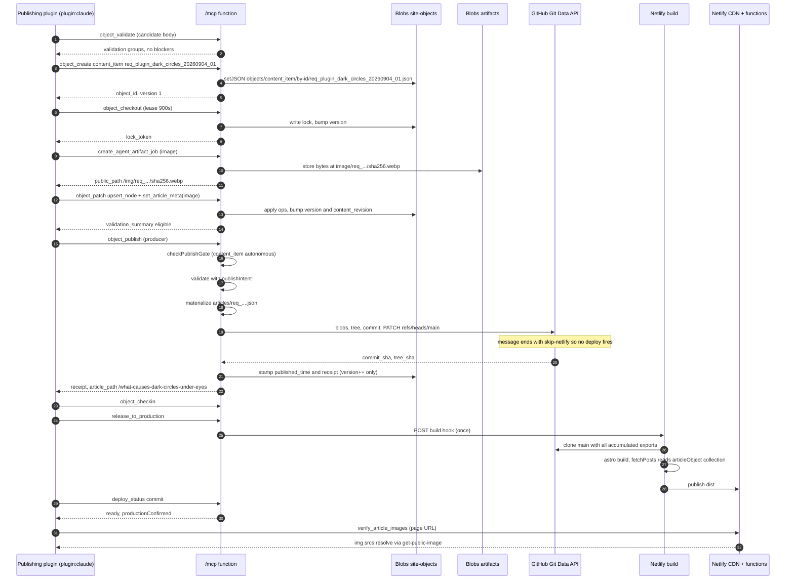
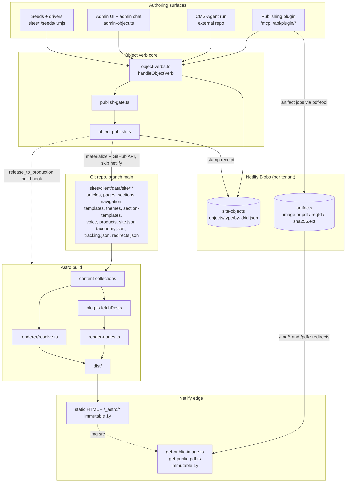

# Content Architecture

> **Status:** verified against the `platform` repo commit `6789644` (2026-09-05). Code is truth; every claim cites a file path. Claims that could not be verified from code are quarantined under **Unverified / open**. Status tags: `[CURRENT]` `[INHERITED]` `[DEPRECATED]` `[EXPERIMENTAL]` `[GENERATED]` `[CANONICAL]` `[DOC-ONLY]`.
> Companion docs: [`ARCHITECTURE.md`](ARCHITECTURE.md) · [`AI_CONTEXT.md`](AI_CONTEXT.md) · [`DATA_CONTRACTS.md`](DATA_CONTRACTS.md) · [`KNOWN_ISSUES.md`](KNOWN_ISSUES.md) · [`GLOSSARY.md`](GLOSSARY.md).

## 1. Purpose

How content exists, moves and renders: where an article originates, its shape in the object store, how it
becomes committed JSON, how Astro turns that into HTML, and where its images come from.

> **The per-site Netlify Blobs object store is canonical. `sites/<client>/data/site/**` is a derived,
> reader-facing mirror written by the publish verb through the GitHub API. The Astro build reads only the
> mirror. Going live is a third, separate step.**

Three surfaces are commonly confused:

| Surface | What it is | Where |
|---|---|---|
| **Record** | Governed object: body + history + lock + review + publication. Full annotation layer. | Blobs store `site-objects`, key `objects/<type>/by-id/<id>.json` (`packages/core/server/lib/object-store-keys.ts:objectRecordKey`) |
| **Export** | Derived JSON mirror, `private.*` stripped, `__generated` added. Committed to git. | `sites/<client>/data/site/**` (`packages/core/server/lib/materializers/*.ts`) |
| **Page** | Built HTML. Renders only the reader projection. | `dist/` → Netlify CDN |

## 2. Where content lives — the authority ladder

| Rung | Artifact | Tag | Writer | Reader |
|---|---|---|---|---|
| 1 | Object record in Blobs `site-objects` (strong consistency — `server/lib/blob-store.ts:getSiteObjectsBlobStore`) | `[CANONICAL]` | `server/lib/object-verbs.ts:handleObjectVerb` | admin canvas, `object_get`, publish |
| 2 | Committed export JSON under `sites/<client>/data/site/**` | `[GENERATED]` | `server/lib/object-publish.ts:publishObject` → `object-git-committer.ts:commitMaterializedFiles` | Astro content collections |
| 3 | Built HTML in `dist/` | `[GENERATED]` | `astro build` | readers / CDN |
| 4 | Seeds `sites/<client>/seeds/*.mjs` | reconcile input | humans + drivers | `scripts/home-conversion-roundtrip.mjs`, `scripts/site-genesis-drive.mjs` |
| — | `src/data/post/**` (legacy markdown) | `[DEPRECATED]` — only `.gitkeep` | nothing (`publish-article.ts` deleted) | `post` collection, permanently empty |

Seeds are **not** authoritative and are known to drift: `sites/drlurie/seeds/sync-site-seed.mjs` exists
because the hand-maintained `site-seed-data.mjs` fell behind the live record; it rewrites the seed **from
the committed export** so a reconcile is a no-op.

### 2.1 Origination paths for a `content_item`

All four converge on one verb core (`server/lib/object-verbs.ts` header: "all action logic lives here,
called with a resolved principal … `admin-object.ts` neither imports nor references the publish secret").

| Path | Entry point | Notes |
|---|---|---|
| **Publishing plugin** (Claude / OpenAI GPT / OpenAI Agent) | `/mcp` → `server/functions/mcp.ts`; `/api/plugin/*` → `netlify/functions/plugin-actions.ts` | Publish sequence rendered into the tenant skill: `server/lib/plugin/render-skill.ts` §4. Charter = tool classes `read`/`draft`/`creation`/`publication` minus `server/lib/plugin/build-tools.ts:PLUGIN_TOOL_DENYLIST`. Live: `req_plugin_*` exports. |
| **CMS-Agent run** | external repo → this tenant's `/mcp`; correlated by an editorial request (`server/lib/requests/store.ts`) | Live: `req_conductor_*` exports. |
| **Admin UI / admin chat** | `netlify/functions/admin-object.ts` → `server/functions/admin-object.ts` (Netlify Identity); `server/lib/agent/*` | `object_create` for `content_item` is **refused from admin chat** (ART-1, `server/lib/mcp-tool-definitions-2.ts:92`); revision via checkout+patch is allowed. |
| **Seeds / drivers** | `sites/drlurie/seeds/articles-seed-data.mjs`, `articles-corpus-seed-data.mjs` | Produced the `req_agent_*_20260713_01` demo articles. |

## 3. Object model

### 3.1 The envelope

`packages/core/schema/object-record-v1.ts:objectRecordSchema`. There is **no** `object_record.v1` string
literal in code; each body carries its own `*_SCHEMA_VERSION`.

```
object_id, object_type, schema_version, site, created_at, updated_at,
status: 'active' | 'archived',
body,
publication: { published_time: string|null, publish_receipt?: PublishReceipt },
review?: { state: 'open'|'changes_requested'|'approved', decisions: [...] },
lock?:   { token, owner_id, owner_label, acquired_at, expires_at },
history: [ { at, action, actor: Principal, details? } ],
version: number,            // bumped by EVERY write
content_revision: number,   // bumped ONLY by body writes
workflow?: WorkflowExtension
```

The two counters are the spine of governance (`object-record-v1.ts`, `object-lock.ts:1-20`,
`object-publish.ts:32-41`): an approval pins a `content_revision`, so any body write invalidates it
(`server/lib/review-state.ts:effectiveApproval`, `publish-gate.ts:235`), while lock churn and the publish
stamp — which move only `version` — deliberately do not.

`Principal` is `human | agent` plus `attribution` (`oauth` | `verified_agent_token` | `publish_key` |
`self_declared` | `inherited_lock`). The header (`object-record-v1.ts:34-61`) records why: a live plugin
run logged sixteen verbs as `unattributed-agent` because the model stopped passing `agent_name`.

### 3.2 Types and bodies

`objectTypes` (13): `page`, `section`, `navigation`, `taxonomy`, `site`, `template`, `section_template`,
`theme`, `product`, `content_item`, `tracking_config`, `editorial_voice`, `visual_standard`.
`visual_standard` is excluded from `governedObjectTypes` (`packages/core/lib/approval-policy.ts:41`) and is
therefore never publishable — `server/lib/materialize.ts:68` throws if it reaches the materializer.

| Type | Version tag | Body file (`packages/core/schema/bodies/`) | Export path (`<root>` = `SiteBinding.dataRoot`) |
|---|---|---|---|
| `content_item` | `content_item.v1` | `content-item-v1.ts` | `<root>/articles/<id>.json` |
| `page` | `page.v1` | `page-v1.ts` | `<root>/pages/<id>.json` |
| `section` | `section.v1` | `section-v1.ts` | `<root>/sections/<id>.json` |
| `navigation` | `navigation.v1` | `navigation-v1.ts` | `<root>/navigation/<id>.json` |
| `taxonomy` | `taxonomy.v1` | `taxonomy-v1.ts` | `<root>/taxonomy.json` |
| `site` | `site.v1` | `site-v1.ts` | `<root>/site.json` |
| `template` | `template.v1` | `template-v1.ts` | `<root>/templates/<id>.json` |
| `section_template` | `section_template.v1` | `section-template-v1.ts` | `<root>/section-templates/<id>.json` |
| `theme` | `theme.v1` | `theme-v1.ts` | `<root>/themes/<id>.json` |
| `product` | `product.v1` | `product-v1.ts` | `<root>/products/<id>.json` |
| `tracking_config` | `tracking_config.v1` | `tracking-config-v1.ts` | `<root>/tracking.json` |
| `editorial_voice` | `editorial_voice.v1` | `editorial-voice-v1.ts` | `<root>/voice/<id>.json` |
| `visual_standard` | `visual_standard.v1` | `visual-standard-v1.ts` | *(never materialized)* |

Two shapes are spread into bodies rather than duplicated: `trackingAttributeShape`
(`tracking-attribute-v1.ts:48` — `tracking {enabled,label,tags,goals}`, single writer `set_tracking`) and
`recipeMetadataShape` (`recipe-metadata-v1.ts` — `template`/`section_template`/`theme`; optional in schema,
**required to publish** via the `recipe_metadata` criterion).

### 3.3 Patch grammar

`packages/core/schema/object-patch-ops.ts` — 44 typed ops, one family per type. Article family
(lines 492-540): `set_article_meta` · `upsert_node` · `update_node` · `move_node` ·
`set_node_visibility` · `remove_node`. `set_article_meta` forbids `nodes` (use node ops) and `tracking`
(one-writer funnel). `update_node` deep-merges over the whole node envelope, so "mark this block a hook" is
one op: `{fields:{private:{strategy:'hook'}}}`. Every op is invertible; the inverse is what `object_discard`
applies (`server/lib/review-state.ts:discardProposal`).

## 4. Article body schema — `content_item.v1`

`packages/core/schema/bodies/content-item-v1.ts`. Model: **"node envelope outside, Rich Text inside."**
Every object is `.strict()` — an unknown key fails the parse.

### 4.1 Envelope

```
tracking?                       slug (required, ^[a-z0-9]+(-[a-z0-9]+)*$)   title (required)
deck?  description?  author? (max 120, plain text)  image? {src, alt?}   // HERO
taxonomy? {category?, tags?}    seo? {meta_title?, meta_description?, canonical_url?}
nodes: ContentItemNode[]        chat?  editorial? {writer_notes?, framework?}
emotional_strategy?             sources? {source_list:[{source_id?,name,url,publisher?,accessed_at?}]}
claims? {claim_list:[{claim_id?,text,node_ids?,source_ids?,risk?,status?,notes?}]}
compliance? {requirements:[...]}  publication_context?
lineage? {parent_content_id?, source_version_id?}
scores? [{scored_by,at,framework,dimension,score,rationale?}]
```

### 4.2 The node

```
id          ^n_[a-z0-9]+$  AND must not contain hook|agitation|cta|advert|offer
kind        'content' | 'action' | 'placement' | 'interactive'
public      {eyebrow?, title?, body?, items?, ctaText?, ctaLink?, label?, media?, images?}
private?    {strategy?, intent?, agentNotes?, sourcePromptId?, inputTemplateId?}
commercial? CommercialMetadata      chat? {invitationText?, suggestedQuery?}
rendering?  {presentation?, emphasis?, placement?}
visibility? 'public' | 'internal' | 'hidden'   (absent = public)
```

`private` / `commercial` / `rendering` / `chat` / `visibility` / the opaque-id rule are **imports** from
`packages/core/schema/article-content-v1.ts`, not copies — the "preservation directive"
(`content-item-v1.ts:14-27`).

`public.body` is `string | rich_text.v1`. A **string is plain text**: escaped, blank lines split
paragraphs, single `\n` → `<br/>` (`lib/article-object/render-nodes.ts:plainTextParagraphs`).

### 4.3 `rich_text.v1`

`packages/core/lib/richtext/rich-text-v1.ts` — a zod mirror of the Contentful Rich Text document model,
with `@contentful/rich-text-types` constants as the single source for node/mark names.
Marks `bold|italic|code`; inline `hyperlink`; blocks `paragraph, heading-2, heading-3, unordered-list,
ordered-list, list-item, blockquote, embedded-entry-block, embedded-asset-block`.
Per-field **grammars** narrow further: `INLINE_COPY_GRAMMAR`, `PROSE_GRAMMAR`, `ARTICLE_BODY_GRAMMAR`
(lines 207-241) — Contentful's `enabledNodeTypes`/`enabledMarks` idiom.

Rendered by `lib/richtext/render-html.ts:renderRichTextV1Html` over
`@contentful/rich-text-html-renderer`, with house overrides (`<strong>`/`<em>`, not `<b>`/`<i>`) and a
never-silently-drop contract: an embed without an injected resolver **throws**. These packages are
load-bearing, not vestigial — they are also why `app/site-astro-config.ts:176` `ssr.noExternal`s them
(Node 20 could not `require()` the CJS build's named exports; fernwell's first production build died on it).

### 4.4 Media nodes

`contentItemNodeMediaSchema` (`content-item-v1.ts:73`):
`{type:'image'|'video'|'audio'|'embed'|'document', title?, contentType?, src, alt?, caption?, sizeBytes?}`.
One `media` per node is the norm; `images: media[]` is the sanctioned gallery form. `type` is the render
discriminant and is **never defaulted** — the patch engine infers it from the `src` and refuses a type the
src contradicts (`lib/article-content/media-type.ts`, wired at `lib/object-patch-apply.ts:63`).
`document` renders as a download + `<object>` preview block, never an ``
(`render-nodes.ts:documentMediaHtml`).

**`ArtifactReference` never appears inside an article body.** Article media carries the *public path* of an
artifact (`/img/{id}/{sha256}.{ext}`, `/pdf/{id}/{sha256}.pdf`), and validation resolves that path back to
the artifact index (`server/lib/object-validate.ts:resolvePublicPathExistence`, `rawArtifactRefForPublicPath`).
`object-validate.ts:811` states it: "Article bodies (content_item) never populate a `*AssetRef` field."
The type itself is `server/lib/artifacts.ts:32` (`blobKey, sizeBytes, sha256, contentType, createdAtISO,
artifactKind?, originalFilename?, filename?, label?, tags?, metadata?, deletedAtISO?, deletedBy?`).

### 4.5 Reader-visible vs private — the leak rule

Two independent enforcement points, kept in lockstep by comment and by test:
**(A) the renderer** (`lib/article-object/render-nodes.ts`) emits only `public` fields of
`visibility === 'public'` nodes; **(B) the validator**
(`server/lib/object-validate.ts:contentItemReaderProjection`, line 686) scans exactly
`{title, deck, description, author, image, seo, nodes → {id, public}}` through
`lib/article-content/assert-reader-safe.ts` for `private`, `strategy`, `agentNotes`, `sourcePromptId`,
`inputTemplateId`.

| Field | Store | Export (git) | Reader HTML |
|---|---|---|---|
| `title`, `deck`, `description`, `author`, `slug`, `image`, `seo`, `taxonomy` | ✅ | ✅ | ✅ (`deck` is the `excerpt` fallback) |
| `nodes[].public.*` (public visibility) | ✅ | ✅ | ✅ |
| `nodes[].public.*` (internal / hidden) | ✅ | ✅ | ❌ (`render-nodes.ts:331`) |
| `nodes[].private.*` | ✅ | ❌ **stripped** | ❌ |
| `nodes[].commercial.*` | ✅ | ✅ | only `disclosure.label` + `rel` (+ the mock ad bank when `adSlot.provider === 'mock'`) |
| `nodes[].rendering`, `chat`, `visibility` | ✅ | ✅ | indirectly (chooses markup) |
| `sources`, `claims`, `compliance`, `scores`, `emotional_strategy`, `editorial`, `lineage`, `publication_context` | ✅ | ✅ | ❌ |
| `tracking.label`, `tracking.tags` | ✅ | ✅ | ❌ (`tracking-attribute-v1.ts:8-14`) |
| `tracking.goals` | ✅ | ✅ | ✅ by construction (neutral slugs, `GOAL_KEY_RE`) |

**Note the asymmetry:** `private` is stripped from the export; the judge/score substrate is not — it is
committed to git in full. `server/lib/materializers/shared.ts:107-142` (`stripPrivate`) records the
ruling ("strip regardless of repository visibility"). Live evidence:
`sites/drlurie/data/site/articles/req_plugin_dark_circles_20260904_01.json` ships
`editorial.writer_notes` containing the aggression dial values.

## 5. Lifecycle & status

There is **no** `draft → in_review → published → retired` enum. Lifecycle is *derived* from four facts:

| Fact | Field | Set by |
|---|---|---|
| exists / removed | `status: 'active' \| 'archived'` | `object-retire.ts:retireObject`, `object-purge.ts` |
| under review | `review.state` | `review-state.ts:submitReview` / `decideReview` |
| live | `publication.published_time` + `publish_receipt` | `object-publish.ts:publishObject` |
| unpublished changes | `content_revision` vs `publish_receipt.content_revision` | derived in `object-inventory.ts` |

**Verbs** (`object-verbs.ts:objectVerbRequestSchema:131`): `get, list, inventory, create, create_variant,
instantiate, instantiate_section, apply_theme, apply_brand_imagery, checkout, refresh_lock, checkin, patch,
validate, submit_review, review_decide, discard, purge_archived, retire, publish_by_time,
marginalia_create/_reply/_list/_resolve`.

**Locks** (`server/lib/object-lock.ts`): default lease **900 s**, max **3600 s**. Stale
`expected_record_version` → **409**; missing/expired/foreign lock → **423**. `patch`, `publish`, `retire`
all require a live lock. `object_publish` deliberately **keeps** the lock (`mcp-tool-definitions-2.ts:567`).

**The publish gate** (`server/lib/publish-gate.ts:checkPublishGate`) asks one question per type: does
publishing require a current human approval? Answered by `sites/<client>/config/approval-policy.ts` via
`packages/core/lib/approval-policy.ts`. Dr-Lurie: `master: 'all-autonomous'` with
`product: 'require-approval'` and `editorial_voice: 'require-approval'` — **`content_item` is autonomous**.
On a gated type an *agent* may execute only if the approval pins the exact action (M-6 `publish_action`)
and, optionally, `request_id` / `artifact_set` / `release_build` (`review-state.ts:approvalPinSchema`);
humans with `admin`/`publisher` are not bound by the pin.

**`publishObject`** (`server/lib/object-publish.ts`) is a five-step machine:
① lock check (423) → ② validate with `publishIntent: true` (422) → ③ materialize (pure; `at` = the
effective `published_time`, never wall-clock) → ④ commit the export to GitHub with `[skip netlify]` →
⑤ stamp `published_time` + receipt, bump `version`, leave `content_revision`.

Failure semantics are asymmetric on purpose: failing at or before the commit leaves the record
byte-identical and unpublished; a successful commit with a failed stamp leaves the export live and the
record *under-claiming* (`stamp_failed_export_committed`, `reconciliation: 'retry_publish'`). Before
stamping, the record is reloaded and the stamp is refused if `content_revision` moved
(`content_changed_during_publish`, 409). `published_time: null` (unpublish) and future timestamps are
**rejected outright** (lines 209-229) — removal goes through `object_retire`.

**Receipt** (`object-record-v1.ts:publishReceiptSchema`):
`{kind:'object_export_commit', branch, commit_sha, tree_sha, no_op, attempts, files[], content_revision,
exported_at, surface?, attribution?, prompt_version?}`. **A receipt proves the export commit, never the
deploy.**

**Retire** (`server/lib/object-retire.ts`) refuses on: the `site` singleton, a still-referenced object, an
open review, a missing lock. Otherwise, in **one** commit, it deletes the export path (GitHub tree entry
`sha: null`) *and* appends a 301 to `<root>/redirects.json`; then archives the record and moves the status
index. Wolf's ruling in the header: "readers should always be redirected."

## 6. Materialization & exports

**The marker** (`server/lib/materializers/shared.ts:generatedMarker` / `renderExport`):

```json
"__generated": {
  "from": "objects/content_item/by-id/<id>.json",
  "at": "<ISO — the effective published_time>",
  "record_version": <ObjectRecord.version at materialize>,
  "producer": {"run_id","node_id","prompt_version","model"},
  "surface": "plugin:claude", "attribution": "oauth"
}
```

`producer`/`surface`/`attribution` go into the **export**, not only the store, because the export is what
the owner analytics DB ingests — "a dimension the ingest cannot see is a dimension nobody can group by"
(`shared.ts:32-43`).

**Determinism.** `canonicalJsonStringify` sorts object keys recursively, preserves array order, emits
2-space JSON + trailing newline. `at`/`record_version`/`exportRoot` are caller-supplied inputs, never
generated in the module — that is what makes a retried publish produce the same blob sha and lets the
committer no-op (`shared.ts:1-21`, `object-git-committer.ts:22-27`). A runtime guard rejects the camelCase
trap (`recordVersion`) rather than emitting an export that dies later inside Astro (`shared.ts:82-96`).

**Stripping.** `stripPrivate` removes every `private` key at any depth, for every type. Nothing else is removed.

**Git mechanics** (`server/lib/object-git-committer.ts:commitMaterializedFiles`):
`GET ref/heads/<branch>` → `GET commits/<head>` → `POST git/blobs` (content-addressed, created once) →
`POST git/trees` (`base_tree` = head tree; deletions as `{sha:null}`) → **if the new tree sha equals the
base tree sha, return a no-op** → `POST git/commits` → `PATCH refs/heads/<branch>` with `force:false`.
On a non-fast-forward rejection (422 "fast forward" / 409) it re-fetches head, rebuilds and retries with
backoff `250ms · 2^(n-1)`, default **4 attempts**, then throws `non_fast_forward_exhausted`.
Env: `GITHUB_CONTENT_TOKEN`, `GITHUB_REPOSITORY`, `GITHUB_BRANCH` (default `main`),
`GITHUB_COMMIT_AUTHOR_NAME/EMAIL` (fallback from `sites/<client>/config/site-identity.ts`).
`[skip netlify]` is appended by `object-publish.ts:withDeferredDeployMarker`, **not** by the committer,
which stays message-agnostic and is reused by retire.

**Release** (`server/lib/production-release.ts`): resolve the target commit (content-branch HEAD via the
GitHub ref API — exactly the accumulation point) → `POST NETLIFY_BUILD_HOOK_URL` **once**
(`netlify-deploys.ts:triggerNetlifyBuild`, the only production-build trigger in the codebase) → poll deploy
receipts until terminal (`pollDeployReceipt`, default 120 s / 5 s) → confirm production serves it. Because
one release build deploys *many* accumulated commits, an exact `deploy.commit === targetCommit` check is
insufficient; on a mismatch it asks GitHub's compare API whether the target is an **ancestor** of the
published commit (lines 122-140, QA-W16-4). Statuses: `released | build_not_confirmed_live |
build_ready_not_published | commit_unresolved | build_hook_not_configured | deploy_lookup_not_configured`.
The `release_to_production` MCP tool and the admin button call this one function.

## 7. Build & render

**Entry.** `packages/core/app/site-astro-config.ts:defineSiteAstroConfig`; each site's `astro.config.ts` is
a thin wrapper (`sites/drlurie/astro.config.ts`); root `astro.config.ts` re-exports drlurie's.
Aliases: `~/assets/*` → `sites/<client>/assets/`; `~/*` → `packages/core/app/` (the shell);
`@core/*` → `packages/core/`; `@site/*` → `sites/<client>/`. `root` stays the repo root for every site (so
repo-relative collection globs work); only `srcDir`/`publicDir`/`outDir` move. `output: 'static'`,
`image.service: passthroughImageService()`.

**Content collections** (`packages/core/app/content/collections.ts:buildSiteCollections`; each site's
`app/content/config.ts` is three lines over it):

| Collection | Glob | Consumer |
|---|---|---|
| `post` | `src/data/post/*.{md,mdx}` | `blog.ts:load` — **permanently empty** `[DEPRECATED]` |
| `articleObject` | `<root>/articles/*.json`, `generateId` pinned to filename | `blog.ts:loadArticleObjectPosts` |
| `pageObject` | `<root>/pages/*.json` | `PageObjectRenderer.astro`, `[...objectPage].astro`, `route-page-object.ts` |
| `sectionObject` | `<root>/sections/*.json` | `shared_ref` dereference |
| `navigationObject` | `<root>/navigation/*.json` | `utils/navigation-data.ts` |
| `templateObject`/`sectionTemplateObject`/`themeObject` | `<root>/{templates,section-templates,themes}/*.json` | admin recipes |
| `productObject` | `<root>/products/*.json`, `generateId` pinned | `/shop/[slug]` |
| `siteObject` | `<root>/site.json` | `utils/site-object.ts` |
| `taxonomyObject` | `<root>/taxonomy.json` | `blog.ts:getTaxonomyLabels` |
| `trackingConfigObject` | `<root>/tracking.json` | tracking loader |

Collection schemas deliberately **do not** import the body schemas: `astro:content`'s `z` is Astro's zod v3
while the project is zod v4, so they only assert `__generated` and `.passthrough()` the body
(`collections.ts:109-116`). Real validation happens at write time (`object-validate.ts`) and again at read
time in `blog.ts`. There is **no** collection for `voice/` — `editorial_voice` materializes so agents can
read it as governed data; no Astro route consumes it.

**`fetchPosts`** (`packages/core/app/utils/blog.ts`) is the one post list:

```
load()
 ├─ getCollection('post') → [] (legacy)                    → getNormalizedPost()
 ├─ loadArticleObjectPosts(takenSlugs)
 │    strip __generated → contentItemBodySchema.safeParse
 │      ✗ → console.warn + SKIP (never a build failure)
 │    slug taken by a committed post → warn + SKIP (the .md post wins)
 │    publishDate := new Date(__generated.at)
 │    rendered   := renderArticleNodes(entry.id, article)  → {html, readingTime}
 │    category/tags → cleanSlug + label lookup from taxonomyObject
 │    → Post {id, slug, permalink, publishDate, title, excerpt, image, category,
 │             tags, author, published_time, metadata, content, readingTime}
 ├─ merge + sort by publishDate desc
 └─ filter: published_time is a finite Date AND <= Date.now()
```

Memoized into `_posts`; listings, category/tag pages, `rankRelatedPosts`, `rss.xml.ts` and `search.json.ts`
all read it. `generatePermalink` interpolates `POST_PERMALINK_PATTERN` (`utils/permalinks.ts:28`) from
`config.yaml`'s `apps.blog.post.permalink` — for drlurie, `/%slug%`.

**The article renderer** (`packages/core/lib/article-object/render-nodes.ts:renderArticleNodes`) is the
*one* renderer, shared by the public build and the admin canvas preview (kills the dual-renderer drift
class). Per node: skip unless visibility is public; wrap in
`<div style="display:contents" data-cms-object-id data-cms-node-id data-cms-node-kind>` (inert for visitors;
`data-cms-track="off"` when `body.tracking.enabled === false`). By kind — `content`: disclosure + header +
body + items + media + images + cta; `action`: disclosure + header + body + prominent cta; `placement`:
offer aside (`offerInline`/`offerCard`) or the mock ad bank when `commercial.adSlot.provider === 'mock'`,
else nothing; `interactive`: `chat.invitationText` only. Guards: `SAFE_HREF_RE` (`https?:` `/` `#`
`mailto:`) — anything else renders as plain text; `bodyOpensWithHeading2()` suppresses a duplicate `<h2>`
(T9.16). Reading time = `ceil(words / 200)`.

**Routes** (`sites/drlurie/app/pages/`):

| File | Serves |
|---|---|
| `[...blog]/index.astro` | the **single article page** (`getStaticPathsBlogPost`, `params.blog = post.permalink`) |
| `[...blog]/[...page].astro` | the paginated library at `/learn/library` |
| `[...blog]/[category]/[...page].astro`, `[...blog]/[tag]/[...page].astro` | `/category/<slug>`, `/tag/<slug>` |
| `[...objectPage].astro` | catch-all for agent-created **page** objects → `components/cms/PageObjectRenderer.astro` |
| `learn/topics/{index,[topicSlug]}.astro` | the topics hub |
| `rss.xml.ts`, `search.json.ts` | derived feeds over `fetchPosts()` |
| `shop/[slug].astro` | `productObject` |
| hand-written `.astro` (`about`, `contact`, `privacy`, …) | the originally converted pages; they win over the catch-all |

`[...blog]/index.astro` layers the editable page object `page_article` (pageType `content_detail`) over the
article — route-level SEO defaults plus optional sections rendered *after* the body via
`components/cms/ObjectSections.astro` (`utils/route-page-object.ts:loadRoutePageObject`). The body itself
always comes from the `content_item` pipeline. Route ownership for the catch-all is decided by the pure
`utils/object-page-routes.ts:computeObjectPageRoutes`; skips are `file_route | blog_slug |
reserved_prefix | loader_owned_page_type | invalid_route`, and every non-benign skip is `console.warn`ed.
Sections resolve through `lib/renderer/resolve.ts` + `resolve-content-grid.ts` and dispatch via
`lib/registry/components/index.ts`; identity chips come from `lib/renderer/section-annotations.ts`.

## 8. Assets & images

**Two families:**

| Family | `src` shape | Storage | Served by |
|---|---|---|---|
| **Artifact** `[CURRENT]` | `/img/{objectId}/{sha256}.{ext}`, `/pdf/{objectId}/{sha256}.pdf` | Blobs store `artifacts` (`blob-store.ts:getArtifactBlobStore`) | Netlify **function** via redirect `/img/* → /.netlify/functions/get-public-image?blobKey=image/:splat` |
| **Committed repo asset** `[DEPRECATED]` | `~/assets/images/uploads/<slug>/<file>` | git, `sites/drlurie/assets/` | Astro asset pipeline → `/_astro/<file>.<hash>.<ext>` |

The redirect table is `sites/drlurie/site.config.ts:redirects`, drift-guarded against root `netlify.toml`
by `tests/netlify/site-config-drift.test.ts`.

**The blob-served function** (`packages/core/server/functions/get-public-image.ts`; site shim
`netlify/functions/get-public-image.ts`) is **public, no auth** — safe because keys are content-addressed
(`image/<requestId>/<sha256>.<ext>` is unguessable without the sha256 of the exact bytes). Extension
allowlist `png|jpg|jpeg|webp|gif|avif|svg`. Headers: `Cache-Control: public, max-age=31536000, immutable`,
`Content-Security-Policy: default-src 'none'; style-src 'unsafe-inline'`, `X-Content-Type-Options: nosniff`.
`get-public-pdf.ts` mirrors it for `/pdf/*`. **There is therefore no cache-invalidation problem for
artifact images by construction** — new bytes mean a new sha256 and a new URL; there is likewise no purge
path.

**Hero vs inline:**

| | Hero | Inline node media |
|---|---|---|
| Field | `body.image {src, alt}` | `node.public.media` / `node.public.images[]` |
| Set by | `set_article_meta` | `upsert_node` / `update_node` |
| Path to HTML | `blog.ts` → `post.image` → `[...blog]/index.astro:findImage()` → `SinglePost.astro` → `components/common/Image.astro` → `getImagesOptimized` → `getImage` under `passthroughImageService()` | `render-nodes.ts:oneMediaHtml` emits a raw `<figure>` string — **bypasses Astro entirely** |
| PDF allowed? | **No** — blocked at validation (`object-validate.ts:classifyArticleImageSrc` `forbidPdf`); a PDF here reaches `getImage` and fails the whole build | Yes, as `{type:'document'}` |
| Rendered | exactly once, by the article furniture | once per node, in node order |

`[...blog]/index.astro` guards the hero with `isDocumentPath()` (`utils/images.ts:26`) before calling
`findImage`. `findImage` returns `http(s)`/`/`-prefixed strings **unchanged** (`utils/images.ts:44-47`), so
a `/img/...` hero never enters the Astro asset pipeline; with `passthroughImageService()` the emitted
`` is the `/img/...` path verbatim.

**Budgets and bounds.** `packages/core/lib/media-policy.ts` — per-site `maxImageBytes` (default 150 KB),
`overBudget: 'warn'|'block'`, `preferredImageFormat`; the budget rides the pdf-tool storage grant so agents
and pdf-tool see the same number, and is surfaced in `object_contract`. Its header records a live
discrepancy (QA-W16-5): every site is configured `warn`, but the pdf-tool service hard-blocks.
`packages/core/lib/artifact-image-bound.ts:boundArtifactImageDimensions` bounds the longest edge on upload
(`fit:'inside'`, `withoutEnlargement:true`), never crops/upscales/converts format; a sharp failure returns
the bytes unchanged rather than failing the upload.

**Path validation** (`server/lib/object-validate.ts:1946-2155`, `checkContentItemMedia`):

| `src` form | Verdict |
|---|---|
| `/img/{id}/{sha64}.{ext}`, `/pdf/{id}/{sha64}.pdf` | governed — existence-checked against the artifact index |
| `https://…` | **warn** — "bypasses artifact governance and can rot" |
| other root-relative `/…` | **warn** — existence unverifiable |
| `data:` URI · `src/assets/…` · type⇄src disagreement · PDF in `body.image` | **block** |

At publish (`atPublish`) a failed existence check is upgraded from warning to blocker. When the artifact
index could not be read at all, the check emits a warning naming the likely
`NETLIFY_SITE_ID`/`NETLIFY_BLOBS_TOKEN` fault — added after a 2026-08-11 incident where every index read
threw and the gate silently reported healthy.

**Post-publish verification.** `netlify/functions/verify-article-images.ts` (MCP `verify_article_images`)
fetches the live page and asserts each expected image/document is present and fetchable. It is
**deploy-aware**: given the publish `commit` it correlates to that commit's Netlify deploy and returns
`inconclusive: true` rather than a false defect while a stale deploy is still served
(`mcp-tool-definitions.ts:360`). For object articles the expected values are the node media public paths
verbatim; for legacy committed assets it falls back to filename-stem matching against `/_astro/` hashes.

**OG images.** `sites/drlurie/public/Social/{og-default,og-home}.jpg`, referenced from
`sites/drlurie/config.yaml` (`metadata.openGraph.images[0].url`) and `site.json`
(`metadataDefaults.ogImage`), absolutized at render by `utils/images.ts:adaptOpenGraphImages`.

## 9. Routing, taxonomy, redirects

**Permalinks.** `packages/core/app/utils/permalinks.ts` reads `astrowind:config` (i.e.
`sites/<client>/config.yaml` via `vendor/integration`). For drlurie: `site.site =
https://drluriescience.netlify.app`, `trailingSlash: false`, `apps.blog.post.permalink = /%slug%`,
`list.pathname = learn/library` → `BLOG_BASE`, `category.pathname = category`, `tag.pathname = tag`.
Tokens: `%slug% %id% %category% %year% %month% %day% %hour% %minute% %second%` (`blog.ts:generatePermalink`).
**Routing authority is `config.yaml`, not `site.json`** (Wolf B2, restated at `site-astro-config.ts:24-27`):
`site.json.blog` carries the same four values but nothing on the build path reads them —
`utils/site-object.ts` feeds `Metadata.astro`, `Logo`, `CustomStyles`, not `permalinks.ts`.

**Slug uniqueness.** `content_item.slug` matches `^[a-z0-9]+(?:-[a-z0-9]+)*$`. Uniqueness is enforced by
the injected `isArticleSlugTaken` resolver (`object-validate.ts:205`), covering both content_item objects
and committed `.md` post stems; a missing resolver means "not verified", never a false failure. At build a
second, defensive guard skips a colliding article with a warning and the `.md` post wins
(`blog.ts:171-176`).

**Taxonomy.** One `taxonomy` object per site (`tax_<siteShortId>`), body `taxonomy.v1`:
`kinds: {category:{terms}, tag:{terms}}`, `Term {term_id ^t_[a-z0-9]+$, slug, label, description?,
status:'active'|'deprecated', merged_into?}`. `term_id` is opaque and stable so slugs/labels can be renamed;
`merged_into` is the alias that keeps published references resolving. Three consumers:
① **build-time labels** — `blog.ts:getTaxonomyLabels` maps `slug → label` (unmapped slugs fall back to the
raw string, so renaming a label updates every card, chip and listing on the next build);
② **write-time reference integrity** — `object-validate.ts:496` resolves `content_item.taxonomy.category`
and `.tags` via the injected `resolveTaxonomyTerm` (built in `object-validation-context.ts:370`);
③ **registry self-consistency** — `taxonomy_slugs` / `taxonomy_merges` / `taxonomy_usage` criteria
(`object-validate.ts:1123-1143`). `server/lib/taxonomy-enforcement.ts:enforceTaxonomy` is the *old*
publish-time slug normalizer built for the deleted `publish-article.ts` and is now orphaned (Defect 3).

**`%term%` pattern copy.** One listing page object serves a whole route family (`page_category` → every
`/category/<slug>`, `page_tag`, `page_topic_detail`); their `route` fields are family patterns
(`/category/[category]`), which is why the catch-all skips them as `loader_owned_page_type`. Any string
value may carry the literal `%term%`; `lib/renderer/listing-term.ts:applyListingTerm` deep-substitutes the
concrete term's display label at build time (keys untouched).

**Redirects — three tables, in precedence order:**

| Table | File | Written by |
|---|---|---|
| Infrastructure (highest) | root `netlify.toml` `[[redirects]]` ← mirrored from `sites/drlurie/site.config.ts:redirects` | humans; drift-guarded by `tests/netlify/site-config-drift.test.ts` |
| Content forwarding | `sites/<client>/data/site/redirects.json` → emitted as `dist/_redirects` at `astro:build:done` (`app/site-redirects-integration.ts:siteRedirectsFile`) | `object_retire` (`object-retire.ts`, `server/lib/site-redirects.ts`) |

Netlify applies `netlify.toml` before `_redirects` — deliberate: infrastructure routing wins, content
forwarding fills in behind it (`site-redirects-integration.ts:16-20`). `redirects.json` is the only export
without a `__generated` marker; it is written directly by `object-retire.ts`, whole-file, from the
store-backed table at blob key `site/redirects.v1.json`. `upsertRedirect` is one-rule-per-`from` and drops
self-referential loops.

## 10. SEO & timestamps

**The metadata stack** (`packages/core/app/components/common/Metadata.astro`) merges four layers with
`lodash.merge`, later wins: ① hardcoded defaults (`noindex:true, nofollow:true`) → ② `config.yaml`
`metadata.*` → ③ `site.json` `metadataDefaults` (+ `site.name`) via `utils/site-object.ts:getSiteObject()`
→ ④ per-page props. Output through `@astrolib/seo`'s `AstroSeo`, OG images absolutized by
`adaptOpenGraphImages`.

**`SITE_NOT_YET_LIVE`** (`Metadata.astro:33`, `:89-92`) is a hardcoded `true` in the shell, applied *after*
the merge — it forces `noindex,nofollow` on every page of every tenant. See Defect 1.

**Per-object SEO.** `content_item.seo {meta_title, meta_description, canonical_url}` maps to
`post.metadata {title, description, canonical}` (`blog.ts:204-208`) and is merged **last** in
`[...blog]/index.astro`, so it wins. Canonical defaults to
`getCanonical(getPermalink(post.permalink,'post'))`. `page.seo` supplies route-level defaults to the
listing/article surfaces via `utils/route-page-object.ts` (with `%term%` already interpolated).

**Sitemap & robots.** `@astrojs/sitemap` is registered unconditionally (`site-astro-config.ts:99`) — every
built page is listed. `sites/drlurie/public/robots.txt` is `User-agent: *` / `Disallow:` (allow all).
Neither respects `SITE_NOT_YET_LIVE`.

**Timestamps:**

| Concept | Where | Notes |
|---|---|---|
| `publication.published_time` | record | the stamped ISO instant; `null` = unpublished |
| `__generated.at` | export | **equals** the effective `published_time`, never wall-clock (`object-publish.ts:272-289`) |
| `publish_receipt.exported_at` | record | the same value, restated |
| `post.publishDate` / `post.published_time` | build | both `= new Date(__generated.at)` (`blog.ts:178,203`) |
| `updateDate` / `updated_time` | — | **only** on the legacy `post` collection schema (`collections.ts:82`). Object articles carry no reader-facing updated time; `record.updated_at` never reaches export or page. |

The gate at `blog.ts:229-232` drops any post whose `published_time` is not a finite Date at or before now
— effectively inert for object articles (whose `at` is always past) and a leftover of the `.md` family's
scheduling. `tests/netlify/publication-timestamp-contract.test.ts` still pins the *legacy*
`content_source.v1` + `publication.v2` shape and its own comment admits its source scans "have no subject".

## 11. Cache & build implications

**What requires a rebuild.** The build is static (`output:'static'`), so every reader-facing change except
blob-served binaries does:

| Change | Rebuild? | Why |
|---|---|---|
| any object publish (`content_item`, `page`, `section`, `navigation`, `site`, `taxonomy`, `theme`, `template`, `product`) | **Yes**, plus an explicit `release_to_production` | exports are read at build time |
| retire (export deletion + redirect) | **Yes** | `_redirects` is emitted at `astro:build:done` |
| a new image/PDF artifact | **No** for the bytes (function-served); **Yes** for the body that references it | `/img/*` is a live function read |
| `tracking.json` | **Yes** | build-time tracking config |
| `config.yaml`, `site.config.ts`, `netlify.toml` | **Yes** (ordinary code deploy) | |

**The two-step release.** Export commits carry `[skip netlify]`, so pushing to `main` does not build.
Exports accumulate dark until `release_to_production` fires the build hook once, producing a single deploy
containing every accumulated commit; `deploy_status` polls the receipt. Consequence
(`production-release.ts:122-140`): the live deploy is usually **ahead of** any one export's commit, so
status must be checked by ancestry, not equality.

**Caching layers:**

| Layer | Policy | Source |
|---|---|---|
| `/_astro/*` | `public, max-age=31536000, immutable` | root `netlify.toml:16-19` |
| `/img/*`, `/pdf/*` | `public, max-age=31536000, immutable` (content-addressed) | `get-public-image.ts`, `get-public-pdf.ts` |
| function error responses | `no-store` | same files |
| HTML | Netlify default (no explicit rule) | — |
| `pretty_urls` | `false` — `/foo` is served, not `/foo/`; matches `trailingSlash:false` | root `netlify.toml:14-15` |

`astro-compress` runs with `CSS:true, HTML:true, JavaScript:true, Image:false, SVG:false`
(`site-astro-config.ts:126-136`) — image compression is off because artifact images are optimized upstream
and are not part of the build output at all. `Content-Security-Policy-Report-Only` is fleet-wide
(`netlify.toml:31-34`), with `img-src 'self' data: https:` because article images may be externally hosted.

## 12. End-to-end trace — one real published article

**Subject:** `req_plugin_dark_circles_20260904_01` — hero image **and** an inline image node, produced by
the publishing plugin (fully agent-driven).
**Export:** `sites/drlurie/data/site/articles/req_plugin_dark_circles_20260904_01.json`

Top-level keys, verbatim:
`["__generated","author","deck","description","editorial","image","nodes","seo","slug","sources","taxonomy","title"]`

`__generated`, verbatim:

```json
{
  "at": "2026-09-04T10:46:33.682Z",
  "from": "objects/content_item/by-id/req_plugin_dark_circles_20260904_01.json",
  "producer": { "model": "claude-opus-5", "node_id": "plugin:claude",
                "prompt_version": "dr-lurie-claude-20260903-f3506d7e",
                "run_id": "plugin_claude_req_plugin_dark_circles_20260904_01" },
  "record_version": 11
}
```

`slug: "what-causes-dark-circles-under-eyes"`, `author: "Dr. Lurié"`,
`taxonomy {category:"skin-health", tags:["patient-education","skin-science","pigmentation"]}`,
10 nodes (9 `content`, 1 `action`) — 4 with `rich_text.v1` bodies, 5 plain strings, 1 media-only — and 3
entries in `sources.source_list`. No `private` block survives (stripped).

| # | Step | Call / artifact |
|---|---|---|
| 1 | Pick the id | `req_plugin_<topic>_<yyyymmdd>_<nn>` — simultaneously the workflow id, artifact scope, object id and committed filename (`plugin/render-skill.ts` §4) |
| 2 | Pre-flight | `object_inventory {object_type:"content_item"}`; `object_validate {object_type:"content_item", body, requested_id}` |
| 3 | Create | `object_create {object_type:"content_item", site:"site_drlurie", requested_id:"req_plugin_dark_circles_20260904_01", body, agent_name}` → writes `objects/content_item/by-id/<id>.json` + `objects/content_item/index/by-status/active/<id>` in `site-objects` |
| 4 | Lock | `object_checkout` → `lock.token`, 900 s lease |
| 5 | Media | `create_agent_artifact_job {artifact_kind:"image", prompt, requirements:{image:{usageContext:"article_body"}}}` → poll `get_agent_artifact_job_status` → `public_path /img/{id}/{sha256}.webp`; bytes land in the `artifacts` store, never in MCP |
| 6 | Patch | `object_patch {lock_token, expected_record_version, ops:[{op:"upsert_node",node:{…}}, …, {op:"set_article_meta", fields:{image:{src:"/img/…224094ae….webp", alt:"…"}}}]}` — each response carries `validation_summary` |
| 7 | Gate | `checkPublishGate` — `content_item` autonomous under `sites/drlurie/config/approval-policy.ts` ⇒ allow, `requires_approval:false` |
| 8 | Publish | `object_publish {object_type, object_id, lock_token, producer}` → validate → materialize → commit → stamp |
| 9 | Commit | `sites/drlurie/data/site/articles/req_plugin_dark_circles_20260904_01.json`, message `Publish content_item: req_plugin_dark_circles_20260904_01 [skip netlify]` — **dark, no deploy** |
| 10 | Receipt | `publication.publish_receipt {kind:"object_export_commit", commit_sha, tree_sha, no_op, attempts, files, content_revision, exported_at:"2026-09-04T10:46:33.682Z"}`; response also returns `article_path:"/what-causes-dark-circles-under-eyes"` (`object-publish.ts:405-422`) |
| 11 | Unlock | `object_checkin` |
| 12 | Release | `release_to_production {idempotency_key: request_id}` → build hook → poll `deploy_status {commit}` |
| 13 | Build | `getCollection('articleObject')` → entry id = filename → `contentItemBodySchema.safeParse` → `renderArticleNodes` → `Post` with `permalink = "what-causes-dark-circles-under-eyes"` |
| 14 | Route | `[...blog]/index.astro` emits `/what-causes-dark-circles-under-eyes` |
| 15 | Verify | `verify_article_images {url, expectedImages:["/img/…224094ae….webp","/img/…41e01eaa….webp"], commit}` |

**Image URLs on the finished page:**

| Slot | Body value | Rendered `` | Served by |
|---|---|---|---|
| Hero | `image.src = /img/req_plugin_dark_circles_20260904_01/224094ae…webp` | the same path verbatim (`findImage` passes `/`-prefixed strings through; `passthroughImageService()` does not rewrite) | `/.netlify/functions/get-public-image?blobKey=image/req_plugin_…/224094ae….webp` |
| Inline (node `n_g8k4`) | `public.media {type:"image", src:"/img/req_plugin_dark_circles_20260904_01/41e01eaa…webp", alt, caption, contentType:"image/webp", sizeBytes:26050}` | `<figure><figcaption>…</figcaption></figure>` emitted directly by `render-nodes.ts:oneMediaHtml` | the same function |

Neither URL passes through `/_astro/`; neither is host-qualified.





## 13. Roles of Markdown / MDX / JSON / frontmatter / editors

| Technology | Status | Where | Live reader path? |
|---|---|---|---|
| **JSON exports** | `[CURRENT]` `[GENERATED]` | `sites/<client>/data/site/**` | **Yes** — the only content the build reads |
| **Markdown `.md` posts** | `[DEPRECATED]` | `src/data/post/` — only `.gitkeep` | **No.** The `post` collection is intentionally empty; Astro logs a benign "collection is empty" line (`blog.ts:216-223`) |
| **MDX** | `[INHERITED]`, unused | `@astrojs/mdx` registered (`site-astro-config.ts:101`); the `post` glob includes `*.mdx` | **No** — zero `.mdx` files exist in the repo |
| **Frontmatter plugins** | `[INHERITED]` | `app/utils/frontmatter.ts` — `readingTimeRemarkPlugin`, `responsiveTablesRehypePlugin`, `lazyImagesRehypePlugin`, wired into `markdown.remarkPlugins/rehypePlugins` | **No** — they run only on markdown, and there is none. Object articles compute reading time in `render-nodes.ts` |
| `scripts/normalize-taxonomy-frontmatter.mjs` | `[DEPRECATED]` | one-time migration over `src/data/post` | **No** — no posts to normalize |
| **`rich_text.v1`** | `[CURRENT]` | `lib/richtext/rich-text-v1.ts` | **Yes** — the formatted half of every article node body |
| **`@contentful/rich-text-types`** | `[CURRENT]` | node/mark constants in `rich-text-v1.ts`, `render-html.ts`, `prosemirror.ts`, `from-markdown.ts`, `render-nodes.ts` | **Yes** — not vestigial |
| **`@contentful/rich-text-html-renderer`** | `[CURRENT]` | `render-html.ts:documentToHtmlString` | **Yes** — the article HTML renderer; `ssr.noExternal`d to survive Node 20 |
| **TipTap / ProseMirror** | `[CURRENT]`, admin only | `lib/admin/node-editor.ts`, `lib/edit-mode/{ui,richtext-editor}.ts`, mapped by `lib/richtext/prosemirror.ts` | Admin editor only. The mapper is data-level and deliberately does not import `@tiptap` types, so editor packages never enter the reader build |
| **`react-markdown`** | `[CURRENT]`, admin only | `packages/core/admin/Markdown.tsx` ← `CandidateStage.tsx`, `KitGallery.tsx`, `chat.tsx` | Admin React islands only |
| **React** | `[CURRENT]`, admin only | `@astrojs/react` registered; "No public page mounts a React component" (`site-astro-config.ts:103-104`) | No reader page loads the React runtime |
| **`astro-embed`** | `[INHERITED]` | one import: `sites/drlurie/app/pages/homes/startup.astro:14` (`YouTube`) — an AstroWind demo page | Built, but a template demo route |
| **`articleBodyToMarkdown`** | `[DEPRECATED]` | `lib/article-content/to-markdown.ts` | **No** — see Defect 2 |
| **`from-markdown.ts`** (Markdown → `rich_text.v1`) | `[CURRENT]` | authoring convenience on the admin/agent write path | Converts at write time, never at render |

## Defects / drift found

1. **`SITE_NOT_YET_LIVE = true` is hardcoded in the fleet shell and silently overrides every SEO setting.**
   `packages/core/app/components/common/Metadata.astro:33,89-92` forces `noindex,nofollow` on every page of
   every tenant *after* merging `config.yaml`, `site.json` and per-page props — while
   `sites/drlurie/config.yaml` declares `robots:{index:true,follow:true}`,
   `sites/drlurie/public/robots.txt` says `Disallow:` (allow all), and `@astrojs/sitemap`
   (`site-astro-config.ts:99`) publishes a sitemap of every page. *Matters:* the only signal search engines
   act on says "do not index", so every published article is invisible while the sitemap advertises it;
   there is also no per-site override — one flag governs four tenants.

2. **The whole `article_body.v1` → Markdown chain is dead code.** `lib/article-content/to-markdown.ts` is
   imported only by `schema/article-content-helpers.ts` and `lib/contentSourceBody.ts`;
   `article-content-helpers.ts` has zero importers, and `contentSourceBody.ts` is imported only by
   `lib/contentSourceImportFormData.ts`, which also has zero importers (repo-wide grep, tests excluded).
   *Matters:* ~400 lines of article-serialization logic with its own PDF/CTA/media rules — and its
   `~/assets/...` path normalization that `site-astro-config.ts:182` still cites as a live constraint on
   the alias table — cannot execute.

3. **`taxonomy-enforcement.ts` is orphaned.** `server/lib/taxonomy-enforcement.ts:enforceTaxonomy` is
   referenced only by `tests/netlify/taxonomy-enforcement.test.ts`; its header calls it the "bounded
   exception to the publish-article off-limits rule" and `publish-article.ts` no longer exists.
   *Matters:* the object publish path has no slug-normalizing taxonomy enforcement — only reference
   integrity (`object-validate.ts:496`), and only when a resolver is injected. The documented "stale
   strings are normalized on every republish" guarantee is delivered nowhere.

4. **Two article-content schemas coexist, and the legacy one is load-bearing for an unrelated reason.**
   `schema/article-content-v1.ts` declares `article_body.v1`; `schema/bodies/content-item-v1.ts` declares
   `content_item.v1` and imports four sub-schemas from it (intended). But `articleBodyV1Schema` itself is
   used only inside `schema/schema-v1.ts` (`ContentSourceV1`, `PublishPayload`), which has no live
   consumers — except that `schema/object-record-v1.ts:2,208` imports `workflowRecordSchema` from it purely
   to reuse the lock-record shape. *Matters:* the ~770-line legacy `schema-v1.ts` cannot be deleted because
   one line of the current envelope depends on it, and the two article models keep reading as alternatives.

5. **The doc/code split on `article_body.v1` is explicitly stale.** `docs/agents/mcp-article-body-v1.md`
   is marked HISTORICAL yet still describes `save_json_blob_publish_by_time` and
   `input.publication.published_time` scheduling, both deleted;
   `tests/netlify/publication-timestamp-contract.test.ts` still parses `content_source.v1` +
   `publication.v2` and admits its scans "have no subject". *Matters:* the only committed publication-
   timestamp test covers a schema no production path touches, so the real contract
   (`__generated.at` == `published_time` == `receipt.exported_at`) is untested.

6. **The prebuild image gate scans directories that no longer exist.** `package.json`'s
   `"build": "node scripts/validate-upload-images.mjs && astro build"` passes no arguments, so the script
   uses its defaults `src/assets/images/uploads` and `src/data/post` (`scripts/validate-upload-images.mjs:9-10`).
   Neither exists: uploads moved to `sites/drlurie/assets/images/uploads` (139 files) and `src/data/post`
   holds only `.gitkeep`. `collectUploadImageFiles` swallows `ENOENT`, so the gate reports "0 images
   checked" and always passes. The other three tenants pass explicit roots (`sites/*/netlify.toml:31`).
   *Matters:* the corrupt-image guard is inert on the flagship site.

7. **139 committed upload images under `sites/drlurie/assets/images/uploads/` are referenced by nothing.**
   No file under `sites/drlurie/data/site/**` contains `assets/images/uploads`. Many directory names are
   self-identifying test residue (`smoke-t3-inline-image-only`, `smoke-t4-hero-and-inline-same-artifact`,
   `smoke-t5-two-inline-images`, `smoke-t7-missing-placement-guardrail`,
   `smoke-t8-hero-collision-guardrail`, `image-and-cta-publishing-smoke-test`, …). *Matters:* they are
   inputs to the deleted markdown pipeline, they are the only thing the (broken) prebuild gate checked, and
   `object-validate.ts:classifyArticleImageSrc` now **blocks** `src/assets/…` outright, so nothing can ever
   reference them again.

8. **A published page object is permanently shadowed by an article slug.**
   `sites/drlurie/data/site/pages/page_skincare_is_not_self_worth.json` has
   `route:"/skincare-is-not-self-worth"`; `articles/req_agent_not_self_worth_20260713_01.json` has
   `slug:"skincare-is-not-self-worth"`. `object-page-routes.ts:computeObjectPageRoutes` skips the page as
   `blog_slug` and `[...objectPage].astro:50` warns at every build. *Matters:* a published, released page
   whose URL belongs to an article. Nothing prevents it at write time — `isRouteTaken` (pages) and
   `isArticleSlugTaken` (articles) are separate resolvers and neither checks the other's namespace.

9. **A second published page object is shadowed by an infrastructure redirect.**
   `sites/drlurie/data/site/pages/page_shop.json` has `route:"/shop"`, but `sites/drlurie/site.config.ts`
   (and root `netlify.toml`) declare `{from:'/shop', to:'/solutions/shop-preview', status:301}`, and
   `netlify.toml` redirects take precedence over static files. *Matters:* another published-but-unreachable
   page; `reservedPrefixes` in `[...objectPage].astro:39` knows the blog bases and `/admin` but not the
   redirect table, so no build warning fires.

10. **Absolute host-qualified image and PDF URLs are inside published article bodies.**
    `articles/req_agent_niacinamide_barrier_after40_20260719_01.json` carries six
    `https://drluriescience.netlify.app/img|pdf/...` values (hero `image.src`, three node media, two
    `ctaLink`s). `object-validate.ts:classifyArticleImageSrc` only **warns** on a remote URL. *Matters:*
    the canonical host is data (`site.config.ts:canonicalHost`, `site.json.urls.canonicalHost`); a domain
    change breaks these six silently, each request leaves the CDN edge and re-enters through DNS, and the
    verbatim `/img/...` matching contract of `verify_article_images` is defeated.

11. **A second hardcoded asset host is baked into published page exports.**
    `https://kugelmedia.netlify.app/drlurieblog/...` appears in
    `sites/drlurie/data/site/pages/{page_services.json:37, page_topics_index.json:23}` and twice in
    `page_skincare_is_not_self_worth.json`, seeded from
    `sites/drlurie/seeds/{page-about,pages-w5,pages-listing}-seed-data.mjs`. It is declared as `assetHost`
    in `sites/drlurie/config/site-identity.ts:36` with the comment "the shared agency asset CDN (favicon +
    editor hints)" — i.e. not intended as a content-image host. *Matters:* reader images depend on a third
    Netlify site outside artifact governance (no sha256, no index, no existence check, no immutable
    guarantee); `tests/scripts/core-no-site-literals.test.mjs` guards `packages/core` against these
    literals but not `sites/*/data` or `sites/*/seeds`.

12. **10 of 26 published articles carry no taxonomy at all.** `req_agent_retinol_vs_bakuchiol_sensitive_skin_20260831_01`,
    `req_agent_simple_skincare_routine_id_choose_20260802_01`, `req_agent_snake_oil_skincare_scams_history_20260828_03`,
    all four `req_conductor_*`, `req_conductor_two_grams_20260831_02`,
    `req_fwconcern_obscurefolkingskincare_20240711_01`, `req_plugin_moisturizer_functions_20260903_01` have
    no `taxonomy` key; `contentItemBodySchema.taxonomy` is optional and no criterion requires it at publish.
    *Matters:* they never appear on any `/category/*` or `/tag/*` page, and `rankRelatedPosts`
    (`blog.ts:375`) scores them 0 against everything, so they are reachable only from the library index and
    are never surfaced as related.

13. **The release step is neither isolated per-publisher nor idempotent.** `production-release.ts:100-120`
    resolves the target as branch HEAD, not the caller's own commit — so whoever releases first deploys
    *everyone's* pending exports, including half-finished batches. Separately,
    `plugin/render-skill.ts:369-375` documents an observed failure: the build hook fires *before*
    `release_to_production` returns, `idempotency_key` does not suppress a second build, and a
    502-then-retry produced "two production builds for one release" — so the skill instructs agents never
    to retry it. *Matters:* the mitigation for both is a prompt instruction, not a server guard.

14. **Publish attribution is inconsistent between exports written the same day.**
    `articles/req_plugin_azelaic_acid_20260904_01.json`'s `__generated` carries `surface:"plugin:claude"`
    and `attribution:"oauth"`; `req_plugin_dark_circles_20260904_01.json` — same surface, same day, same
    `prompt_version` — carries `producer` but **neither**. `object-publish.ts:publishProvenance` copies both
    from `input.actor`, so that publish's actor carried neither. *Matters:* the W7.4 learning join is built
    on export dimensions that are silently absent for some revisions, and the ingest cannot distinguish
    "absent" from "not applicable".

15. **`redirects.json` opts out of the export contract, and a failed store read silently truncates it.**
    `object-retire.ts:171-176` writes it with plain `JSON.stringify(…, null, 2)` rather than `renderExport`,
    so it is the only file under `data/site/` with no `__generated` marker — and `collections.ts:125`
    defines every derived export as `z.object({__generated:…}).passthrough()`, so it would fail if ever
    globbed. Worse, `upsertRedirect` rewrites the **whole** file from `deps.existingRedirects`, while
    `site-redirects.ts:loadSiteRedirects` returns `[]` on *any* error by design. *Matters:* one unreadable
    store read during a retire silently drops every previously written redirect.

16. **`tsconfig.json` pins `@site` and `~/assets` to drlurie for the whole monorepo.**
    `tsconfig.json:9-12` maps `"~/assets/*": ["sites/drlurie/assets/*"]` and `"@site/*": ["sites/drlurie/*"]`,
    while `site-astro-config.ts:180-186` resolves both per site at build time; root `astro.config.ts` also
    re-exports drlurie's config. *Matters:* `astro check` and editor type-checking validate every tenant's
    shell code against **drlurie's** data and assets, so a type error unique to
    zilberman/fernwell/platform cannot be caught locally, and `@site/data/site/site.json` (imported by
    `utils/site-object.ts:23`) always type-resolves to the drlurie export.

17. **`postbuild` hardcodes a tenant path in the root package.**
    `package.json`: `"postbuild": "node scripts/tracking-dims-push.mjs --export-root sites/drlurie/data/site"`.
    Other tenants run their own variant inline in `sites/*/netlify.toml`. *Matters:* any non-drlurie build
    invoked through the root `npm run build` would push drlurie's tracking dimensions.

18. **Two demo/fixture articles are live in production.** `articles/req_agent_object_model_demo_20260713_01.json`
    (slug `object-model-demo`) and `…_variant_20260831_01.json` (`object-model-demo-variant`); the seed
    header (`sites/drlurie/seeds/articles-seed-data.mjs:1-22`) calls them "honest DEMONSTRATION content" and
    warns "unpublish is not supported yet — once published + released this article is live at
    /object-model-demo". Both also reference the same `req_canvas_…` and `req_artifact_drill_…` images.
    *Matters:* indexable article URLs on a commercial DTC site; the only removal path is `object_retire`,
    which post-dates the seed's warning.

19. **`Social/` exists twice; the root copy is dead weight.** `Social/{og-default,og-home}.jpg` (3.5 MB) sit
    at the repo root, but `publicDir` is `sites/drlurie/public` (`site-astro-config.ts:83`), which has its
    own `Social/`. *Matters:* the root copy is never served and is a trap for anyone updating an OG image.

20. **`checkReaderSafety` blocks the bare words "private" and "strategy" in article prose.**
    `lib/article-content/assert-reader-safe.ts:5,15` — for `content_item` only, `scanProseWords` is true, so
    an article containing either word fails validation and cannot publish. W14 finding F4 already carved
    plain pages out of this rule for exactly this reason; articles were left in. *Matters:* a false blocker
    on legitimate copy, with an error ("Found forbidden internal keyword") that reads as a leak rather than
    a word-choice constraint.

21. **The build's article loader degrades silently in the case that matters most.** `blog.ts:164-176`
    `console.warn`s and **skips** any export failing `contentItemBodySchema.safeParse` — "Loud skip, never
    a build failure: a bad export is healed store-side" — and the slug-collision branch below it does the
    same. *Matters:* a schema change that invalidates existing exports removes articles from the live site
    with no build failure, no deploy failure, and no signal but a line in a build log.

## Unverified / open

- **The object store's actual contents.** Everything about records — whether an export's source record is
  still `active`, whether `page_skincare_is_not_self_worth` has been retired, what `content_revision` any
  live article is at — is inferred from committed exports and code; the store was not read. Defects 8 and 9
  are verified for the *export*; the record `status` is unknown.
- **Whether `/shop` is actually shadowed at the edge.** Based on Netlify's documented precedence
  (`netlify.toml` → static files → `_redirects`); not observed live.
- **`passthroughImageService()` behavior for a root-relative string src.** Read from
  `site-astro-config.ts:160` and `utils/images-optimization.ts:astroAssetsOptimizer`; the claim that
  `getImage` returns the path verbatim (hence that hero `srcset` entries are all the same URL) was not
  executed.
- **Whether any tenant other than drlurie publishes `content_item` objects.** Only
  `sites/drlurie/data/site/articles/` was enumerated.
- **CMS-Agent's own composition schema.** The brief and `docs/agents/mcp-article-body-v1.md` say
  `article_body.v1` "still exists as CMS-Agent's composition schema"; that repo is not in this clone, so
  the mapping into `content_item.v1` could not be verified from code.
- **pdf-tool's `article_brochure_v1` template.** `lib/pdf/article-brochure-v1-render-data-schema.ts` states
  it is a generated mirror of pdf-tool's own file; the authority was not checked.
- **Whether `media_budget` actually fires for article images.** `object-validate.ts:901` exists, but the
  `sizeBytes` resolution path for `/img/` public paths (as opposed to Major-Key refs) was not traced end
  to end.
- **HTML cache behavior.** No explicit `Cache-Control` for HTML is set in `netlify.toml`; Netlify's default
  was not verified.
