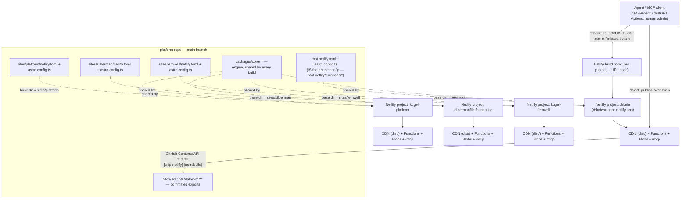

# Deployment, Configuration & Scripts

> **Status:** verified against the `platform` repo commit `6789644` (2026-09-05). Code is truth; every claim cites a file path. Claims that could not be verified from code are quarantined under **Unverified / open**. Status tags: `[CURRENT]` `[INHERITED]` `[DEPRECATED]` `[EXPERIMENTAL]` `[GENERATED]` `[CANONICAL]` `[DOC-ONLY]`.
> Companion docs: [`ARCHITECTURE.md`](ARCHITECTURE.md) · [`AI_CONTEXT.md`](AI_CONTEXT.md) · [`DATA_CONTRACTS.md`](DATA_CONTRACTS.md) · [`KNOWN_ISSUES.md`](KNOWN_ISSUES.md) · [`GLOSSARY.md`](GLOSSARY.md).

## Purpose

This document is the deployment/ops reference for the Kugel platform monorepo (the `platform` repo, commit `6789644`): how the four tenant sites map to Netlify projects, what each build actually runs, how a function shim is wired, every environment variable the server layer reads and what happens when it is absent, how a code change vs. a content change goes live, and what CI actually gates. It also records a full, timed run of the repo's own checks (`npm ci`, `astro check`, `eslint`, `npm test`, `npm run build`, a per-tenant build) executed on 2026-09-05.

Ground truth is code (`packages/core/**`, `netlify.toml`, `scripts/**`, `.github/workflows/actions.yaml`); `docs/**` and `README.md` are cited only where they diverge from it — see `## Defects / drift found`.

## Topology



Key asymmetry: publishing content (`object_publish`) never triggers a Netlify build — it only commits the derived export JSON to `main` with a `[skip netlify]` marker (`packages/core/server/lib/object-publish.ts:87` `NETLIFY_SKIP_MARKER`). Only `release_to_production` (`packages/core/server/lib/production-release.ts`) fires a project's build hook. A code push to `main` (no `[skip netlify]`) triggers Netlify's normal per-project build per the `ignore` command in each `netlify.toml`.

## Netlify projects & base directories

Four Netlify projects share this one repo, distinguished by **base directory**:

| Tenant | Netlify project | Base directory | Config source |
|---|---|---|---|
| drlurie | drluriescience.netlify.app | repo root | `netlify.toml`, `astro.config.ts` |
| platform | kugel-platform | `sites/platform` | `sites/platform/netlify.toml`, `sites/platform/astro.config.ts` |
| zilberman | zilbermanfilmfoundation | `sites/zilberman` | `sites/zilberman/netlify.toml`, `sites/zilberman/astro.config.ts` |
| fernwell | kugel-fernwell | `sites/fernwell` | `sites/fernwell/netlify.toml`, `sites/fernwell/astro.config.ts` |

`sites/platform/netlify.toml:6-11` states the mechanism explicitly: "Set the Netlify project's BASE DIRECTORY to `sites/platform` — that is what makes Netlify read this file instead of the repo-root one." drlurie is the sole root-deployed tenant (`sites/drlurie/astro.config.ts:1-12`, "T14.3 repoints the Netlify projects" — never done).

### `netlify.toml` diff — root (drlurie) vs. platform/zilberman/fernwell

`sites/platform/netlify.toml`, `sites/zilberman/netlify.toml`, and `sites/fernwell/netlify.toml` are **byte-identical except for the site slug in comments/paths** (verified: `diff` of the three files after normalizing the slug shows zero content differences). The root file differs in three structural ways:

| Aspect | Root (`netlify.toml`) | Per-tenant (`sites/{platform,zilberman,fernwell}/netlify.toml`) |
|---|---|---|
| `[build].command` | `npm run build` (`netlify.toml:2`) | Self-healing one-liner: resolve/install the workspace astro with `--no-install` guard, run `validate-upload-images.mjs` against site-relative `assets/images data/post`, `astro build --config astro.config.ts`, then best-effort `tracking-dims-push.mjs --export-root data/site` (e.g. `sites/platform/netlify.toml:32`) |
| `[build].ignore` | none — every push always builds | `git -C ../.. diff --quiet $CACHED_COMMIT_REF $COMMIT_REF -- sites/<slug> packages/core` (e.g. `sites/platform/netlify.toml:40`) — skips the build unless that tenant's dir or `packages/core` changed |
| Legacy content redirects | 5 extra 301s: `/blog`, `/topics`, `/topics/*`, `/shop`, `/early-access` (`netlify.toml:214-236`) | absent — these are drlurie-specific legacy URLs |
| `postbuild` | separate npm script, absolute `--export-root sites/drlurie/data/site` (`package.json:18`) | folded into the one build command, site-relative `--export-root data/site` |

Identical across all four (P1 parity law, enforced by `packages/core/cli/admin-parity.mjs:154-160` `CANONICAL_TOML_POSTURE`, byte-compared):
- `publish = "dist"`; `NODE_VERSION = "20"`; `SECRETS_SCAN_OMIT_KEYS = "GITHUB_REPOSITORY"` (the repo's own `owner/repo` string trips the secrets scanner in ordinary prose — see each file's comment, e.g. `netlify.toml:8-13`).
- `[build.processing.html] pretty_urls = false`; the `/_astro/*` immutable-cache header; the report-only CSP (`script-src 'self' 'unsafe-inline'`, Google Fonts, YouTube-nocookie/Vimeo frames — comment cites `tests/netlify/csp-drift.test.ts` as the hosts-drift gate).
- `[functions] directory = "netlify/functions"`, `node_bundler = "esbuild"`.
- Three scheduled functions, identical schedules: `mcp-keepalive` (`*/5 * * * *`), `membership-sweep` (`17 3 * * *`), `editorial-request-sweep` (`*/5 * * * *`).
- The full redirect table for `/pdf/*`, `/img/*`, `/mcp`, `/api/plugin/*` (ChatGPT Actions facade), `/api/plugin-install`, the six OAuth well-known/`oauth/*` paths, `/api/t` (tracking ingest), the unforced `/admin/content/:objectId` and `/admin/requests/:requestId` single-segment rewrites, and the `/admin/{content,templates,studio,media,traffic}` 301 collapses onto `/admin/objects` and `/admin/analytics`.

**Enforcement**: `scripts/audit-site-admin-parity.mjs` (99 lines) drives `packages/core/cli/admin-parity.mjs` (1015 lines) per `--site`/`--root`/`--all`, checking TOML posture, function-shim completeness/wiring, and admin-critical env — `npm run fleet:parity`. `tests/netlify/site-config-drift.test.ts` (94 lines) independently asserts, per tenant, that the `[[redirects]]` table parsed out of `netlify.toml` deep-equals that tenant's `site.config.ts` `redirects` array, and that `config.yaml`'s `site:` URL equals `site.config.ts`'s `canonicalHost` — **but only for `drlurie`, `platform`, and `fernwell`** (`tests/netlify/site-config-drift.test.ts:40-62`); `zilberman` has both a `netlify.toml` and a `site.config.ts` (`sites/zilberman/site.config.ts` exists) but is absent from the `TENANTS` array — see `## Defects / drift found` #1.

## Build pipeline

Entry chain: `astro.config.ts` (root) → `sites/drlurie/astro.config.ts` → `packages/core/app/site-astro-config.ts`. Every other tenant's `sites/<client>/astro.config.ts` calls the same shared factory directly.

- **Root `astro.config.ts`** (12 lines) is a one-line re-export: `export { default } from './sites/drlurie/astro.config';` — kept so `npm run build`/`astro check`/the live root Netlify project keep working unchanged (comment cites "until T14.3", never completed).
- **`sites/drlurie/astro.config.ts`** calls `defineSiteAstroConfig({ siteDir: 'sites/drlurie', site: siteConfig.canonicalHost, imageDomains, outDir: 'dist' })` — `outDir` is pinned to the repo-root `dist` (comment: "the live Netlify project publishes `dist`... a new site scaffolded after this gets the default `sites/<client>/dist`"). `sites/{platform,zilberman,fernwell}/astro.config.ts` omit `outDir`, so they build to `sites/<client>/dist` (confirmed live: the `npx astro build --config sites/platform/astro.config.ts` run below wrote to `sites/platform/dist`, not the shared root `dist`) — per-tenant builds do **not** share one output directory.
- **`packages/core/app/site-astro-config.ts`** (`defineSiteAstroConfig`, 198 lines) is the shared shell:
  - `root` is always `REPO_ROOT`; only `srcDir` (`<siteDir>/app`), `publicDir` (`<siteDir>/public`), and `outDir` move per site.
  - `output: 'static'` (no hybrid/SSR — confirmed by the build log: `[build] output: "static"`).
  - Integrations: `tailwind` (absolute `configFile`, `applyBaseStyles:false`), `sitemap`, `mdx`, `react` (scoped to `/admin/*` islands — comment: "No public page mounts a React component"), `icon` (tabler + a curated flat-color-icons subset), `astro-compress` (CSS+HTML+JS, images/SVG off), the vendored `astrowind` integration (`config: path.join(siteRoot, 'config.yaml')`, absolute), `shellRoutes()` (injects `/admin/*` — "fleet law — injected, not copied per site"), `siteRedirectsFile({siteDir})` (serves retirement redirects), `identityEmailTemplates()` (publishes 4 Netlify Identity e-mail templates under `/emails/identity/*.html` — confirmed in every build log). `partytown` is defined but gated behind `hasExternalScripts = false` (line 73) — never actually loaded.
  - Three Vite aliases carry the whole per-site seam (lines 12-27, 188-193): `~/` → `packages/core/app` (the shell, "fleet law: identical bytes for every client"), `~/assets/` → `<siteRoot>/assets` (an exception carved out of `~/` because stored content bakes in that literal prefix), `@core/` → `packages/core`, `@site/` → `<siteRoot>` (resolved per build).
  - `vite.ssr.noExternal` force-bundles `@contentful/rich-text-html-renderer`/`-types` (dual CJS/ESM packages that break under Node 20's ESM loader — comment cites fernwell's first build failure as the discovered case).
- **`vendor/integration/`** (`[INHERITED]`, 345 lines total) is the original AstroWind theme integration, kept and still load-bearing: `vendor/integration/index.ts` loads `config.yaml`, exposes it as the virtual module `astrowind:config` (`SITE`, `I18N`, `METADATA`, `APP_BLOG`, `UI`, `ANALYTICS`), calls `updateConfig({site, base, trailingSlash})`, and on `astro:build:done` rewrites `robots.txt` with the sitemap URL. `vendor/integration/utils/configBuilder.ts` (203 lines) defines the merge-with-defaults shape for every `config.yaml` key. The virtual module is imported by 24+ files across `packages/core/app` (metadata/SEO tags, blog listing/pagination, related posts, theme toggle, footer, site verification tag) — still fully load-bearing, not vestigial.
- **`sites/<client>/config.yaml`** — keys still read: `site.name/site/base/trailingSlash/googleSiteVerificationId`, `metadata.*` (SEO defaults, OpenGraph, Twitter card), `i18n.language/textDirection`, `apps.blog.*` (post/list/category/tag pathnames + robots), `ui.theme`. All four tenants enable `apps.blog` and use `ui.theme: 'system'`; the one real difference is the list pathname — `sites/drlurie/config.yaml:47` and `sites/{zilberman,fernwell}/config.yaml:43` use `learn/library`, while `sites/platform/config.yaml:43` uses the plain `library` (platform's manual/wiki content sits under a different top-level path than drlurie's marketing "Learn" section).
- **`sites/<client>/site.config.ts`** carries the canonical host, image domains, `siteId`, and the `redirects` array asserted against `netlify.toml` by the drift test above.

### MCP + OAuth server and the ChatGPT Actions facade

`packages/core/server/functions/mcp.ts` (1911 lines) is the single MCP tool router shared by every tenant — `configureMcp({ saveArtifactHandler, objectStoreHandler, deployStatusHandler, ...verifyArticleImagesHandler? })` lets each site's shim inject its own `SiteBinding`-bound handlers (see Function shims). `packages/core/server/functions/mcp-oauth.ts` (390 lines) is the co-located OAuth 2.1 authorization server (RFC 9728 protected-resource metadata, RFC 8414 server metadata, RFC 7591 dynamic client registration, `/oauth/{authorize,consent,token,revoke}` — `/oauth/consent` is the one endpoint gated on Netlify Identity, everything else is public protocol surface). One function serves every OAuth endpoint; the `netlify.toml` redirect table (identical across all four tenants) is what splits it into named paths via an `oauth_endpoint` query hint, with the endpoint path itself staying authoritative. `plugin-actions.ts` (root shim; core fn shares the same name) is a thin ChatGPT-Actions facade over the same tool set and the same OAuth — "it holds no credential and adds no business logic of its own" (`netlify.toml` comment) — routed by the `/api/plugin/*` splat so the tool name (the last path segment) never needs a routing-table change when the plugin charter grows. `plugin-install.ts` is deliberately a separate, unauthenticated-read path (`/api/plugin-install`, outside the `/api/plugin/*` charter prefix) serving the public install page's facts; file downloads behind `?download=` are still gated on tenant membership.

### `tsconfig.json` and per-site typecheck

Root `tsconfig.json` (`extends: astro/tsconfigs/base`) hardwires `paths`:
```
"~/assets/*": ["sites/drlurie/assets/*"],
"~/*": ["packages/core/app/*"],
"@core/*": ["packages/core/*"],
"@site/*": ["sites/drlurie/*"]
```
`@site/*` and `~/assets/*` resolve to **drlurie only** — a static analysis tool (an editor's TS server, `tsc --noEmit`) opened at the repo root sees drlurie's `@site/*` imports resolve, but the identical `@site/*` import inside `sites/platform/app/**` would resolve to the wrong tree under plain `tsc`. This does not affect the real build (Astro/Vite resolves the alias per-config, correctly, via `site-astro-config.ts`'s `vite.resolve.alias`) or `astro check` (see `## Defects / drift found` #2 for the real consequence: `check:astro` only ever checks drlurie).

`tsconfig.test.json` (used by `npm test`'s first stage) targets Node/`NodeNext`, includes `netlify/**`, `packages/core/**`, `sites/**/*.ts`, `tests/**`, but **excludes** `packages/core/app/**`, `sites/*/app/**`, `sites/*/astro.config.ts`, and the React admin surface (`.tsx` files, `admin/index.ts`, `components/**`, `lib/registry/components/index.ts`) — comment: "the app SHELL is Astro/Vite territory... none of which tsc can see." `tests/netlify/tsconfig.json` is a narrower sibling (`outDir: ../../.tmp/save-opt-in-test`) used only by `npm run test:opt-in`, including `netlify/**`, `packages/core/lib/tracking/loader/**`, and its own local tests.

`eslint.config.js` (flat config): `@eslint/js` recommended + `eslint-plugin-astro` flat/recommended + `typescript-eslint` recommended, astro-eslint-parser for `.astro` files, `react-hooks/rules-of-hooks` as an **error** specifically for `.tsx` (comment: this is the one net that catches a hooks-after-early-return bug, because `tsconfig.test.json` excludes admin `.tsx` and `astro check` "type-checks them without knowing what a hook is" — i.e. ESLint is the *only* gate on that class of admin-UI bug). `exhaustive-deps` deliberately off (25 pre-existing warnings). Ignores `.tmp` (build-diff worktrees + compiled test output) so linting never triples on itself.

`.prettierrc.cjs`: `printWidth:120`, single quotes, `es5` trailing commas, `prettier-plugin-astro` for `.astro` files.

`tailwind.config.js`: `content` globs are **absolute** (`path.join(REPO_ROOT, dir, ...)` for `packages/core`, `sites`, `src`) specifically because Netlify builds from a tenant's base directory, not the repo root — a relative glob silently resolved to nothing and turned every `@apply` into a "class does not exist" build error (comment, lines 10-13).

## Function shims

Root `netlify/functions/*` (50 files) is drlurie's function set. Each `sites/{platform,zilberman,fernwell}/netlify/functions/*` directory carries **49** files — an exact diff (`diff <(ls netlify/functions/) <(ls sites/platform/netlify/functions/)`) shows the root has exactly one extra file, `verify-article-images.ts`, which the other three do not carry.

**Pattern** (confirmed against `netlify/functions/object-store.ts` and `sites/platform/netlify/functions/mcp.ts`): every shim is a thin, mechanical wire —
```ts
import '../../sites/drlurie/config/policy-bindings.js';           // side-effect: registers policy providers
import { createHandler } from '../../packages/core/server/functions/object-store.js';
import { drlurieSiteBinding } from '../../sites/drlurie/config/site-binding.js';
export * from '../../packages/core/server/functions/object-store.js';
export const handler = createHandler(drlurieSiteBinding);          // or `export default` for Functions-2.0 fns
```
`packages/core/server/functions/*.{ts}` (52 files, 4 are `*.test.ts`, so **48** deployable core functions) is fleet law; `packages/core/cli/create-site.mjs:coreFunctionNames()` (line 1889) enumerates that directory as the "expected" shim set, and `admin-parity.mjs`'s `function-shims`/`shim-wiring` checks (lines 456-506) assert every expected name has a same-named shim in each tenant's `netlify/functions/`, importing `server/functions/<name>.js`, the `policy-bindings.js` side-effect import, and the correct export form (`export default` for a Functions-2.0 core fn detected via `export const config`, else a named `handler`).

`verify-article-images.ts` is **not** one of the 48 core functions (`packages/core/server/functions/` has no such file) — it is a drlurie-only, fully self-contained function (669 lines, reads `PUBLISH_SECRET`/`NETLIFY_PUBLISH_SECRET` directly) that the parity audit therefore never flags as "missing" on the other tenants. `netlify/functions/mcp.ts:1-16` documents the asymmetry explicitly: "`verify-article-images` stays at the repo root and is still INJECTED rather than imported by core: it is a per-site function, and it serves the object path..., not just the retired legacy one." `sites/platform/netlify/functions/mcp.ts:4-7` states the converse: "This site has no legacy article path, so the legacy trio is not injected and the tools that need it are absent from this site's tool list — the correct outcome, not a gap." Net effect: only drlurie's `/mcp` advertises a `verify_article_images` tool.

One further asymmetry, unrelated to parity tooling: `netlify/functions/admin-traffic.ts` (present in all four shim sets) is a **one-line compatibility re-export** — `export { handler } from './admin-analytics.js';` — with a comment marking it for deletion "once the old path has had a full deploy cycle with no traffic" (T21.9b). It has not been removed; see `## Defects / drift found` #7.

| Tenant | Function count | Notes |
|---|---|---|
| drlurie (root `netlify/functions/`) | 50 | 48 core shims, +`verify-article-images.ts` (site-only), +`admin-traffic.ts` (deprecated shim) |
| platform / zilberman / fernwell | 49 each | 48 core shims + `admin-traffic.ts`; missing `verify-article-images.ts` by design (no legacy article path) |

### Scheduled functions (identical schedules on all four `netlify.toml`)

| Function | Schedule | Purpose | Consequence if undeclared |
|---|---|---|---|
| `mcp-keepalive` | `*/5 * * * *` | Probes `/mcp` and, since every tenant's `SiteBinding` sets `warmAdminKeepalive: true` (`sites/*/config/site-binding.ts`), also the admin-object/admin-audit read path (`/admin/content` TTFB), to avoid the ~5-15min cold-start reclaim; logs a structured latency line per probe. `MCP_KEEPALIVE_DISABLED=true` turns it off without a deploy. | `/mcp` cold-starts on the next real agent call, which can be slow enough to blow an MCP client's `initialize` timeout — the "cannot connect" symptom the function exists to prevent |
| `membership-sweep` | `17 3 * * *` (daily) | Expires stale invitations, purges removed memberships past their grace period, reports queued identity deletes | Invitations never expire, removed members never purge |
| `editorial-request-sweep` | `*/5 * * * *` | Derives every running editorial request's status from CMS-Agent's run state, appends progress to attached chats, nudges a dead driver up to 3 times | A request never leaves `queued` — "close the window and come back" breaks |

Both `admin-parity.mjs`'s `netlify-functions-config` check (lines 508-529) and the `[[functions."<name>"]] schedule = ` presence in each `netlify.toml` are required together — Netlify deploys a scheduled function's code regardless, but it **only ever runs** if the schedule block is declared (P1 law, enforced by the parity audit, not by Netlify itself).

## Configuration files

| File | Role | Status |
|---|---|---|
| `astro.config.ts` (root) | Re-exports `sites/drlurie/astro.config` | `[CURRENT]` |
| `sites/<client>/astro.config.ts` | Thin entry calling `defineSiteAstroConfig` | `[CURRENT]` |
| `packages/core/app/site-astro-config.ts` | Shared Astro config factory (aliases, integrations, image/markdown/vite config) | `[CURRENT]` |
| `sites/<client>/config.yaml` | AstroWind-inherited site/metadata/blog/i18n/theme config, loaded by `vendor/integration` | `[INHERITED]`, still consumed |
| `sites/<client>/site.config.ts` | Canonical host, image domains, siteId, `redirects[]` (drift-tested against `netlify.toml`) | `[CURRENT]` |
| `sites/<client>/config/site-binding.ts` | `SiteBinding` instance: `siteId`, `env` (env-var name lists), `dataRoot`, `warmAdminKeepalive` | `[CURRENT]` |
| `sites/<client>/config/policy-bindings.ts` | Side-effect module registering per-site approval/creation/media policy providers | `[CURRENT]` |
| `packages/core/server/lib/site-binding.ts` | `SiteBinding` type + `PLATFORM_ENV_NAMES` (the Netlify-standard env-name chains) + `readBoundEnv` (live, uncached lookup) | `[CURRENT]` |
| `tsconfig.json` | Root TS config; `@site/*`/`~/assets/*` hardwired to drlurie (defect #2) | `[CURRENT]` with a known gap |
| `tsconfig.test.json` | Node-test compile target for `npm test`'s first stage; excludes the Astro/React shell | `[CURRENT]` |
| `tests/netlify/tsconfig.json` | Narrower compile target for `npm run test:opt-in` | `[CURRENT]` |
| `eslint.config.js` | Flat ESLint config across `.ts/.tsx/.astro` | `[CURRENT]` |
| `.prettierrc.cjs` | Formatting rules + `prettier-plugin-astro` | `[CURRENT]` |
| `tailwind.config.js` | Shared Tailwind config, absolute content globs | `[CURRENT]` |
| `vendor/integration/**` | Vendored AstroWind Astro integration (config.yaml loader, `astrowind:config` virtual module, robots.txt/sitemap wiring) | `[INHERITED]`, load-bearing |
| root `netlify.toml` | drlurie's Netlify project config | `[CURRENT]` |
| `sites/{platform,zilberman,fernwell}/netlify.toml` | Per-tenant Netlify project config | `[CURRENT]` |
| `Dockerfile`, `docker-compose.yml`, `nginx/nginx.conf`, `vercel.json` | AstroWind-template deployment alternatives | `[INHERITED]`, dead (see defects) |

## Environment variables

The authoritative census is `scripts/fleet-capability-probe.mjs`'s `T11_7_ENV_COVERAGE` map (lines 100-251), which classifies every provisioning-relevant env var against one of the 11 `capability_status` families (`packages/core/server/lib/capability-status.ts:39-50` `CAPABILITY_FAMILIES`) or `family: null` with an inline reason. Grepping `process.env\.` across `packages/core/server`, `netlify`, `sites/*/netlify`, and `scripts` turns up the same ~45 names plus platform-injected ones (`NETLIFY`, `URL`, `CONTEXT`, `DEPLOY_URL`, `BRANCH`, `AWS_LAMBDA_FUNCTION_NAME`, `LAMBDA_TASK_ROOT`).

### Gated families (`capability_status`, `packages/core/server/lib/capability-status.ts`)

Each family delegates to one `*MissingEnvVars` predicate that is also the real call path's own gate — "exactly one place per family the required env-var names are declared" (file header).

| Family | Env vars | Missing-vars fn | Degrade behavior |
|---|---|---|---|
| `pdf_bridge` | `PDF_TOOL_BASE_URL`, `PDF_TOOL_AGENT_RUN_TOKEN` | `pdfToolBridgeMissingEnvVars` (`pdf-tool-client.ts:27`) | pdf-tool bridge calls return a typed `pdf_tool_bridge_not_configured` error, never a throw |
| `pdf_storage_grant` | `PDF_TOOL_STORAGE_SITE_ID`, `PDF_TOOL_STORAGE_TOKEN` | `pdfToolStorageGrantMissingEnvVars` (`pdf-tool-storage-grant.ts:83`) | pdf-tool cannot write this tenant's artifact stores |
| `commerce` | `STRIPE_SECRET_KEY` (live) or `STRIPE_SECRET_KEY_TEST` (test, default mode) | `commerceMissingEnvVars` (`stripe-env.ts:49`) | Stripe client unavailable; product checkout disabled. `STRIPE_MODE` selects live/test (default `test` — "a missing flag must never charge real cards") |
| `purchase_token` | `PURCHASE_TOKEN_SECRET` (≥16 chars) | `purchaseTokenMissingEnvVars` (`purchase-tokens.ts:57`) | digital-goods delivery tokens cannot be minted/verified. **Not yet listed in `docs/cms-architecture/cms-pipeline/T11.7-provisioning-cli.md`'s env table** — flagged in-code as a P2 gap (`fleet-capability-probe.mjs:248-251`) |
| `build_hook` | `NETLIFY_BUILD_HOOK_URL` | `netlifyBuildHookMissingEnvVars` (`netlify-deploys.ts:63`) | `release_to_production` cannot trigger a build |
| `deploy_lookup` | `NETLIFY_SITE_ID`/`SITE_ID` + `NETLIFY_AUTH_TOKEN`/`NETLIFY_BLOBS_TOKEN` | `netlifyDeployLookupMissingEnvVars` (`netlify-deploys.ts:48`) | `deploy_status`/release confirmation degrades to best-effort (no live-production confirmation) |
| `git_committer` | `GITHUB_CONTENT_TOKEN`, `GITHUB_REPOSITORY` (`GITHUB_BRANCH` optional, defaults `main`) | `gitCommitterMissingEnvVars` (`object-git-committer.ts:119`) | `object_publish` throws `not_configured` (500) — publishing is fully blocked |
| `blob_credentials` | `NETLIFY_SITE_ID`/`SITE_ID` + `NETLIFY_BLOBS_TOKEN`/`NETLIFY_AUTH_TOKEN` (`NETLIFY_BLOBS_API_URL` optional override) | `blobCredentialsMissingEnvVars` (`blob-store.ts`) | Falls back to the Lambda blob context, then to a local file-backed store under `.netlify/local-blobs/` (`local-blobs.ts`) — never a hard failure |
| `mcp_auth` | `MCP_HTTP_AUTH_TOKEN` | trivially true once observed (gate runs before any tool handler) | unset = **auth gate open** (`site-binding.ts:37`, "gate open when the variable is unset") |
| `artifact_upload` | `ARTIFACT_UPLOAD_TOKEN_SECRET` (optional: `ARTIFACT_UPLOAD_MAX_BYTES`, `ARTIFACT_UPLOAD_MAX_IMAGE_DIMENSION_PX`) | `artifactUploadMissingEnvVars` (`artifact-upload.ts:82`) | signed upload-intent tokens cannot be minted |
| `mail` | `MAIL_PROVIDER` (only `resend` supported — `mail/index.ts:65`), `MAIL_API_KEY`, `MAIL_FROM` (`MAIL_REPLY_TO` optional) | `mailMissingEnvVars` | unset/`none` is a **deliberate opt-out**, not a gap — request-notification e-mail silently doesn't send |

**Not yet a `capability_status` family**: the CMS-Agent bridge. `packages/core/server/lib/agent/cms-agent-client.ts:206-223` defines `cmsAgentMissingEnvVars`/`isCmsAgentConfigured` (`CMS_AGENT_MCP_ENDPOINT`, `CMS_AGENT_MCP_TOKEN`) "mirroring pdf-tool-client's T16.5 arrangement" but the comment says "any **future** capability-status family" — it was never added to `CAPABILITY_FAMILIES`, and `T11_7_ENV_COVERAGE` doesn't mention either var at all. `capability_status`/`fleet-capability-probe` therefore cannot detect a tenant with a dead CMS-Agent bridge; only the admin chat itself fails closed with `cms_agent_not_configured` at call time. See `## Defects / drift found` #4.

### Other env vars in active use (not `capability_status`-gated)

| Var(s) | Purpose | Source |
|---|---|---|
| `PUBLISH_SECRET` / `NETLIFY_PUBLISH_SECRET` | Internal `x-publish-key` gate on `verify-article-images` and (per `site-binding.ts:36`) the intra-process publish-secret chain most MCP tool calls authenticate through | `site-binding.ts:80`, `netlify/functions/verify-article-images.ts:245` |
| `ADMIN_EMAILS` | Bootstrap Owner allowlist for `/admin` — "without it (and before any invite) NOBODY can sign in as owner/admin" | `admin-parity.mjs:170-174`, `packages/core/server/lib/users-store.ts:21` |
| `ROLE_EMAILS_ADMIN` / `_EDITOR` / `_PUBLISHER` | Environment-based role allowlists, same mechanism as `ADMIN_EMAILS` | `membership/verbs.ts`, `fleet-capability-probe.mjs:138-140` |
| `IDENTITY_URL` | Netlify Identity (GoTrue) endpoint override; optional, falls back to `${URL}/.netlify/identity` | `admin-parity.mjs:176-179` |
| `ANTHROPIC_API_KEY`, `OPENAI_API_KEY`, `ANTHROPIC_MODEL`, `OPENAI_CHATKIT_WORKFLOW_ID` | Admin agent-chat / legacy AI adapters | `fleet-capability-probe.mjs:165-168`; per `admin-parity.mjs:200-209` these keys are marked "legacy non-chat AI surfaces" — "admin chat itself is Client Manager-only" (i.e. routed through CMS-Agent, not these keys directly) |
| `CMS_AGENT_MCP_ENDPOINT`, `CMS_AGENT_MCP_TOKEN` | CMS-Agent Cloud Run `/mcp` endpoint + this tenant's scoped bearer | `site-binding.ts:49-52`, `admin-parity.mjs:211-222` |
| `TRACKING_SINK_URL`, `TRACKING_SINK_TOKEN`, `TRACKING_PROJECT_ID`, `TRACKING_SALT` | kugel-data tracking-sink endpoint/auth/tenant partition/hashing salt — "missing... degrades to" blob-mirror-only (client-side, not an MCP gate) | `fleet-capability-probe.mjs:159-162` |
| `NETLIFY_AUTH_TOKEN` / `NETLIFY_BLOBS_TOKEN` | Netlify Blobs + deploy-lookup credential (aliases, first non-empty wins) | `site-binding.ts:78,86` |
| `NETLIFY_API_TOKEN` | Distinct name used by `create-site.mjs --netlify-token` for site-creation/provisioning API calls (not a runtime server var) | `create-site.mjs` |
| `GITHUB_COMMIT_AUTHOR_NAME` / `_EMAIL` | Cosmetic git-author override for object-publish commits; has a site-identity default | `object-git-committer.ts:148-151` |
| `MCP_KEEPALIVE_DISABLED` | Ops knob — turns off the scheduled keepalive probe without a code change | `fleet-capability-probe.mjs:211` |
| `SKIP_RELEASE` | Read directly by at least one script/test path to bypass a live release step | grep hit in `packages/core/server`/`scripts` |
| `NETLIFY`, `NETLIFY_SITE_ID`/`SITE_ID`, `URL`, `DEPLOY_URL`, `CONTEXT`, `BRANCH`, `GITHUB_OUTPUT` | Netlify/GitHub-Actions-injected runtime context, never hand-set | various |

### Env vars named in docs/README but read only by dead code

| Var | Where it's described | Live reader? |
|---|---|---|
| `PUBLISH_SECRET` | README.md:165 (as part of the retired `publish-article.ts` flow) | **Yes** — but for the *current* system (`verify-article-images.ts`, `site-binding.ts`'s internal gate chain), not the README's described flow |
| `CLERK_SECRET_KEY`, `PUBLIC_CLERK_PUBLISHABLE_KEY` | README.md:169-170 | **No** — zero matches for `CLERK_SECRET_KEY`/`PUBLIC_CLERK_PUBLISHABLE_KEY` anywhere in `packages`, `netlify`, `sites`, `scripts`, `src` |
| `NETLIFY_PUBLISH_ENDPOINT` | README.md:175, 200 | **No** — zero matches in live code |
| `SAVE_JSON_BLOB_BASE_URL` | Not in README, but named in `fleet-capability-probe.mjs:213-216` | **No** — explicitly marked `'legacy — the save-json-blob pipeline was retired (OQ-W11-6); not provisioned for new clients.'` |

See `## Defects / drift found` #5 for the full scope of the README's staleness (it describes an entire retired publish pipeline, not a stray variable).

## Release protocol

### Code change

A push to `main` reaches Netlify's normal build/deploy pipeline **per project**, gated by each `netlify.toml`'s `[build].ignore`:
- **drlurie** (root base dir) has no `ignore` — every push rebuilds it, regardless of what changed.
- **platform / zilberman / fernwell** each run `git -C ../.. diff --quiet $CACHED_COMMIT_REF $COMMIT_REF -- sites/<slug> packages/core` — the build is skipped unless that tenant's own directory *or* `packages/core` changed (added after PR #501, 2026-08-04, when a `packages/core`-only change shipped stale functions to a tenant whose own `sites/<slug>` dir was untouched — comment in each file, e.g. `sites/platform/netlify.toml:33-39`).

So: a `packages/core` change rebuilds **every** tenant; a `sites/drlurie`-only change rebuilds only drlurie (root always builds) and none of the others (their ignore command sees no diff under `sites/<slug>` or `packages/core`).

### Content change (object publish + release)

1. An agent or human calls `object_publish` over a tenant's `/mcp`. `packages/core/server/lib/object-publish.ts` materializes the record to its committed export path (`materializers/*`) and commits it via the GitHub Contents API with the commit message carrying `[skip netlify]` (`object-publish.ts:87` `NETLIFY_SKIP_MARKER`) — this **does not** trigger a Netlify build. The verb then stamps `published_time` + `publish_receipt` on the object record. A publish receipt proves the export landed in git; it proves nothing about what is live.
2. Separately, `release_to_production` (`packages/core/server/lib/production-release.ts`, 345 lines) — called by the `release_to_production` MCP tool (agents) or the admin "Release to Production" button (humans), "shared by BOTH surfaces so there is one release path, never two" — resolves the target commit (defaults to the content branch HEAD via the GitHub ref API), POSTs the tenant's `NETLIFY_BUILD_HOOK_URL` exactly once via `triggerNetlifyBuild` ("the only thing here that can start a production build... there is deliberately no second env var and no other trigger path"), then polls Netlify deploy receipts until that commit's deploy reaches a terminal state, and reports whether production is confirmed to actually serve it (`ReleaseToProductionResult.released`/`productionConfirmed`).
3. `deploy-status.ts` (core function, root shim: `netlify/functions/deploy-status.ts`) and `netlify-deploys.ts` expose the same deploy-receipt polling as a standalone read (`deploy_status` MCP tool) so an agent can check progress without re-triggering a build.
4. Caveat documented in `production-release.ts:22-25`: the build hook only helps if the project's Netlify builds are active and "Auto Publishing" is unlocked — under a locked deploy, Netlify still builds but does not publish, and `released:false`/`productionConfirmed:false` is the only symptom.

## Local development

- `npm run dev` / `npm run start` both run bare `astro dev` (`package.json:15-16`) — with no `--config` flag this resolves the default `astro.config.ts`, i.e. **drlurie**.
- To develop another tenant: `astro dev --config sites/<client>/astro.config.ts` (documented in each `sites/<client>/astro.config.ts` header comment, e.g. `sites/platform/astro.config.ts:8`).
- No `netlify-cli`/`netlify dev` dependency or usage exists anywhere in `package.json` or the docs grepped (`netlify dev` returns zero hits) — local functions development relies on the blob-store fallback chain instead: `packages/core/server/lib/blob-store.ts` checks explicit API credentials, then the Lambda blob context, then falls back to `createLocalBlobStore` (`local-blobs.ts`), a file-backed store under `.netlify/local-blobs/` (gitignored). This means `astro dev` alone exercises real page rendering; exercising the Netlify Functions (`/mcp`, admin API) locally would need a separate invocation not documented in this repo (see `## Unverified / open`).

## CI

`.github/workflows/actions.yaml` (191 lines), triggers: `pull_request`/`push` to `main`. Jobs:

| Job | Matrix | Steps | Notes |
|---|---|---|---|
| `build` | `node-version: [20, 22, 24]` | `npm ci` → `npm run build` → `npm test` | 20 is Netlify's production version (comment: "CI must exercise it or a Node-20-only build failure ships uncaught") |
| `check` | Node 22 | `npm ci` → `npm run check` (astro+eslint+prettier) → `build-diff.mjs --self-test` → `schema-migration-gate.mjs` (`scripts/ci/schema-migration-gate.mjs`, per-site dry-run schema-migration classifier against committed exports) → `npm run test:opt-in` | |
| `discover-fleet` | — | `discover-fleet-matrix.mjs --base --head`, `fetch-depth:0` | Outputs the `sites` JSON list + `fan_out` boolean |
| `fleet` | `site: <discovered sites>` | `npm ci` → `npm run check:astro` → `npm run build` → `npm test` → conditional `sites/<site>/seeds/sync-site-seed.mjs --check` | Runs only if `discover-fleet` found ≥1 site |
| `fleet-build-diff` | `site: <discovered sites>` | `build-diff.mjs --base --head --site sites/<site>` (never fails the job; uploads a diff artifact) | PR-only, only when the diff fanned out beyond `sites/**` |

`scripts/ci/discover-fleet-matrix.mjs:discoverSites()` (line 33) enumerates **every** `sites/<name>/` directory carrying a `site.config.ts` — today that is all four tenants (`drlurie`, `fernwell`, `platform`, `zilberman` all have one). See `## Defects / drift found` #3 for why the `fleet` job's per-site matrix does not actually exercise each site distinctly.

`schema-migration-gate.mjs` compiles its own throwaway `tsc -p tsconfig.test.json` pass into `.tmp/ci-schema-gate/` (separate from `npm test`'s `.tmp/ci-test`) and calls `migrate-site.mjs`'s dry-run classifier per discovered site against its committed exports — "a failing site blocks merge."

## Scripts catalogue

### Root `package.json` scripts

| Script | Command | Purpose |
|---|---|---|
| `dev`/`start` | `astro dev` | Local dev server, drlurie by default |
| `build` | `node scripts/validate-upload-images.mjs && astro build` | Prebuild image-integrity gate, then the drlurie build |
| `postbuild` | `node scripts/tracking-dims-push.mjs --export-root sites/drlurie/data/site` | Best-effort push of object/producer/strategy dimensions to kugel-data; hardwired to drlurie's export root (defect #6) |
| `check` | `check:astro && check:eslint && check:prettier` | Full static-check gate |
| `check:astro` | `astro check` | Type/template check — **only against the default (drlurie) astro config** |
| `check:eslint` | `eslint .` | Lint |
| `check:prettier` | `prettier --check ...` | Format check, scoped to `src/**` and `scripts/**` |
| `fix` / `fix:eslint` / `fix:prettier` | — | Auto-fix variants |
| `test` | `tsc -p tsconfig.test.json` → `node --test` in `.tmp/ci-test` → `node --test tests/scripts/*.test.mjs` → `node --test packages/core/cli/capture/*.test.mjs` | Three-stage suite; exits non-zero if any stage fails |
| `test:e2e:browser` | `E2E_BROWSER=1 node tests/e2e/accept-router.browser.mjs` | Opt-in browser e2e (not run in this verification pass) |
| `test:opt-in` | `tsc -p tests/netlify/tsconfig.json` → `node --test .tmp/save-opt-in-test/tests/netlify/*.test.js` | Netlify-tsconfig-strict compile + e2e genesis/blob-path tests; CI-only until W14 T14.7 (was silently not running) |
| `site:create` | `node packages/core/cli/create-site.mjs` | Provisioning CLI |
| `capture:spike`/`map`/`theme`/`emit`/`preview`/`score` | `node packages/core/cli/capture/*.mjs` | The capture pipeline (spike a source site → map structure → derive theme → emit section_templates → render preview → score against a rubric) |
| `site:genesis` | `node scripts/site-genesis-drive.mjs` | Births a scaffolded site's starter objects through its own `/mcp` |
| `site:verify` | `site-genesis-drive.mjs --verify` | Read-only: proves genesis actually landed (MISSING/DRIFTED/OK per manifest entry) |
| `fleet:parity` | `node scripts/audit-site-admin-parity.mjs --all` | Repo-only admin-workspace parity audit, every tenant + root |
| `fleet:capability` | `node scripts/fleet-capability-probe.mjs --all` | Live per-tenant `capability_status` + cheap real-MCP-read probe |

### `packages/core/package.json` / `sites/*/package.json`

`@fleet/core` (`packages/core/package.json`) has no scripts — it's a workspace dependency target only (`react-markdown`, `remark-gfm`). Each `sites/<client>/package.json` (`@fleet/site-<client>` / `@drlurie/site-drlurie`) is a placeholder manifest with a single `@fleet/core: "*"` dependency and no scripts — "data + bindings only," the workspace link exists so npm resolves the monorepo graph, not because any site runs its own build tooling.

### `scripts/**` catalogue

**Genesis / provisioning**
| Script | One-line purpose |
|---|---|
| `site-genesis-drive.mjs` | Drives a scaffolded site's object-store birth over `/mcp`; genesis order is law (nav → site singleton → everything else), `--verify` mode is read-only |
| `audit-site-admin-parity.mjs` | Repo-only `/admin` workspace parity report per tenant (wraps `admin-parity.mjs`) |
| `audit-storage-grant-parity.mjs` | **Live** proof every tenant's pdf-tool storage grant (`PDF_TOOL_STORAGE_SITE_ID`) is its own, not shared with another tenant — cannot run repo-only |
| `fleet-capability-probe.mjs` | Live per-tenant `capability_status` + cheap real-MCP-read exercise (the full env census lives here, see Environment variables) |
| `provision-pdf-tool-stores.mjs` | Write/read/delete probe against the six Netlify Blob stores pdf-tool writes into via a Dr-Lurie storage grant |

**Seeds** (one-time or per-genesis data population, mostly superseded by `site-genesis-drive.mjs`'s generic seed-module path)
| Script | Purpose |
|---|---|
| `seed-navigation.mjs`, `seed-page-home.mjs` | T2.2/home-page object seeding via `object_create` |
| `seed-article-pdf-template.mjs` | Seeds the vendored `article_brochure_v1` pdf-tool template into any tenant |
| `seed-drlurie-pdf-defaults.mjs` | `[DEPRECATED]`-adjacent: one-time drlurie-only retrofit ("deliberately NOT part of that generic path") |
| `normalize-taxonomy-frontmatter.mjs` | One-time canonical-slug rewrite of legacy post frontmatter |
| `backfill-editorial-requests.mjs`, `backfill-visual-standard.mjs` | Backfill scripts for records that predate a registry/mechanism |

**Tracking**
| Script | Purpose |
|---|---|
| `tracking-dims-push.mjs` | postbuild hook pushing object/producer/strategy dims to kugel-data; degrades to `skipped: missing_configuration` with no env (confirmed in the verification run below) |
| `tracking-mirror-prune.mjs` | Deletes blob-mirrored tracking events older than 90 days (dry-run by default) |
| `tracking-mirror-replay.mjs` | Backfills the blob mirror into the owner sink, idempotent on `event_id` |

**Audits / CI**
| Script | Purpose |
|---|---|
| `validate-upload-images.mjs` | Prebuild gate: corrupt/mismatched committed upload image or dangling markdown reference fails the build |
| `verify-section-components.mjs` | Renders homepage sections through a real `astro build`, diffs against the live homepage output (structural-identity oracle) |
| `build-diff.mjs` | Two-ref (or working-tree-vs-ref) build + normalized HTML diff; the cutover acceptance gate and CI's `fleet-build-diff` mechanism |
| `measure-object-history.mjs` | Read-only sizing of `ObjectRecord.history[]` growth (offline or live) |
| `capture-preview-fixture.mjs` | Regenerates the T12.10 draft-preview fixture end-to-end against a synthetic source site |
| `ci/discover-fleet-matrix.mjs` | CI fleet discovery + change-scoped fan-out decision |
| `ci/schema-migration-gate.mjs` | Per-site dry-run schema-migration classifier against committed exports |

**Drills / one-off patches — `[DEPRECATED]` (targeted a past, now-closed migration/incident)**
| Script | Targeted event |
|---|---|
| `patch-nav-header-t28-t29.mjs` | T2.8/T2.9 one-time `nav_header` content decision (remove a dropdown item) |
| `patch-fernwell-admin-nav.mjs` | One-time fix for fernwell's missing admin nav group |
| `fix-about-portrait.mjs` | 2026-07-11 heal: a secrets-scanner-tripping portrait URL that blocked all production deploys |
| `restore-about-portrait.mjs` | 2026-07-12 remediation: an AI edit hallucinated a CDN URL onto the About portrait |
| `drill-footer-cta.mjs` | T2.7 acceptance drill: full agent-edit round trip on a trivial footer CTA change |
| `home-conversion-roundtrip.mjs` | Standing round-trip prover for one object family via MCP (generalizes the drill above) |
| `submit-navigation-review.mjs` | T2.3 one-time submission of the seeded nav drafts for review |

**`scripts/lib/**` (including `scripts/lib/pdf-templates/**`)**: pure helper/data modules backing the above (e.g. `object-store-client.mjs`, `html-normalize.mjs`, `roundtrip-drill.mjs`/`roundtrip-reconcile.mjs`, `tracking-prune.mjs`/`tracking-replay.mjs`, `json-schema-subset.mjs`, `article-template-seed.mjs`) — not independently invoked.

## Provisioning summary

`packages/core/cli/create-site.mjs` (2722 lines) — `--name <client> [--dry-run] [--netlify-token …] [--niche …] [--json]`. Scaffolds `sites/<client>/`: self-contained `config/site-identity.ts` + `config/site-binding.ts` + `site.config.ts` + `netlify.toml` + `package.json`, an empty committed-export tree, and a baseline seed pack (site singleton, nav skeleton, taxonomy skeleton, default theme, nine canonical section-template recipes). `--dry-run` touches neither disk nor network. `--netlify-token` additionally creates the Netlify site via the API, provisions blob stores (write→read→delete probe), and prints a real per-site env checklist. Secrets (`PUBLISH_SECRET`, `TRACKING_SALT`, `ARTIFACT_UPLOAD_TOKEN_SECRET`) are minted in memory and pushed straight to Netlify's env store — never written to disk or printed. Idempotent (only ever creates).

`scripts/site-genesis-drive.mjs` (`npm run site:genesis` / `site:verify`) then births that scaffold as real store objects through the new site's own `/mcp`: navigation first (site singleton's `defaultNavigation` refs must resolve), then the site singleton, then everything else — order is pinned by `tests/netlify/site-genesis.e2e.test.ts`. Per object: `object_get → object_create (if missing) → object_checkout → object_publish → object_checkin`, then one `release_to_production` at the end. `--verify` is strictly read-only and reports MISSING/DRIFTED/OK per manifest entry.

`npm run fleet:parity` (`audit-site-admin-parity.mjs --all`) and `npm run fleet:capability` (`fleet-capability-probe.mjs --all`) are the two standing proofs: the first repo-only (TOML posture, function shims, admin-critical env *names* present in the checklist), the second live (per-tenant `capability_status` + one cheap real MCP read per family where a safe one exists — e.g. `object_inventory` for `blob_credentials`, `deploy_status` with a zero-commit placeholder for `deploy_lookup`; `commerce`, `purchase_token`, `build_hook`, `git_committer` have no safe read-only exercise and are status-only).

`docs/cms-architecture/site-provisioning-runbook.md` (340 lines) sequences the human half: §1 scaffold, §2 create the Netlify site + provision stores, §3 what's still manual (env secrets, DNS, mail), §3a admin workspace/canvas bootstrap (human gate), §4 wiring a second deployment, §5 verifying the scaffold. `docs/cms-architecture/new-client-acceptance.md` (119 lines) frames the same sequence as Stage 0 (scaffold, owner: `create-site`) → Stage 1 (genesis, owner: `site-genesis-drive`) → live verification (law P3) → Stage 2 (onboarding, explicitly out of genesis scope).

## Defects / drift found

1. **`site-config-drift.test.ts` silently omits zilberman.** `tests/netlify/site-config-drift.test.ts:40-62`'s `TENANTS` array covers only `drlurie`, `platform`, `fernwell` — but `sites/zilberman/site.config.ts` and `sites/zilberman/netlify.toml` both exist (confirmed by listing) and are structurally identical to platform/fernwell's. Zilberman's redirect table and `config.yaml` site URL can drift from its `site.config.ts` with no test catching it, breaking the P1 parity law the test file's own header claims to enforce fleet-wide ("W15 S3 widened them fleet-wide"). Matters because this is exactly the class of silent drift the test was written to prevent.

2. **`npm run check:astro` only ever checks drlurie.** `check:astro` = bare `astro check` (`package.json:22`), which loads the default `astro.config.ts` — drlurie's. There is no `check:astro:platform` etc., and the CI `fleet` job's per-site matrix leg (below, #3) doesn't pass `--config` either. A type error confined to `sites/platform/app/**`, `sites/zilberman/app/**`, or `sites/fernwell/app/**` is invisible to both local `npm run check` and CI.

3. **CI's `fleet` job matrix does not actually build/check the matrix site.** `.github/workflows/actions.yaml:141-143` runs `npm run check:astro`, `npm run build`, `npm test` inside a `strategy.matrix.site` loop over every discovered tenant (`discover-fleet-matrix.mjs:discoverSites()` now returns all four: drlurie, fernwell, platform, zilberman), but **none of those three commands reference `${{ matrix.site }}`** — `check:astro`/`build` both resolve the default (drlurie) astro config regardless of which site the leg claims to be testing. The job's own comment (lines 120-124) says "Today's fleet is exactly [drlurie]... this job is the SAME build... until a second site's build is actually wired (T11.11)" — that comment is now stale (three more tenants exist with real `site.config.ts`/`netlify.toml`), and the wiring it defers was never done: the `fleet` job currently runs the identical drlurie build N times under N different site labels, giving false confidence that platform/zilberman/fernwell are independently CI-verified.

4. **CMS-Agent bridge has no `capability_status` family.** `packages/core/server/lib/agent/cms-agent-client.ts:206-223` implements `cmsAgentMissingEnvVars`/`isCmsAgentConfigured` in the same T16.5 single-predicate style as every other gated family, and its own comment calls out "any future capability-status family" — but `CAPABILITY_FAMILIES` (`capability-status.ts:39-50`) has 11 entries and none is `cms_agent`; `T11_7_ENV_COVERAGE` (`fleet-capability-probe.mjs`) never mentions `CMS_AGENT_MCP_ENDPOINT`/`CMS_AGENT_MCP_TOKEN` either. A tenant with a misconfigured or expired CMS-Agent bearer is invisible to both `capability_status` and `fleet:capability` — it only surfaces when admin chat is actually used and fails closed with `cms_agent_not_configured`.

5. **Root `README.md` describes a retired system, not this one.** *(Line numbers below are to `README.md` **as it stood at commit `6789644`**; the same 2026-09-05 pass replaced it and archived the original verbatim at `docs/history/README-astrowind-template.md`, which addresses this entry.)* The file was almost entirely the unmodified upstream AstroWind template README (marketing copy, Vercel demo link, unrelated theme screenshots) plus a section (README.md:150-217) documenting a `netlify/functions/publish-article.ts` Clerk-authenticated publish flow driven by `NETLIFY_PUBLISH_ENDPOINT`/`CLERK_SECRET_KEY`/`PUBLIC_CLERK_PUBLISHABLE_KEY`. None of this exists: `publish-article.ts` is not present anywhere in the repo, `CLERK_SECRET_KEY`/`PUBLIC_CLERK_PUBLISHABLE_KEY`/`NETLIFY_PUBLISH_ENDPOINT` have zero live readers, and there is no `agent:publish`/`agent:publish:dry-run` npm script. The legacy article pipeline this section describes was retired 2026-07-29 (`netlify/functions/mcp.ts:9-22`). `README.md:153` also claims `@netlify/blobs` is in `optionalDependencies` "so `npm install` can still complete in restricted... environments" — it is a normal `dependencies` entry today (`package.json:51`, inside the `dependencies` block opened at `:43`), and `package.json` has no `optionalDependencies` key at all. A future maintainer or agent reading only `README.md` would build against a publish mechanism that cannot possibly work.

6. **Root `postbuild` and `@site`/`~/assets` aliases are hardwired to drlurie.** `package.json:18` (`"postbuild": "node scripts/tracking-dims-push.mjs --export-root sites/drlurie/data/site"`) and `tsconfig.json`'s `paths` (`@site/*` → `sites/drlurie/*`, `~/assets/*` → `sites/drlurie/assets/*`) both name drlurie literally at the repo root. The per-tenant `netlify.toml` build commands correctly pass a site-relative `--export-root data/site` (folded into their one-line build command), so the *deployed* behavior is correct per tenant — but a root-level `npm run build && npm run postbuild` (exactly what CI's `build` job runs) always pushes drlurie's tracking dims, never a matrix site's, compounding defect #3's blind spot.

7. **`admin-traffic.ts` compatibility shim was never removed.** `netlify/functions/admin-traffic.ts` (present in all four tenants' shim sets) is a one-line re-export of `admin-analytics.ts`, explicitly commented "keeps the OLD function URL... for one wave... Remove this file once the old path has had a full deploy cycle with no traffic" (T21.9b). The renaming PR (#688, this repo's current HEAD, "Analytics: rename the Traffic admin surface...") is the very commit this clone is pinned to, so the shim is at most one release old — noted here so it isn't missed at the next cleanup pass, not urgent.

8. **Three-way Node version disagreement.** `.nvmrc` pins `24`; `package.json engines.node` allows `>=20.9.0`; every `netlify.toml`'s `NODE_VERSION` is `"20"` (production); CI's `build` job matrix tests `[20, 22, 24]` while `check`/`discover-fleet`/`fleet`/`fleet-build-diff` all pin `22`. A contributor running plain `nvm use` gets Node 24 locally — two majors ahead of what Netlify actually deploys — though CI does cover 20 in the `build` job, so a Node-20-only failure would still be caught before merge (this is a workflow/DX rough edge, not a proven live bug).

9. **`Dockerfile`/`docker-compose.yml`/`nginx/nginx.conf`/`vercel.json` are unreferenced AstroWind leftovers.** None appear in `.github/workflows/actions.yaml`, any `scripts/**` file, or any `netlify.toml`; the Docker image's static-`nginx` serving model has no equivalent for the Netlify Functions this system depends on for `/mcp`, `/admin/*`, tracking ingest, or Blobs — building this image would produce a non-functional deployment (no `/mcp`, no admin, no publish path). Low urgency (nothing wires them in), but worth deleting or clearly marking dead so a future agent doesn't attempt to "fix" the Docker path into a real deployment target.

## Unverified / open

- Whether `netlify dev` (or any local Functions runtime) is used at all in practice — no `netlify-cli` dependency, no script, no doc reference found; local dev as configured only exercises `astro dev` page rendering, not `/mcp`/admin functions. Not confirmed either way whether developers run Netlify CLI globally outside this repo's own manifest.
- Live values of `CACHED_COMMIT_REF`/`$COMMIT_REF` behavior under Netlify's actual build-skip evaluation (the `ignore` command) could not be exercised in this sandbox (no live Netlify project) — the skip logic was read from the `netlify.toml` comment and command text only, not observed live.
- Whether `SKIP_RELEASE` and `MCP_ENABLE_ADMIN_TOOLS` (both grepped as read somewhere) are still load-bearing in a current code path or are stale flags from an earlier wave — not traced to a specific call site in this pass.
- Live Netlify project settings (actual base directories, actual scheduled-function enablement, actual Auto Publishing lock state per tenant) — this task verified only what the *committed config* declares, not the live Netlify dashboard state for any of the four projects.
- Whether the "49 vs 48" function-shim count nuance reconciles exactly per `admin-parity.mjs`'s live `--all` run — the audit script was read but not executed in this pass (it needs `--site`/`--root`/`--all` and touches only the repo, so it *could* be run in a future pass at low cost). By file listing the delta is fully accounted for: 48 deployable core functions vs 49 files per non-drlurie tenant shim dir, the extra being the deprecated `admin-traffic.ts` re-export.
- Whether `docs/cms-architecture/cms-pipeline/T11.7-provisioning-cli.md`'s env checklist has since been updated to add `PURCHASE_TOKEN_SECRET` (the in-code comment at `fleet-capability-probe.mjs:248-251` flags it as missing as of the code version in this clone) — not independently confirmed against that doc's current text in this pass (docs are hints; the code-side gap is the verified fact).
- Whether any external CI (Netlify's own build logs, a GitHub branch-protection rule) requires the `check`/`build`/`fleet` jobs to pass before merge — `.github/workflows/actions.yaml` defines the jobs but branch-protection settings live in GitHub repo settings, not in this clone.

## Verification run log

All commands run in `/root/platform` on 2026-09-05 (commit `6789644`). No tracked file was modified by any step (`git status --short` was empty both before per-site builds and after the full sequence — confirmed twice). `node_modules/`, `dist/`, `sites/platform/dist/`, and `.tmp/` were created as build/install artifacts (all gitignored) and are not part of the deliverable.

| Step | Command | Duration | Result |
|---|---|---|---|
| 1 | `npm ci --no-audit --no-fund` | 18.4s | Success. 1059 packages added. One peer-dependency warning: `unstorage@1.15.0` (an `astro` transitive dep) wants `@netlify/blobs@^6.5.0 \|\| ^7.0.0 \|\| ^8.1.0`; this repo pins `@netlify/blobs@^10.7.0` directly — a version-range warning only, install succeeded and the app functions (confirmed by every later step). |
| 2 | `npm run check:astro` | 58.9s | **0 errors, 0 warnings, 50 hints** across 1478 files. All ~50 hints are pre-existing `ts(6133)`/`ts(7043)`/`ts(7027)`/`ts(7044)` (unused-var / implicit-any / unreachable-code) items in server-lib and test files — first ~20 distinct file:line locations captured in this run: `packages/core/server/lib/mcp-tool-handlers.ts:2050,2065,2079,2129,2258` (unused `event` param, ×5+), `packages/core/server/lib/object-retire.ts:184` (`commit` implicit any), `packages/core/server/lib/object-verbs.ts:2514` (unused `objectType`), `packages/core/server/lib/membership/verbs.ts:878` (unreachable code), `scripts/lib/roundtrip-drill.mjs:232` (unused `body`), `tests/netlify/member-link.test.ts:21`, `tests/netlify/save-opt-in.test.ts:90`, `tests/netlify/stripe-webhook.test.ts:170,216` (implicit-any `input`/`init` params, ×3 files). None are errors; `astro check`'s own summary line explicitly reports 0 errors / 0 warnings. |
| 3 | `npm run check:eslint` | 22.7s | Clean — zero output, exit 0. |
| 4 | `npm test` | 2m42s (2m39s on repeat run) | **All three stages passed, 5188/5188 tests, 0 failures.** Stage 1 (`tsc -p tsconfig.test.json` then `node --test` in `.tmp/ci-test`): 4742 tests, 525 suites, 0 fail, 128.3s. Stage 2 (`node --test tests/scripts/*.test.mjs`): 230 tests, 0 fail, 7.2s. Stage 3 (`node --test packages/core/cli/capture/*.test.mjs`): 216 tests, 0 fail, 2.2s. Zero `error TS` occurrences in the full log — the tsc compile stage had no failures. No test was skipped for network/env reasons; the full suite is self-contained (fixtures, mocked `fetch`, offline blob store). |
| 5 | `npm run build` | 46.3s | Success. Prebuild `scripts/validate-upload-images.mjs`: "Upload image validation passed: 0 images checked." Astro build: `output: "static"`, 107 pages built in 44.37s. Warnings observed: (a) `[glob-loader] No files found matching "*.md,*.mdx" in directory "src/data/post"` and later `The collection "post" does not exist or is empty` — expected, `src/data/post/` is intentionally empty (`.gitkeep` only, legacy pipeline retired 2026-07-29); (b) a Vite chunking warning that `packages/core/lib/admin/requests-store.ts` is both dynamically and statically imported (cosmetic, does not fail the build); (c) `[objectPage] NOT serving page_skincare_is_not_self_worth at /skincare-is-not-self-worth — blog_slug` — by design (`sites/drlurie/app/pages/[...objectPage].astro:51-54` loudly warns on any store-backed page whose route collides with a file-owned route; this is a stale/colliding demo content object, not a code defect). Postbuild `scripts/tracking-dims-push.mjs --export-root sites/drlurie/data/site`: `[tracking-dims] skipped: missing_configuration` — confirmed graceful no-op with no tracking-sink env configured (exit 0, does not fail the build). |
| 6 | `npx astro build --config sites/platform/astro.config.ts` | 37.3s | Success — proves the per-site build path independently of drlurie. 76 pages built in 35.25s, output to `sites/platform/dist` (a **separate** directory from the root build's `dist/` — confirms per-site builds do not share one output tree). Two content-reference warnings observed: `Entry pageObject → page_article was not found.` for `/governed-content-lifecycle-gates-agent-workflows/` and `/multisite-without-content-forks/` — a broken reference in platform's own manual-page content data, not a build failure (build still succeeded, page still emitted). |
| 7 | `git status --short` (after step 5) | — | Empty — no tracked file changed. |
| 8 | `git status --short` (after step 6) | — | Empty — no tracked file changed. `git checkout -- .` was **not** needed at any point in this run. |

Not run in this pass (out of scope / would require live credentials): `npm run test:e2e:browser` (browser e2e), `npm run fleet:capability` (needs live `MCP_HTTP_AUTH_TOKEN__<SLUG>` + deployed endpoints), `npm run fleet:parity` (repo-only and cheap — could be added in a follow-up verification pass), zilberman/fernwell standalone builds (platform's build was taken as sufficient proof of the shared per-site path; zilberman/fernwell's `astro.config.ts` are byte-for-byte the same shape).
