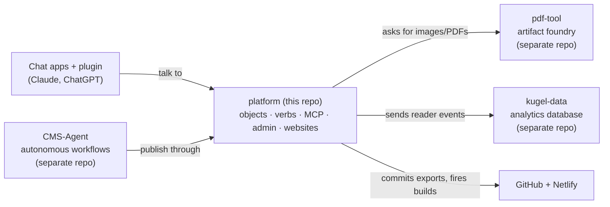
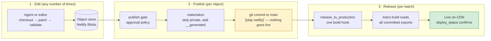

# Kugel Platform — plain-language overview

> For humans. Written 2026-09-05 from the verified architecture documents (commit `6789644`). If you want evidence for any sentence here, the technical docs linked at the bottom cite the exact file. Diagrams: the boxes below render on GitHub; the publish-vs-release picture and nine more from the technical docs are in [`diagrams/`](diagrams/) as SVG.

## 1. What this repository is, in one paragraph

`platform` is the **web-publishing half of the Kugel system**. It started life as a free website template (AstroWind) and has been rebuilt into an engine that runs several client websites from one codebase, and which is built so that **AI agents, not people, do the writing, editing and publishing** (every governed object type on drlurie except `product` and `editorial_voice` publishes autonomously today). Every piece of a site (a page, a section, an article, the menu, the colour theme, a product) is a typed JSON *object* stored in a per-client database (Netlify Blobs). Agents change objects through a small set of governed *verbs* (check out → edit → validate → publish → release) over each client's own MCP endpoint; the website is just a rendering of those objects, rebuilt when someone presses "release".

## 2. The four planes

| Plane | Repo | Job | Talks to platform how |
|---|---|---|---|
| **Publishing surface** | the `platform` repo (this) | Owns the content objects, renders the sites, serves the admin, exposes `/mcp` per client | — |
| **Autonomous agent plane** | `vreich-ui/cms-agent` | Workflows that research, write and publish without a human | Publishes by calling a client's `/mcp` like any other agent; the admin chat asks it to *think*, but the tools run here |
| **Artifact foundry** | `vreich-ui/pdf-tool` | Makes images, PDFs and PDF templates | Platform hands it a short-lived storage pass; it writes the files straight into the client's storage and returns a reference |
| **Analytics** | `vreich-ui/kugel-data` | Stores reader events and computes statistics | Platform relays events to it and reads back aggregates for `/admin/analytics` |

## 3. One engine, four client sites

| Client ("tenant") | Site | Role |
|---|---|---|
| **drlurie** | drluriescience.netlify.app | The real, worked example — the only site with traffic and a shop. It is deployed from the repository root, so the root config files are *its* files |
| **platform** | kugel-platform.netlify.app | The project's own site and manual — built as a tenant on purpose |
| **zilberman** | zilbermanfilmfoundation.netlify.app | A cloned client site (foundation) |
| **fernwell** | kugel-fernwell.netlify.app | A synthetic site kept to prove that engine changes propagate to every client |

Everything under `packages/core/` is shared "fleet law": change it once, every client gets it. Everything under `sites/<client>/` is that client's own data, settings and routes. A change to the engine that affects what a client folder must contain is not finished until it has been applied to all four (parity law P1).

## 4. How an article goes live

Three things are worth keeping straight, because they are the source of most confusion:

1. **The database is the truth, the git files are a copy.** Publishing writes a JSON *export* of the object into `sites/<client>/data/site/…` and commits it. Those files are generated. Editing them by hand changes nothing durable and will be overwritten.
2. **"Published" does not mean "live".** The publish commit carries `[skip netlify]`, so it does not build the site. "Release" is a separate action that fires one build containing *every* export committed since the last release. A publish receipt proves the export exists, not that readers can see it.
3. **Agents' private notes never reach the web.** Each article node has a `public` part (rendered) and a `private` part (strategy, intent, agent notes). The private part is stripped from the export and the page, and a validator refuses to publish anything that leaks it.

Images and PDFs follow their own path: pdf-tool makes them, they land in the client's blob storage, and the article only stores the public address `/img/<request>/<sha256>.webp`. The address is content-addressed, so a new image is always a new URL — there is nothing to cache-bust.

## 5. What is inherited from the template and what is Kugel

| | Inherited from AstroWind | Built for Kugel |
|---|---|---|
| **Still in use** | The page layout shell, header/footer, blog listing helpers, the `config.yaml` loader, Tailwind config | The object store and verbs, all schemas, publishing and release, the MCP + OAuth server, the admin app, the article renderer, tracking, the plugin export, membership, editorial requests, the provisioning CLI |
| **Dead weight** | 19 demo widgets, three demo landing pages, a Markdown layout, a Decap CMS folder, Docker/nginx/Vercel files, the old README | A retired OpenAI "publisher agent" function (still deployed, nobody calls it), a legacy base64 upload tool, 139 orphaned upload images from the deleted Markdown pipeline |

The old Markdown-blog way of publishing was deleted on 2026-07-29. Any document that still talks about `publish-article`, Clerk logins, ChatKit or `save_json_blob` describes history.

## 6. Tracking — what it measures and where the chain breaks

The sites run a **first-party, cookieless tracker**: page views, which sections and article blocks a reader actually saw, how long, how far they scrolled, clicks on calls-to-action, outbound links and "buy" buttons, form submissions and goals. Events go to `/api/t` on the same site, get enriched (country and region only — city is dropped; the IP is hashed into a daily visitor hash and discarded), and are relayed to kugel-data's Postgres. Netlify Analytics is a second, server-side feed. `/admin/analytics` shows both.

What this is *for* is to let CMS-Agent learn which content and which agent decisions perform. Today that loop is **not connected**: numbers reach a human dashboard and stop. The verified gaps that block the chain content → publication → exposure → engagement → conversion → revenue → agent decision are:

| Gap | Plain meaning |
|---|---|
| Purchase join key never matches; purchase "kind" never matches | Revenue can never be attributed to a reader session — two separate bugs, both must be fixed |
| No object *version* on events | We know an event hit article X, not which revision of X |
| Node strategy is empty for all new content | The "which persuasion block worked" join has been blank since the private-field strip on 2026-08-31 |
| Experiment/exposure events do not exist | kugel-data has an A/B machinery that nothing can feed |
| No workflow version on the producer record | Agents can compare prompts, not the graph that produced the article |

The good news: the measurement stack is deterministic and model-free, and kugel-data already produces the per-producer performance vector (`/rollups`). Closing the loop is mostly about adding a handful of identifiers, not building a new system. Details: [`TRACKING_ARCHITECTURE.md`](TRACKING_ARCHITECTURE.md) §15.

## 7. Health check (run 2026-09-05)

Install, type-check, lint, 5,188 tests and the drlurie build all pass; a second tenant (platform) builds independently. Caveat: the type-check and the CI "fleet" job only ever exercise drlurie's configuration.

## 8. The decisions that need you

| # | Decision | Recommendation |
|---|---|---|
| KI-7 | `SITE_NOT_YET_LIVE` forces *noindex* on every page of every site — drlurie's articles are published and listed in the sitemap, but every page also tells Google not to index it | Flip it to a per-site setting and switch drlurie on, or accept that nothing is indexed |
| KI-8/9 | Revenue attribution is structurally dead (two key mismatches) | Fix both before any "which content sells" analysis is trusted |
| KI-28 | `run-publisher-agent` is deployed on all four sites with no caller | Retire it |
| KI-22 | Anyone's release ships everyone's pending exports; a retry can double-build | Accept for now (single operator) or add a server-side guard |
| KI-11 | Node strategy dimension is empty for new content | Decide where strategy may live outside `private` (it is a neutral slug) |
| — | 139 orphaned upload images, two demo articles live in production, 19 dead widgets | Cleanup wave; no product risk |

The full list with severity is [`KNOWN_ISSUES.md`](KNOWN_ISSUES.md) (entries 7–62).

**Single next action:** rule on KI-7 (indexing) and KI-8/9 (revenue keys) — the two blockers that silently zero out the business signals everything else is meant to optimize.

## Where to read more

[`ARCHITECTURE.md`](ARCHITECTURE.md) · [`CONTENT_ARCHITECTURE.md`](CONTENT_ARCHITECTURE.md) · [`CMS_INTEGRATION.md`](CMS_INTEGRATION.md) · [`TRACKING_ARCHITECTURE.md`](TRACKING_ARCHITECTURE.md) · [`DEPLOYMENT.md`](DEPLOYMENT.md) · [`DATA_CONTRACTS.md`](DATA_CONTRACTS.md) · [`KNOWN_ISSUES.md`](KNOWN_ISSUES.md) · [`GLOSSARY.md`](GLOSSARY.md) · for agents: [`AI_CONTEXT.md`](AI_CONTEXT.md).
