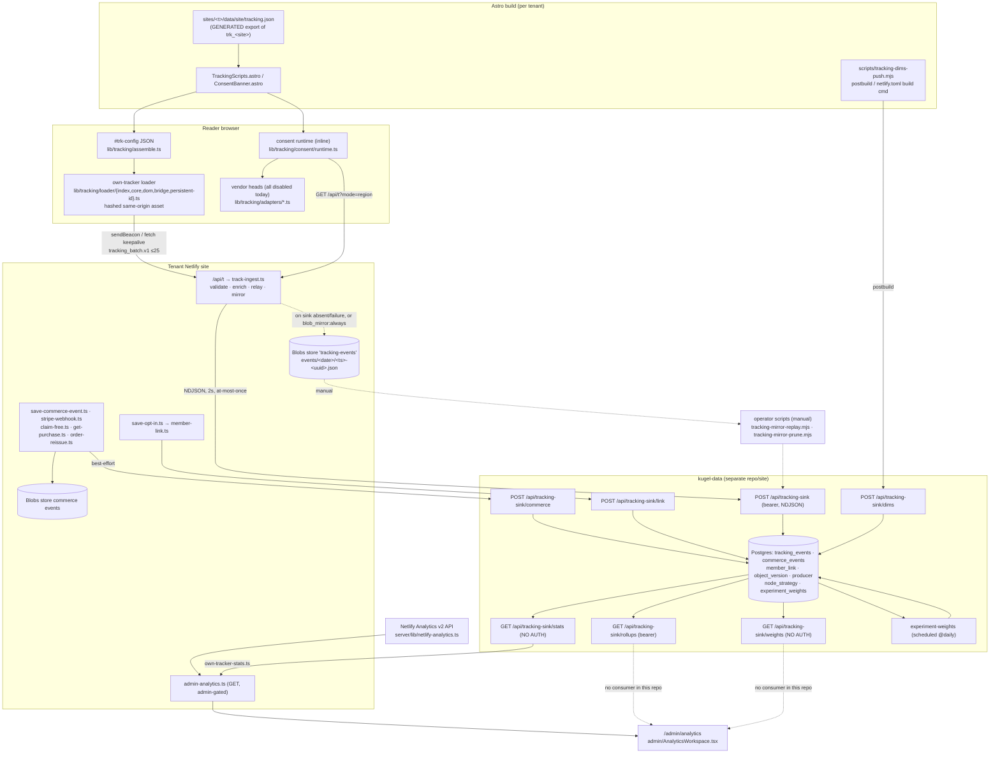
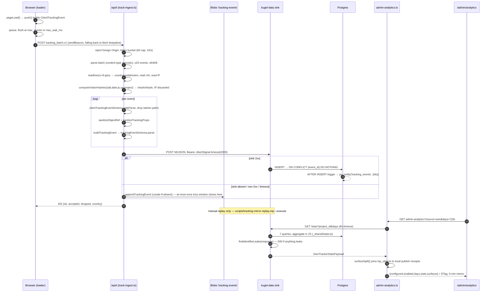

# Tracking & Analytics Architecture

> **Status:** verified against the `platform` repo commit `6789644` (2026-09-05) and `vreich-ui/kugel-data` commit `6c9c712` (read through the GitHub API; that repo is not vendored here). Code is truth; every claim cites a file path. Claims that could not be verified from code are quarantined under **Unverified / open**. Status tags: `[CURRENT]` `[INHERITED]` `[DEPRECATED]` `[EXPERIMENTAL]` `[GENERATED]` `[CANONICAL]` `[DOC-ONLY]`.
> Companion docs: [`ARCHITECTURE.md`](ARCHITECTURE.md) · [`AI_CONTEXT.md`](AI_CONTEXT.md) · [`DATA_CONTRACTS.md`](DATA_CONTRACTS.md) · [`KNOWN_ISSUES.md`](KNOWN_ISSUES.md) · [`GLOSSARY.md`](GLOSSARY.md).

## 1. Purpose & scope

The Kugel platform runs **two independent traffic feeds** and one commerce
event log:

| Feed | Nature | Owner | Read through |
|---|---|---|---|
| **Own tracker** (`tracking_event.v1`) | first-party, client-side, cookieless by default | this repo → kugel-data Postgres | `/admin/analytics?source=own` |
| **Netlify Analytics** | server-side, ad-blocker-proof, per-site add-on | Netlify | `/admin/analytics?source=netlify` |
| **`commerce_event.v1`** | server-authoritative + two client kinds | this repo (Blobs) → kugel-data | admin analytics KPI only (counts) |

This document describes **what exists**. It is not a design for an analytics
system. Section 15 is the only forward-looking section, and it is scoped to
*identifiers and contract fields*, not to a system.

Scope boundaries worth stating up front: the tracking stack is **write-only
inside this repo** — `getTrackingEventsBlobStore`
(`packages/core/server/lib/blob-store.ts:298`) has exactly one caller, the writer
in `packages/core/server/functions/track-ingest.ts`; reporting is a thin proxy
over an externally owned endpoint (`packages/core/server/lib/own-tracker-stats.ts`),
never a local query; and the honest in-repo account of what this can and cannot
support is `packages/core/lib/admin/variant-experiments.ts:1-52`, worth reading
before anyone calls any of it an A/B test.

---

## 2. Topology



Status of each edge: solid = live code path; dashed = fallback, manual, or
**no implemented consumer**. `RU`/`WT` have no caller anywhere in
`/root/platform` (grep for `rollups`, `weights`, `variant_id`, `experiment_weights`
returns nothing outside `packages/core/lib/admin/variant-experiments.ts`'s prose).

---

## 3. Event taxonomy

The vocabulary is `TRACKING_EVENT_KINDS` in
`packages/core/schema/bodies/tracking-config-v1.ts:35-54` — **18 kinds, closed
enum**. Every kind below is emitted by `packages/core/lib/tracking/loader/core.ts`
unless noted. "Gate" = the `defaults` matrix key that must list the kind
(`createTracker.collects`, `core.ts:149`).

| Event | Trigger | Emitter | Props | Gate (`defaults.<type>`) | Consent |
|---|---|---|---|---|---|
| `pageview` | `astro:page-load` (and initial bind) | `core.ts:298 pageLoad` | — (first pageview only carries `context`) | `page` or the page object's own type | none (cookieless) |
| `term_view` | page-load when a `[data-cms-term-id]` marker exists | `core.ts:314` | — | `taxonomy` | none |
| `section_impression` | IntersectionObserver ≥0.5 on a `[data-cms-section-id]` marker | `core.ts:339` | — | `section` | none |
| `node_impression` | same, `[data-cms-node-id]` | `core.ts:344` | — | `content_item` | none |
| `completion` | first impression of `article.last_node_id` | `core.ts:350` | — | `content_item` | none |
| `section_dwell` | page end, accumulated visible time per section | `core.ts:450` | `dwell_ms` | `section` | none |
| `node_dwell` | page end, per node | `core.ts:457` | `dwell_ms` | `content_item` | none |
| `engagement` | page end, visibility-aware page dwell | `core.ts:465` | `dwell_ms` (≤7 200 000) | `page` | none |
| `read_progress` | page end, `seenNodes / node_count` | `core.ts:471` | `pct_read` | `content_item` | none |
| `scroll_depth` | scroll crosses 25/50/75/90/100 % | `core.ts:362` | `depth_pct` | `page` | none |
| `cta_click` | click on `a`/`button` inside a section marker | `dom.ts:80` → `core.ts:384` | `label_slug` | `section` | none |
| `nav_click` | click inside `[data-cms-nav-object]` | `dom.ts:33` | `label_slug` | `navigation` | none |
| `tag_click` | click inside `[data-cms-term-id]` | `dom.ts:59` | `label_slug` | `taxonomy` | none |
| `outbound_click` | anchor whose host ≠ page host | `dom.ts:72` | `href_host` | `page` **or** `defaults.outbound_links` | none |
| `buy_click` | `#buy-box [data-role="buy"]` click, emitted after the create-checkout fetch resolves | `loader/index.ts:112,251` | `label_slug`, `value_cents`, `commerce_event_id` | `product` | none |
| `form_submit` | capture-phase `submit` on `form[data-netlify="true"]` | `loader/index.ts:275` | `label_slug` | `section` | none |
| `form_start` | **never emitted** — kind exists, gate exists (`core.ts:398`), no producer | — | `label_slug` | `section` | — |
| `goal` | declared goal bindings (`bridge.ts`) and `trk:goal` CustomEvent | `core.ts:250,416` | `goal`, `value_cents`, `label_slug`, `commerce_event_id` | **never gated, never sampled** | own event: none. Provider fan-out: ads consent |

Notes that matter:

- **Nothing in the own pipeline is consent-gated.** The consent runtime's own
  doc says so (`consent/runtime.ts:12-14`): it gates only `advertising`-class
  vendor snippets and the persistent-id upgrade. Consent state is *recorded on*
  every event (`consent: {analytics, ads, gpc}`) but never suppresses one.
- **`/admin` is never tracked**, double-guarded: boot bail (`loader/index.ts:168`,
  `core.ts:310`) and a server-side per-event path check
  (`track-ingest.ts:249`).
- **Sampling** (`own.sample_rate`) applies to impressions and dwell only.
  `sampled()` is defined once (`core.ts:152`) and the rule is that pageviews and
  goals are never sampled (`core.ts:311` and `core.ts:245-250` bypass it).
- **Dedupe**: one impression per ref per pageview (`impressed` Set,
  `core.ts:333`); one scroll bucket each (`bucketsHit`); one `completion` per
  page (`completionSent`); one provider conversion per `provider:label`
  (`bridge.ts:111,148`).
- **`exposure`** — the event kind kugel-data's experiment machinery is entirely
  built on (`004_rollup_views.sql` `v_variant_assignment`) — **is not in the
  platform's enum at all** and can never be emitted or accepted.

---

## 4. Event schema

### 4.1 `tracking_event.v1`

`packages/core/schema/tracking-event-v1.ts`. Two shapes on purpose:
`clientTrackingEventSchema` (what the loader may author) and
`trackingEventSchema` (the stored/forwarded shape after enrichment). Both are
`strictObject` — an unknown key rejects the event.

| Field | Type / bound | Authored by | Notes |
|---|---|---|---|
| `schema` | literal `tracking_event.v1` | server | not sent by the client |
| `event_id` | uuid | client | idempotency key end-to-end |
| `project_id` | string ≤64 | **server** | `TRACKING_PROJECT_ID`, else `resolveSiteIdentity(env).siteShortId` (`track-ingest.ts:239`) |
| `ts` | ISO datetime | client | client clock — see §12 |
| `event` | `trackingEventKindSchema` (18 kinds) | client | |
| `url.path` | string 1..512 | client | |
| `url.route` | string ≤256, nullable, optional | client | **always `null` today** — `readPageContext` hardcodes `route: null` (`loader/index.ts:77`) |
| `object.object_type` | ≤32, nullable | client | re-checked against `objectTypes` at ingest |
| `object.object_id` | ≤128, nullable | client | re-checked with `isObjectIdForType` |
| `object.section_id` | ≤64 | client | ingest regex `^s_[a-z0-9]+$` |
| `object.section_type` | ≤48 | client | ingest regex `^[a-z][a-z0-9_]{0,47}$` |
| `object.node_id` | ≤64 | client | ingest regex `^n_[a-z0-9]+$/i` |
| `object.node_kind` | ≤32 | client | |
| `object.term_id` | ≤64 | client | ingest regex `^t_[a-z0-9]+$` |
| `props` | allowlisted, see below | client | sanitized per kind at ingest |
| `visitor.mode` | `cookieless` \| `consented` | client | `consented` only while a `_dlid` stands |
| `visitor.vid` | uuid, nullable | client | forced `null` unless `mode === 'consented'` (`tracking-events.ts:152`) |
| `visitor.vhash` | 64 hex | **server** | `sha256(salt + utcDate + ip + ua + project_id)` |
| `visitor.shash` | 64 hex | **server** | `sha256(salt + vhash + floor(now/30min))` |
| `consent.analytics` / `.ads` / `.gpc` | boolean ×3 | client | recorded, never enforced server-side |
| `context.referrer` | ≤1024, nullable | client | **first pageview only** |
| `context.utm.{source,medium,campaign,content,term}` | ≤128 each | client | first pageview only, gated on `defaults.utm_capture` |
| `context.viewport.{w,h}` | int | client | first pageview only |
| `context.lang` | ≤35 | client | first pageview only |
| `context.ua` | ≤512, nullable | **server** | truncated request UA |
| `context.geo.country` / `.subdivision` | ≤2 / ≤8, nullable | **server** | city is dropped, never read (`track-ingest.ts:72 readGeo`) |

**Props allowlist per kind** — `TRACKING_PROPS_ALLOWLIST`,
`packages/core/server/lib/tracking-events.ts:34-53`. Keys outside the list for a
given kind are dropped silently. Bounds: `depth_pct` 0-100, `dwell_ms` 0-7 200 000,
`pct_read` 0-100, `href_host` ≤253, `goal` `^[a-z][a-z0-9_]{1,31}$`, `label_slug`
kebab/snake slug, `value_cents` non-negative int, `commerce_event_id` uuid.

**Batch wrapper** — `tracking_batch.v1`, `{schema, events[1..25]}`
(`tracking-event-v1.ts:120`). Body cap 64 KB (`track-ingest.ts:42`).

### 4.2 `commerce_event.v1`

`packages/core/server/lib/commerce-events.ts`. Eight types
(`commerceEventTypes:37`): `product_viewed`, `checkout_started` (the only two the
public capture endpoint accepts, `clientCommerceEventTypes:51`),
`checkout_completed`, `fulfillment_issued`, `download_succeeded`,
`fulfillment_reissued`, `checkout_abandoned`, `amount_mismatch`.

Envelope: `{schema, event_id, ts, type, actor{anon_id,email_hash}, subject{product_id,order_id,session_id}, context{path,referrer,ua}, data{…}}`.
`email_hash` is `sha256:<hex>` of the normalised address; the raw email lives only
in order records (`commerce-orders.ts`).

Sink projection — `commerceSinkPayload` (`commerce-events.ts:~185`) maps
`type → kind` and lifts `amount_cents`/`currency` out of `data`, POSTing one
NDJSON line to `${TRACKING_SINK_URL}/commerce`, best-effort, 2 s, never awaited.

---

## 5. Identifiers

| Identifier | Shape | Minted where | Scope | Stability |
|---|---|---|---|---|
| `event_id` | uuid v4 | `crypto.randomUUID()` in the browser (`loader/index.ts:191`) | one event | permanent; the sink's idempotency key (`ON CONFLICT (event_id) DO NOTHING`, `_shared/ingest.ts insertRows`) |
| `project_id` | bare site slug (`drlurie`) | server env `TRACKING_PROJECT_ID` (`track-ingest.ts:234`), fallback `siteShortId` | tenant | permanent; the sink partition key on every table |
| `vhash` | sha256 hex | `computeVisitorHashes` (`tracking-events.ts:118`) | one visitor, one UTC day, one project | **rotates daily**; also changes when IP or UA changes |
| `shash` | sha256 hex | same function, 30-min window index | one "session" | 30-minute fixed window over `vhash` — **not** an idle-timeout session |
| `vid` (`_dlid`) | uuid in `localStorage` | `readOrMintPersistentId` (`loader/persistent-id.ts:25`) | one browser profile | up to 396 days, fixed at mint, never slid; only exists under analytics consent with GPC off |
| `object_id` | `page_…`/`req_…`/`prod_…`/`sec_…`/`nav_…`/`tax_…` | CMS object store | one governed object | permanent across versions |
| `object_type` | enum | derived from the id prefix client-side (`loader/index.ts:61 TYPE_BY_PREFIX`) | — | — |
| **object version** | integer | `__generated.record_version` in the export | one published revision | **NOT on any event** — `tracking_events` has no `version` column (stated in `004_rollup_views.sql`) |
| `section_id` | `s_<alnum>` | section instance id, rendered by `renderer/section-annotations.ts:53` | one section slot on one page | stable while the section stays in the page body |
| `section_type` | slug | same | — | — |
| `node_id` | `n_<alnum>` | article node id, rendered by `article-object/render-nodes.ts:333` | one node of one article | **re-minted on `object_create_variant`** (`lib/article-object/variant.ts`) |
| `node_kind` | slug | same | — | — |
| `term_id` | `t_<alnum>` | taxonomy export; page routes stamp `data-cms-term-id` | one taxonomy term | permanent |
| `url.path` | string | `location.pathname` | one route | changes with slug |
| `url.route` | string | **never populated** (`loader/index.ts:77`) | — | — |
| `variant_id` | — | **nothing in this repo mints one.** kugel-data reads `props->>'variant_id'` off `exposure` events that cannot exist | — | — |
| `variant_of` | object id | `lineage.parent_content_id` → `object_version.variant_of` (`tracking-dims-push.mjs:58`) | variant family | permanent |
| `run_id`, `node_id`(producer), `prompt_version`, `model` | strings ≤128 | `producerContextSchema` (`schema/object-record-v1.ts:96`), stamped into `__generated.producer` at publish | one published revision | permanent, but only present on revisions published with a producer context |
| `surface` / `attribution` | `plugin:claude` … / `oauth` … | `publish_receipt.surface` and `__generated.surface` (`materializers/shared.ts:102`) | one published revision | permanent in this repo; **dropped by the sink** (§13.4) |
| editorial request id | `req_<flow>_<topic>_<yyyymmdd>_<nn>` | the request record; also *is* the `content_item` object id | one editorial job | permanent |
| `commerce_event.event_id` | uuid | `deterministicUuid(session.id:type)` (`stripe-webhook.ts:210`) or `randomUUID()` | one commerce event | permanent |
| `props.commerce_event_id` | uuid | `session.metadata.event_id` echoed as `X-CEID` by `checkout-session-status.ts:33` | one checkout | **does not equal any `commerce_event.event_id`** — §13.1 |
| Stripe `session_id` | `cs_…` | Stripe | one checkout | on `commerce_events.session_id`, never on a tracking event |
| `member_hash` | sha256 hex of the lowercased email | `member-link.ts:63` | one member | permanent; joined to `shash` only |
| request id (`req_…` in HTTP logs) | — | not part of this pipeline | — | — |

### Correlation table — what joins to what **today**

| Join | Key | Works? |
|---|---|---|
| event → event (same session) | `shash` | yes, within a 30-min window |
| event → object | `object_id` | yes |
| event → node strategy | `(project_id, object_id, node_id)` | join exists; **`strategy`/`intent` are NULL for new content** (§13.3) |
| event → publication | `object_version` on `object_id` **only** (`tracking-sink-stats.ts` dims coverage note) | partial — version-blind |
| event → producing run/prompt | `object_version` + `producer` → most-recent published version (`v_producer_window.current_version`) | approximate; an event cannot name the version that served it |
| event → publishing surface | publish receipt, **inside the CMS** (`admin-analytics.ts:publishingSurfaces`) | yes in the admin; **no** in the sink |
| event → purchase | `props.commerce_event_id = commerce_events.event_id` | **broken** (§13.1) |
| purchase → revenue | `commerce_events.amount_cents` where `kind='purchase'` | **broken** (§13.2) |
| session → member | `member_link(project_id, shash, member_hash)` | yes, for opt-ins and Stripe buyers |
| event → variant arm | `props.variant_id` on `exposure` | **impossible** — neither kind nor prop exists |
| event → agent decision | via `producer.run_id` / `prompt_version` | only for revisions carrying a producer context (3 of 27 committed articles) |

**Where the chain breaks:** exposure → engagement holds; engagement → conversion
→ revenue does not (two independent key mismatches); content → agent decision
holds only at the *object* grain and only for the most recent published version.

---

## 6. Lifecycle of one event



---

## 7. Data flow & storage

### 7.1 Blob mirror `[CURRENT]`

- Store name `tracking-events` (`blob-store.ts:299`).
- Key layout `events/<yyyy-mm-dd>/<compactTs>-<event_id>.json`
  (`tracking-events.ts:172 trackingEventKey`) — the commerce-events layout,
  filename-safe and lexicographically time-ordered within a day.
- Append is create-if-absent (`appendTrackingEvent:184`, pre-read + `onlyIfNew`).
  Immutable; nothing in the codebase updates or deletes a mirror blob.
- Modes (`own.blob_mirror`, `tracking-config-v1.ts:109`):
  `fallback` (default — mirror only when the relay failed), `always`, `off`.
  Resolved by `resolveSinkConfig` (`tracking-events.ts:215`), cached 5 min in
  the function instance (`track-ingest.ts:135`).
- The header states the mirror is **for replay only, never a reporting surface**
  (`tracking-events.ts:12-16`). The code honours that: no reader exists.

### 7.2 Postgres (kugel-data) `[CURRENT]`

| Table | Key | Written by | File |
|---|---|---|---|
| `tracking_events` | `event_id UNIQUE` | `POST /api/tracking-sink` | `schema.sql` / `001_…sql` |
| `commerce_events` | `event_id UNIQUE` | `POST /api/tracking-sink/commerce` | `002_…sql` |
| `member_link` | `(project_id, shash, member_hash)` | `POST /api/tracking-sink/link` | `002_…sql` |
| `object_version` | `(project_id, object_id, version)` | `POST /api/tracking-sink/dims` | `002_…sql` |
| `producer` | `(project_id, object_id, version)` | same | `002_…sql` |
| `node_strategy` | `(project_id, object_id, node_id)` | same | `schema.sql` + `002_…sql` |
| `experiment_weights` | `(project_id, object_id, variant_id)` | scheduled `experiment-weights` | `002_…sql` |

Indexes: `(project_id, ts)`, `(project_id, object_id, ts)`, `(project_id, event, ts)`,
GIN on `props`, and `((props->>'commerce_event_id'))` (`003_…sql`).

A trigger `tracking_events_notify` fires `pg_notify('tracking_events', …)` per
insert carrying only ids — the "DB listening to triggers" the plan asked for.
**No LISTEN consumer exists in either repo.**

Views (`004_rollup_views.sql`, rewritten by `005_rollups_on_baseline_traffic.sql`):
`v_variant_assignment`, `v_session_object`, `v_attributed_events`,
`v_attributed_purchases` (internal); `v_sessions`, `v_object_window`,
`v_producer_window` (served by `/rollups`). Measures: `pageviews`, `exposures`,
`sessions`, `completion_rate`, `cta_ctr`, `buy_click_rate`, `purchase_rate`,
`revenue_cents`, `p75_dwell_ms`. Migration 005's whole point is that variant
identity became optional (synthetic `'control'` arm) because
`v_variant_assignment` is empty in production — exposures are not built.

### 7.3 Retention — **none enforced**

- Policy of record: 90 days for the mirror (`tracking-events.ts:16`, OQ-W13-4).
- `scripts/tracking-mirror-prune.mjs` implements it, **dry-run by default**,
  requires a pre-compiled `.tmp/ci-test` tree, and appears in **no** npm script
  and **no** `[functions."…"] schedule` block (`netlify.toml` declares only
  `mcp-keepalive`, `membership-sweep`, `editorial-request-sweep`).
- kugel-data has **no purge, no TTL, no retention job**. Its only scheduled
  function is `experiment-weights` (`@daily`).

**State it plainly: retention is documented and tooled, not implemented.**

---

## 8. Aggregation & reporting

### 8.1 `/stats` contract (kugel-data) `[CURRENT]`

`GET /api/tracking-sink/stats?project_id&days` — **unauthenticated by design**
(`tracking-sink-stats.ts`, no `requireBearer`). `days` clamps to 1..90
(`_shared/stats.ts clampDays`), default 7. The platform only ever asks for 7 or 30
(`OwnTrackerDays`, `own-analytics-logic.ts:31`).

Response (`OwnTrackerStatsPayload`, `packages/core/lib/admin/own-analytics-logic.ts:116`):

```
project_id, days,
totals { events_by_kind{}, sessions, visitors, consented_sessions,
         commerce_events, member_links },
daily[]      { date, pageviews, sessions, visitors, buy_clicks, purchases },
top_objects[]{ object_id, object_type, pageviews, sessions, completion_rate },
top_sources[]{ referrer_host_or_utm_source, sessions },
last_event_at, dims { object_version, producer, node_strategy }
```

- `sessions` = distinct `shash`; `visitors` = distinct `vhash`;
  `consented_sessions` = distinct `shash` where `visitor_vid` is non-null.
- `completion_rate` = sessions that fired `node_impression` on the object's
  highest-`position` `node_strategy` row ÷ sessions with a pageview.
- `top_sources` derives a **hostname** from the referrer or falls back to
  `utm_source` (`deriveSourceLabel`), one label per session, top 20.
- **Leak guard**: `findIdentifierLeaks` walks the whole response and 500s on any
  banned key (`shash`, `vhash`, `visitor_vid`, `vid`, `ip`, `user_agent`, `ua`,
  `referrer`, `member_hash`), any bare sha256-shaped string, or any raw URL.
  kugel-data's `CLAUDE.md` marks these guards as never-to-be-touched.

### 8.2 `admin-analytics` `[CURRENT]`

`packages/core/server/functions/admin-analytics.ts` (renamed from `admin-traffic`,
T21.9b; `netlify/functions/admin-traffic.ts` is a still-deployed re-export shim).
GET-only behind `resolveAdminAccessFromEvent`. Two branches:

- `?source=own&days=7|30` → `fetchOwnTrackerStats` (8 s timeout,
  `own-tracker-stats.ts:22`) + `publishingSurfaces()`, which point-reads each
  `top_objects` object's record and returns `publication.publish_receipt.surface`.
  `surfaceSplit()` groups pageviews by surface, keeping `unknown` distinct from
  `workflow` on purpose.
- default → Netlify Analytics v2
  (`https://analytics.services.netlify.com/v2/{SITE_ID}`,
  `netlify-analytics.ts:87`) — `/pageviews`, `/visitors`, `/ranking/pages`,
  `/ranking/sources`. `/ranking/not_found` and `/ranking/countries` are verified
  live in the header comment but **never called**.

Both branches: real `ETag` + `304`, `Cache-Control: private, max-age=60,
stale-while-revalidate=240`, and a 5-minute module-scope memo keyed
`own:<siteId>:<days>` / `<siteId>:<range>:<from>:<to>:<resolution>`. Honest
degrades — `{configured:false, enabled:false, error_code, message}` — never a 500
for "not set up".

### 8.3 The admin page `[CURRENT]`

`packages/core/app/routes/admin/analytics.astro` → `packages/core/admin/AnalyticsWorkspace.tsx`
(631 lines) + `AnalyticsCharts.tsx` (180 lines, hand-rolled inline SVG). Two tabs
("Own tracker" / "Netlify"), state in the URL (`?source=own|netlify&range&compare`)
and `localStorage` per site+user. Both tabs render through one
`AnalyticsPanelState` resolver pair (`resolveOwnAnalyticsPanel`,
`resolveNetlifyAnalyticsPanel`).

Own tab KPIs: Pageviews, Sessions, Visitors, Consented %, Purchases. Footer:
Last event, Capture rate (own pageviews ÷ Netlify pageviews over the *same*
window, `null` for 90d/custom — `captureRate`, explicitly documented as a lower
bound on client-side visibility, not a completeness score).

**Export: none.** No CSV, no JSON download, no "save this view" anywhere in
`AnalyticsWorkspace.tsx` / `AnalyticsCharts.tsx`. The only persistence is the
range/tab preference in `localStorage`. Wolf's "review, save, export" is
**review only** today.

### 8.4 `/rollups` and `/weights` `[EXPERIMENTAL — no consumer]`

`GET /api/tracking-sink/rollups?project_id&from&to&by=object|producer` (bearer,
≤366-day window, ≤5000 rows) and `GET /api/tracking-sink/weights?project_id`
(no auth) exist and are implemented. **Nothing in `/root/platform` calls either.**

---

## 9. Privacy boundary

**Never stored, anywhere:**

| Value | Where it dies |
|---|---|
| Raw IP | exists only inside `createTrackIngestHandler`'s local scope; hashed into `vhash` and discarded (`track-ingest.ts:230-242`, `tracking-events.ts:118`) |
| City-level geo | never read — `readGeo` extracts `country` + `subdivision` only (`track-ingest.ts:72`, OQ-W13-4) |
| Raw email | `member-link.ts:63` sends `sha256(lowercased email)`; `commerce-events.ts hashEmail` produces `sha256:<hex>`; raw email lives only in order records |
| Free-text labels | `slugify` bounds every click label to 48 chars of `[a-z0-9-]` (`core.ts:102`); hosts via `hostOf` |
| `tracking.label` / `tracking.tags` | reporting-only, never rendered and never in the export goal map (`tracking-attribute-v1.ts:11-16`, `assemble.ts:10-12`) |
| Raw referrer in reporting | reduced to a hostname before leaving `/stats` (`deriveSourceLabel`) and re-checked by `findIdentifierLeaks` |
| `node.private` (strategy/intent) | stripped from every committed export (`materializers/shared.ts:stripPrivate`) — see §13.3 for the cost |

**Consent modes** (`consent/runtime.ts`, `tracking-config-v1.ts:138`):

| Posture | Unknown region | Restricted region | Banner |
|---|---|---|---|
| `geo-adaptive` (drlurie) | held | held | shown once region confirmed restricted |
| `consent-first` (platform) | held | held | always |
| `us-first` | released unless the `Intl` timezone starts `Europe/` | held | only when confirmed restricted |

- Region oracle: `GET /api/t?mode=region` → `{country}` from the request geo,
  nothing stored server-side; cached in `sessionStorage._dlregion`.
- GPC beats everything: `adsAllowed()` and `idUpgradeAllowed()` both return false
  under GPC, and `setVisitor` refuses to store an id (`core.ts:437`).
- `ad_personalization` stays **denied even on grant** — the banner is
  deliberately not a certified TCF CMP (`runtime.ts:207`).
- Consent Mode v2 denied defaults are pushed **synchronously before any vendor
  head** (`runtime.ts:353`, and `TrackingScripts.astro:109` emits the bootstrap
  before the adapter heads).
- Device storage: `localStorage._dlconsent` (the choice) and `localStorage._dlid`
  (the consented id, 396-day cap fixed at mint, `persistent-id.ts:22`). The
  cookieless default stores **nothing**.

**Salt rotation:** `TRACKING_SALT` is a per-site secret, auto-minted at
provisioning (`docs/cms-architecture/cms-pipeline/T11.7-provisioning-cli.md:68`,
"must differ per site"). The *hash* rotates daily by construction (the UTC date is
an input); the salt itself has **no rotation mechanism** in code — rotating it
would orphan every prior `vhash`/`shash` and break `member_link` continuity.

**CSP:** `netlify.toml:34` ships a `Content-Security-Policy-Report-Only` header
(report-only, not enforcing) whose all-providers-disabled baseline is
`script-src 'self' 'unsafe-inline'; connect-src 'self'; frame-src youtube-nocookie,
player.vimeo`. `tests/netlify/csp-drift.test.ts` fails in both directions when a
site's enabled providers and its toml disagree — see §13.5 for the hole in it.

---

## 10. Downstream consumers

| Consumer | Status | Evidence |
|---|---|---|
| `/admin/analytics` own tab | `[CURRENT]` | `admin-analytics.ts` → `/stats` |
| `/admin/analytics` Netlify tab | `[CURRENT]` | `netlify-analytics.ts` |
| Publishing-surface split | `[CURRENT]` | `own-analytics-logic.ts:surfaceSplit`, joined locally against publish receipts |
| `scripts/tracking-mirror-replay.mjs` | `[CURRENT]`, manual, dry-run default | operator action, not automation |
| `scripts/tracking-mirror-prune.mjs` | `[CURRENT]`, manual, never scheduled | §7.3 |
| `scripts/tracking-dims-push.mjs` | `[CURRENT]`, runs on every tenant build | §11 |
| kugel-data `/rollups` | `[EXPERIMENTAL]` — implemented, **zero callers** | grep |
| kugel-data `/weights` + `experiment-weights` job | `[EXPERIMENTAL]` — implemented, **zero callers, and structurally inert** (needs `exposure` events that cannot exist) | §13.6 |
| `pg_notify` listener | `[DOC-ONLY]` | trigger exists, no LISTEN client in either repo |
| CMS-Agent learning | `[DOC-ONLY]` in this repo | see below |
| Metric-derived `scores[]` | `[DOC-ONLY]` | `docs/cms-architecture/12-object-tracking-and-analytics.md:696` §15, explicitly "DESIGN ONLY, nothing implemented"; the proposed `append_scores` op does not exist in `packages/core/schema/object-patch-ops.ts` |

**CMS-Agent feedback — precise status.** The CMS-Agent MCP server exposes
`feedback_ingest_tracking`, `feedback_ingest_monetizer`, `learning_record_observation`,
`optimizer_*` and `dataset_*` tools (visible in this session's connector tool list).
**No code path in `/root/platform` calls any of them.** Repo-wide grep for
`feedback_ingest_tracking`, `agent-learning-patch`, `goal-bridge` as a runtime
symbol, `learning-join` outside tests: nothing. `packages/core/server/lib/agent/cms-agent-client.ts`
contains no feedback or tracking call. `tests/netlify/learning-join.test.ts` is an
*acceptance test on the export/receipt shape*, not a bridge; `tests/netlify/goal-bridge.test.ts`
covers the browser goal→ad-conversion bridge, which is unrelated to agent learning.

So: **tracking data reaches a human dashboard and stops.** Nothing moves it into
an object record or into CMS-Agent today.

---

## 11. Configuration

### 11.1 Environment (per tenant Netlify site)

| Var | Scope | Used by |
|---|---|---|
| `TRACKING_PROJECT_ID` | per-site, bare slug (`drlurie`, not `trk_drlurie`) | `track-ingest.ts:234`, `own-tracker-stats.ts`, `commerce-events.ts`, `member-link.ts`, `tracking-dims-push.mjs` |
| `TRACKING_SALT` | per-site, must differ per site | `track-ingest.ts:240`, `member-link.ts:33` |
| `TRACKING_SINK_URL` | fleet-shared (per-site override allowed) | relay target; `${url}/stats`, `/commerce`, `/link`, `/dims` are appended by their callers |
| `TRACKING_SINK_TOKEN` | fleet-shared | `Authorization: Bearer` on relay, `/commerce`, `/link`, `/dims`, and (unnecessarily) `/stats` |
| `NETLIFY_AUTH_TOKEN` / `NETLIFY_BLOBS_TOKEN`, `NETLIFY_SITE_ID` / `SITE_ID` | per-site | `netlify-analytics.ts` (reuses `netlifyDeployLookupMissingEnvVars`) |

kugel-data side: `TRACKING_SINK_TOKEN` (`_shared/http.ts requireBearer`) and one of
`NETLIFY_DATABASE_URL` / `NETLIFY_DB_URL` / `DATABASE_URL` (`_shared/db.ts`).

The env-name **indirection** is a schema law: `tracking_config.providers.own`
carries `endpoint_env` / `auth_env` as *names* only, regex-pinned to
`^[A-Z][A-Z0-9_]{2,63}$` and refused if they contain `://`
(`tracking-config-v1.ts:25-30`). `resolveSinkConfig` re-guards them at read
(`tracking-events.ts:215`) and falls back to the OQ-W13-6 defaults.

### 11.2 The `trk_<site>` object

Type `tracking_config`, id `trk_<siteShortId>` (`lib/object-ids.ts:19`), singleton,
exported to `sites/<t>/data/site/tracking.json`. Body =
`{providers, consent, defaults}` (`tracking-config-v1.ts:170`).
`providers` is a **fixed-key strict object** so a deep-merge edits one provider;
`gtm` exists for shape stability but enabling it *fails the schema*
(`tracking-config-v1.ts:129`). Every provider id is regex-pinned at write **and
re-asserted at render** (`adapters/types.ts:reassertId`) — a hand-edited export
throws at build rather than emitting script text.

`tracking_config` does **not** carry the shared `tracking` attribute
(`TRACKING_ATTRIBUTE_EXEMPT_TYPES`, `tracking-attribute-v1.ts:104`), alongside
`editorial_voice` and `visual_standard`.

### 11.3 `tracking_attribute` — the per-object block

`packages/core/schema/bodies/tracking-attribute-v1.ts`. Spread into every other
governed body as `tracking?: {enabled?, label?, tags?, goals?}` via
`trackingAttributeShape:49`. Written only by the uniform `set_tracking` op.

- `enabled:false` → the renderer stamps `data-cms-track="off"` on the subtree
  (`section-annotations.ts:55`, `render-nodes.ts:329`) and the loader skips it
  (`dom.ts:28,101`).
- `goals[]` reach the page inside `#trk-config` (public by construction — hence
  `GOAL_KEY_RE` / `CONVERSION_LABEL_RE` force neutral slugs); `label`/`tags`
  never leave the store.
- `TRACKABLE_ACTIVITIES_BY_TYPE:73` is the code-owned matrix of which goal `on`
  activities are collectable per type.

### 11.4 Tenant parity

| Tenant | `tracking.json` committed? | `own` provider | Posture | Loader mounts? |
|---|---|---|---|---|
| `drlurie` | **yes**, `trk_drlurie` v8 (2026-08-31) | `enabled:true`, `blob_mirror:fallback`, `ingest_path:/api/t` | `geo-adaptive`, `analytics_id_mode:unrestricted-auto`, 33 restricted regions (EEA-30 + UK + CH + IL) | yes |
| `platform` | **yes**, `trk_platform` v2 (2026-08-02) | **absent — `"providers": {}`** | `consent-first`, no restricted regions | **yes** (see §13.6) |
| `zilberman` | no export (seed skeleton only, `sites/zilberman/seeds/tracking-config-seed-data.mjs`) | — | — | no |
| `fernwell` | no export (seed skeleton only) | — | — | no |

All four tenants declare the `/api/t` → `track-ingest` redirect
(`netlify.toml:168` and each `sites/*/netlify.toml:209`) and ship the
`track-ingest` function shim, so the endpoint answers everywhere even where the
loader never mounts.

### 11.5 Dimensions push

`scripts/tracking-dims-push.mjs`. Reads `<exportRoot>/pages/*.json` and
`<exportRoot>/articles/*.json`, builds three row families, POSTs
`{project_id, object_version[], producer[], node_strategy[]}` to `${sink}/dims`
with Bearer auth, 2 s timeout. Best-effort: missing config → `skipped:
"missing_configuration"`; never throws; a build never fails on it.

Wiring — **the task brief's "hardwired to drlurie" is only half true**:

- Root `package.json:18` `postbuild` → `--export-root sites/drlurie/data/site`.
  Correct: drlurie *is* the root-deployed tenant.
- `sites/{platform,zilberman,fernwell}/netlify.toml:31` each append
  `node ../../scripts/tracking-dims-push.mjs --export-root data/site || true`
  to their own build command. Every tenant pushes its own dimensions under its
  own `TRACKING_PROJECT_ID`.

The residual hazard is that the root `postbuild` fires on **any** root
`npm run build`, so a root build performed with another tenant's env would file
drlurie's rows under that tenant's `project_id`.

---

## 12. Known data-quality limitations

1. **Client-only measures treated as authoritative.** `dwell_ms`, `pct_read`,
   `depth_pct`, `completion` and every impression are computed in the browser
   and sent as facts. The ingest bounds them but cannot verify them. Ad
   blockers, tracking protection, and JS failures remove them entirely — the
   capture-rate footer (`own-analytics-logic.ts:captureRate`) is the only signal
   of how much is missing, and only for 7d/30d.
2. **At-most-once relay.** `forwardToSink` has a 2 s timeout and **no retries**
   (`track-ingest.ts:304`). Loss is caught by the mirror only when
   `blob_mirror` is `fallback`/`always`; with `off` a slow sink silently drops
   the batch. Replay from the mirror is a manual operator action.
3. **Mirror-only mode is a reporting dead end.** With no sink configured every
   event lands in Blobs and *nothing reads it* — `/stats` returns zeros and the
   admin shows "not configured".
4. **Duplicates.** `event_id` de-duplicates at the sink and the mirror. But
   `sendBeacon` failure → `fetch(keepalive)` retry (`loader/index.ts:107`) can
   deliver the same batch twice; that is handled. Not handled: a *page* that
   fires `pagehide` and `astro:before-swap` — `pageEnd()` guards with
   `pageEnded` (`core.ts:442`), so end-of-page events fire once.
5. **No version on events.** `tracking_events` has no `version` column
   (`004_rollup_views.sql` states it as a schema fact). Engagement cannot be
   attributed to the revision that served it; `v_producer_window` picks the most
   recently published version with a producer row instead.
6. **`url.route` is always null** (`loader/index.ts:77`), so route-template
   grouping ("/learn/[slug]") is impossible; only literal paths exist.
7. **SPA-less pageview semantics.** Pageviews ride `astro:page-load`, and ga4 is
   configured `send_page_view:false` so the loader owns navigation truth
   (`adapters/ga4.ts`). A View-Transition swap counts as a pageview; a plain
   anchor to another page also counts. There is no "engaged session" concept
   beyond the 30-minute `shash` window.
8. **`shash` is a fixed 30-minute wall-clock window, not a session.** A visit
   spanning 12:29→12:31 is two sessions; a visit at 12:01 and 12:29 is one.
   Session counts are therefore systematically noisy at the margins.
9. **`vhash` conflates device changes.** Any IP or UA change (mobile handoff,
   browser update, VPN) mints a new "visitor" the same day.
10. **Bots.** No bot filtering anywhere. The only gate is the token bucket
    (60 tokens, 10/s refill, **per warm function instance** —
    `track-ingest.ts:111`), which is a burst brake, not a bot filter. The
    per-member `write-rate-limit.ts` is MCP-only and does not touch `/api/t`.
11. **`display:contents` markers.** Section and node markers render as
    `display:contents` (`render-nodes.ts:333`, `PageObjectRenderer.astro:89`)
    and generate no CSS box, so a 0.5-threshold IntersectionObserver on the
    marker never fires. Fixed (T21.9): `resolveObservationTarget` observes the
    first box-generating descendant and `trackableRefOfClosest` maps back to the
    marker (`loader/dom.ts:121-172`), with seven tests pinning it
    (`tests/netlify/tracking-loader.test.ts:628,884-965`). **Verified present.**
12. **Blocked scripts.** The loader is a hashed same-origin Astro asset and the
    endpoint is `/api/t` (deliberately generic) — the stated ad-blocker posture
    (`adapters/own.ts:1-9`). It is still client JS and still blockable.
13. **Timezone.** Everything server-side is UTC: `utcDate` for the hash
    (`track-ingest.ts:241`), `date_trunc('day', ts AT TIME ZONE 'UTC')` in the
    sink, `dateWindowForDays` UTC-midnight windows, and `resolveDateWindow`
    computing UTC then asking Netlify for UTC buckets (`netlify-analytics.ts`
    header). The admin renders `last_event_at` in **browser locale**
    (`own-analytics-logic.ts` footer) — the one place clocks mix.
14. **Two feeds, two definitions.** Netlify "Visits/Unique visitors" and own
    "Pageviews/Sessions" are deliberately labelled differently
    (`own-analytics-logic.ts:ownTrackerChartSeries` comment) — they are not
    comparable except through `captureRate`.

---

## 13. Defects / drift found

1. **The purchase→event join key can never match. `[CURRENT]`, blocking**
   `packages/core/server/functions/checkout-session-status.ts:33,40` returns
   `X-CEID: session.metadata.event_id`, and `create-checkout-session.ts:121`
   mints that as a fresh `randomUUID()`. Every `commerce_event` the webhook
   writes uses `deterministicUuid(\`${session.id}:${type}\`)`
   (`stripe-webhook.ts:210,254`). kugel-data joins
   `ce.event_id::text = te.props->>'commerce_event_id'`
   (`004_rollup_views.sql` / `005_…sql` `v_attributed_purchases`, `v_sessions`).
   The two uuids are drawn from different generators and cannot be equal.
   *Why it matters:* `purchase_rate`, `revenue_cents` and `v_sessions.purchased`
   are structurally always zero — the entire engagement→revenue link is dead.

2. **`commerce_events.kind` is never `'purchase'`. `[CURRENT]`, blocking**
   `packages/core/server/lib/commerce-events.ts commerceSinkPayload` sets
   `kind: event.type`, drawn from `commerceEventTypes` — `checkout_completed`,
   `fulfillment_issued`, …; there is no `purchase` member. The sink filters
   `kind = 'purchase'` in `tracking-sink-stats.ts` (daily purchases) and in
   `v_attributed_purchases` / `v_sessions`. kugel-data's own seed writes
   `kind: "purchase"` (`scripts/seed-rollups.mjs`), so its tests are green.
   *Why it matters:* the admin "Purchases" KPI and `daily[].purchases` are
   always 0 even when orders exist. Independent of defect 1 — both must be fixed.

3. **`node_strategy.strategy` / `.intent` are NULL for all new content. `[CURRENT]`**
   `packages/core/server/lib/materializers/shared.ts:132 stripPrivate` drops every
   `private` key from every export (W6 Q, 2026-08-31), but
   `scripts/tracking-dims-push.mjs:88-90` reads `node.private?.strategy` /
   `node.private?.intent` from those exports. Verified empirically: every
   committed article with `__generated.at >= 2026-09-03` has zero nodes carrying
   `private` (`req_conductor_n_acetylcysteine_…`, `req_fwconcern_…`,
   `req_plugin_azelaic_acid_…`, `req_plugin_dark_circles_…`,
   `req_plugin_moisturizer_functions_…`). The unit test stays green because
   `tests/scripts/tracking-dims-push.test.mjs:30` hand-builds an export that
   still carries `private`.
   *Why it matters:* OQ-W13-5's blessed "engagement × strategy" JOIN — the whole
   reason `node_strategy` exists — silently degrades to nulls for everything
   published from now on.

4. **`object_version.surface` / `.attribution` are pushed and thrown away. `[CURRENT]`**
   `scripts/tracking-dims-push.mjs:60-75` sends both columns and its comment
   declares a "SINK CONTRACT: two additional columns on `object_version`".
   `netlify/database/migrations/002_…sql` defines neither, and
   `tracking-sink-dims.ts normalizeObjectVersion` does not read them.
   *Why it matters:* the "do plugin-written articles perform differently?"
   question is answerable only inside the CMS (`admin-analytics.ts
   publishingSurfaces`, top-N objects only), never from the owner DB.

5. **The CSP-drift gate is vacuous for drlurie. `[CURRENT]`**
   `tests/netlify/csp-drift.test.ts:139` lists drlurie as
   `'drlurie (root netlify.toml — no committed tracking export)'` with **no**
   `trackingPath`, but `sites/drlurie/data/site/tracking.json` exists
   (`record_version: 8`, 2026-08-31). This is the exact failure T16.6 fixed for
   `platform`, reintroduced by drlurie's export landing. `zilberman` and
   `fernwell` are not in the table at all.
   *Why it matters:* the one gate that makes "enabling an ad provider must ship
   its CSP hosts in the same change" enforceable cannot see the site most likely
   to enable one.

6. **The loader mounts where `providers.own` is absent. `[CURRENT]`**
   `packages/core/app/components/tracking/TrackingScripts.astro:105-113` gates
   only on "a `tracking_config` export exists"; `assemble.ts:124` then defaults
   `ingest_path` to `/api/t`. `sites/platform/data/site/tracking.json` has
   `"providers": {}` — no `own` block at all — yet the platform tenant ships the
   loader and beacons to `/api/t`. `ownAdapter` (`adapters/own.ts`) contributes
   its `connect-src 'self'` CSP entry only when `own.enabled === true`, so the
   collection and the CSP declaration disagree.
   *Why it matters:* a tenant that has not opted into first-party collection is
   collecting; and the "flip a switch" contract for `own.enabled` does nothing.

7. **`data-cms-buy-product` is read but never rendered. `[CURRENT]`**
   `packages/core/lib/tracking/loader/dom.ts:46-57` classifies `buy_click` from
   `[data-cms-buy-product]`. Repo-wide grep finds **no emitter**. Real buy clicks
   come from the `#buy-box` + `[data-role="buy"]` path
   (`loader/index.ts:251-253`), which exists only in
   `sites/drlurie/app/pages/shop/[slug].astro:97,104`.
   *Why it matters:* a dead classification branch that looks like coverage; any
   non-drlurie shop page would emit no `buy_click` at all.

8. **`buy_click` never carries `commerce_event_id`. `[CURRENT]`**
   `loader/index.ts:121-136` reads `X-CEID` from the `create-checkout` response;
   `create-checkout-session.ts:147` returns `event_id` in the JSON **body** and
   sets no such header. Only `checkout-session-status.ts` sets `X-CEID`, and that
   lands on the `goal` event via `statusPurchaseGoalId`. The loader test stubs a
   fake `X-CEID` on the create-checkout response
   (`tests/netlify/tracking-loader.test.ts:420,428`), so the gap is invisible to
   CI. (Even if fixed, defect 1 still applies to the id itself.)

9. **Stale, schema-invalid tracking fixture. `[CURRENT]`**
   `tests/fixtures/tracking-events/pageview.json` has `url` as a bare string and
   `consent: {analytics, marketing}` — both reject against
   `trackingEventSchema` (`url` must be `{path, route?}`; consent requires
   `{analytics, ads, gpc}`). It is only ever grepped for PII strings
   (`tests/netlify/tracking-pii-leak.test.ts`), so nothing catches it.
   *Why it matters:* the one committed example of the wire format is wrong, and
   anyone reading it to build a consumer will build the wrong consumer.

10. **Retention is documented and tooled, never enforced. `[CURRENT]`**
    `packages/core/server/lib/tracking-events.ts:16` states 90 days;
    `scripts/tracking-mirror-prune.mjs` implements it but is dry-run by default,
    needs a manual `tsc` step, appears in no npm script, and no
    `[functions."…"] schedule` block in any `netlify.toml`. kugel-data has no
    purge job at all (its only schedule is `experiment-weights` `@daily`).
    *Why it matters:* an unbounded, growing store of hashed-but-personal event
    data with a written 90-day policy nobody applies.

11. **`admin-traffic` compatibility shim outlived its wave. `[DEPRECATED]`**
    `netlify/functions/admin-traffic.ts` says "Remove this file once the old path
    has had a full deploy cycle with no traffic"; it and its three site copies
    (`sites/*/netlify/functions/admin-traffic.ts`) are still deployed.

12. **Admin paths are excluded from the own feed but not the Netlify feed. `[CURRENT]`**
    `/admin` is dropped at the loader (`core.ts:310`) and at ingest
    (`track-ingest.ts:249`). `packages/core/lib/admin/analytics-logic.ts
    normalizePathLabel:202` applies no exclusion, so Netlify's server-side
    `/ranking/pages` will list `/admin/...` rows. `analytics-dashboard-spec.md`
    R6.4 gate reads "no admin path in any rendered ranking, **both feeds**".

13. **`/stats` is called with a Bearer token it does not want. `[CURRENT]`, minor**
    `own-tracker-stats.ts:67-68` attaches `Authorization: Bearer
    ${TRACKING_SINK_TOKEN}`; `tracking-sink-stats.ts` has no `requireBearer`.
    The fleet-shared write token travels to a read endpoint that ignores it.

14. **Experiments are a complete, inert subsystem. `[EXPERIMENTAL]`**
    kugel-data's `v_variant_assignment` requires `event = 'exposure'` carrying
    `props->>'variant_id'`. `exposure` is not in `TRACKING_EVENT_KINDS`
    (`tracking-config-v1.ts:35`) and `variant_id` is not in `trackingPropsSchema`
    (`tracking-event-v1.ts:53`) — so the sink would reject such an event even if
    something emitted it. `005_rollups_on_baseline_traffic.sql` documents that
    `v_variant_assignment` is empty in production and works around it with a
    synthetic `'control'` arm; `experiment-weights` filters
    `arms.some(a => a.exposures > 0)` and therefore decides nothing. Nothing in
    `/root/platform` reads `/weights`. `packages/core/lib/admin/variant-experiments.ts:17-27`
    states the same conclusion from the CMS side.

15. **Root `postbuild` is tenant-hardwired. `[CURRENT]`, low**
    `package.json:18` pins `--export-root sites/drlurie/data/site`. This is
    correct for the root-deployed tenant and every other tenant runs the script
    itself (`sites/*/netlify.toml:31`), so it is not a fleet gap — but a root
    `npm run build` executed with another tenant's env would file drlurie's rows
    under that tenant's `project_id`.

---

## 14. Unverified / open

- Whether kugel-data's Postgres actually has migrations 001–005 applied in
  production. Migration files exist in git; no code here proves the deploy state.
- Whether `TRACKING_SINK_URL` / `TRACKING_SINK_TOKEN` / `TRACKING_SALT` /
  `TRACKING_PROJECT_ID` are set on any live tenant. Only the env *names* appear
  in code and docs; no value or probe result was available.
- Whether Netlify Analytics is actually enabled per tenant (the add-on is a paid
  per-site plan; `netlify-analytics.ts` maps 401/403/404 all to "not enabled").
- The real volume of events in `tracking_events` — and therefore whether any of
  the aggregates above have ever returned a non-zero row in production.
- Whether the `pg_notify('tracking_events', …)` trigger has any LISTEN consumer
  outside these two repos (an owner-side worker would not be visible here).
- kugel-data `docs/` and `tests/` were not read (the fetch was scoped to the
  files named in the task); assertions about what its tests pin come only from
  in-file comments and `CLAUDE.md`.
- `netlify/database/migrations/001_tracking_sink_reference.sql` was not fetched;
  it is byte-size-identical to `schema.sql` (4837 B) and is treated as the same
  content.
- Whether the `drlurie` tracking export is actually *deployed* (a publish receipt
  proves the export commit, never the deploy — `release_to_production` is a
  separate verb).
- Whether any tenant has ever run `tracking-mirror-replay.mjs --execute`.
- CMS-Agent's internal handling of `feedback_ingest_tracking` — the tool is
  listed on its MCP surface; its contract and storage were not inspected (out of
  repo, and no call site exists here to infer a shape from).

---

## 15. Future feedback-loop compatibility

**The question:** can the data that exists today feed CMS-Agent learning without
coupling the tracking pipeline to an LLM?

**The answer:** the *measurement* half is sound and deliberately model-free. Every
number in the pipeline is produced by deterministic code — DOM observers, a
salted hash, SQL aggregates, and a Beta-Bernoulli sampler
(`kugel-data/_shared/experiment.ts`). Nothing calls a model, and nothing needs
to. The `/rollups` endpoint already emits exactly the shape a learner wants:
`(project_id, run_id, node_id, prompt_version, day) → {pageviews, exposures,
sessions, completion_rate, cta_ctr, buy_click_rate, purchase_rate, revenue_cents,
p75_dwell_ms}`. A learning process can pull that over HTTP with a bearer token
and never touch an LLM.

**What breaks the chain is identifier coverage, not architecture.** The chain the
agent needs is:

> content → publication → promotion → exposure → engagement → conversion →
> revenue → agent decision / workflow version

| Link | Identifier needed | Status today | Where |
|---|---|---|---|
| content | `object_id` | **present** | `tracking_events.object_id`; `object_version`, `producer`, `node_strategy` all keyed on it |
| content (sub-unit) | `node_id` + its strategy/intent | **partially present** — `node_id` is on events; `strategy`/`intent` push as NULL for anything published since the export privacy strip (§13.3) | `render-nodes.ts:333` / `tracking-dims-push.mjs:88` |
| publication | `version` of the revision that served the event | **missing** — no `version` on any event; `v_producer_window` guesses "most recent published version" | `004_rollup_views.sql`, `tracking-sink-stats.ts` dims note |
| publication | `published_at`, `route`, `variant_of` | **present** | `object_version` (`002_…sql`) |
| publication | publishing `surface` / `attribution` | **partially present** — in the CMS (publish receipt + `__generated`), **not** in the sink (§13.4) | `object-record-v1.ts:150`, `materializers/shared.ts:102` |
| promotion | any promotion/placement identifier (which surface, list, slot, campaign the reader arrived through) | **missing entirely** — the closest thing is `context.utm` on the first pageview and `section_id` on impressions | `tracking-event-v1.ts:67` |
| exposure | a per-impression arm/exposure identifier | **missing** — `exposure` is not a legal event kind and `variant_id` is not a legal prop (§13.14) | `tracking-config-v1.ts:35`, `tracking-event-v1.ts:53` |
| engagement | `pageview`, impressions, `dwell_ms`, `pct_read`, `completion`, `scroll_depth`, `cta_click` | **present** and already aggregated | `_shared/stats.ts`, `v_object_window` |
| conversion | `buy_click`, `form_submit`, `goal` | **present** as events | `TRACKING_PROPS_ALLOWLIST` |
| conversion | a key linking a conversion event to a commerce record | **present in shape, broken in value** — `props.commerce_event_id` exists, is indexed (`003_…sql`), and is joined on, but never equals a real `commerce_events.event_id` (§13.1) | `checkout-session-status.ts:33` vs `stripe-webhook.ts:210` |
| revenue | `amount_cents`, `currency` | **present in the table, unreachable** — every revenue query filters `kind='purchase'`, a value the platform never sends (§13.2) | `commerce-events.ts commerceSinkPayload` vs `005_…sql` |
| member continuity | `member_hash` ↔ `shash` | **present** | `member-link.ts`, `member_link` table |
| agent decision | `run_id`, `prompt_version`, `model`, producer `node_id` | **partially present** — the `producer` table exists and is populated, but only 3 of 27 committed articles carry a producer context, and only via the *current* version | `producerContextSchema`, `tracking-dims-push.mjs:81` |
| agent decision | workflow/graph version (which workspace graph produced this) | **missing** — `producer` carries `run_id` + `node_id` + `prompt_version` + `model`, not a graph or workflow version | `object-record-v1.ts:96` |
| feedback return path | anything that writes a measurement back onto an object or into CMS-Agent | **missing** — doc-only (`12-…§15`, no `append_scores` op, no `feedback_ingest_tracking` call site) | §10 |

### Minimal additions — identifiers and contract fields only

These are the smallest set that would close the chain. **None of them is a
system design**, none implies a promotion or monetisation mechanism, and none
requires a model anywhere in the pipeline.

1. **`object_version` on the event.** Add an optional `version: number` to
   `objectRefSchema` (`tracking-event-v1.ts:36`), stamp it from the rendered
   export's `__generated.record_version`, and add a nullable `version` column to
   `tracking_events`. This is the single highest-value addition: it turns
   "engagement of this object" into "engagement of this revision" and removes
   the `current_version` guess from `v_producer_window`.

2. **Repair `commerce_event_id` as a real foreign key.** Make
   `create-checkout-session` mint the id the webhook will use
   (`deterministicUuid(session.id + ':checkout_completed')`) and carry it in the
   session metadata, so `props.commerce_event_id` names a row that exists. No
   new field — the field is already there and already indexed.

3. **Agree one conversion `kind` literal.** Either the platform emits
   `kind: 'purchase'` alongside `checkout_completed`, or kugel-data filters on
   `kind IN ('checkout_completed','purchase')`. A shared constant, one line each
   side. Without 2 *and* 3, revenue is unreachable regardless of anything else.

4. **Restore the strategy dimension.** `node.private.strategy` / `.intent` no
   longer reach the export by design. `tracking-dims-push.mjs` needs a source
   that survives the strip — either a non-`private` `node.strategy` /
   `node.intent` pair on the export (they are neutral slugs, not persuasion
   copy), or a dims push driven from the object store rather than the export.

5. **Carry `surface` and `attribution` into the sink.** Two nullable columns on
   `object_version` and two lines in `normalizeObjectVersion`. The producer side
   already sends them.

6. **A `workflow_version` field on `ProducerContext`.** One optional string
   beside `run_id` / `node_id` / `prompt_version` / `model`
   (`object-record-v1.ts:96`), and one nullable column on `producer`. Without it
   the agent can compare prompts but not graphs.

7. **An `exposure` decision, either way.** Today the platform's enum and the
   sink's views disagree about whether `exposure`/`variant_id` exist. Either add
   `exposure` to `TRACKING_EVENT_KINDS` and `variant_id` to
   `trackingPropsSchema` (making the existing sink machinery live), or delete
   the exposure-dependent paths in kugel-data. The current half-state is the
   worst of both: implemented, tested, documented, and structurally inert.

8. **A promotion/placement identifier — if and only if promotion is ever built.**
   Nothing exists today and nothing should be invented ahead of it. The natural
   shape, when the time comes, is one bounded slug on the object ref
   (`placement_id`, same grammar as `section_id`) rather than a new event kind.

### What is deliberately *not* needed

- No LLM anywhere in ingest, storage, aggregation or rollup. The existing stack
  is arithmetic and SQL; keep it that way. The only place a model belongs is the
  consumer that reads `/rollups` and decides what to change.
- No new reporting surface. `/rollups` already emits the producer-grain vector.
- No relaxation of the privacy boundary. Every identifier proposed above is an
  *object-side* identifier (version, surface, workflow, strategy) — none is
  visitor-side, so none moves the PII line. `findIdentifierLeaks` and the
  `props` allowlist stay exactly as they are.
