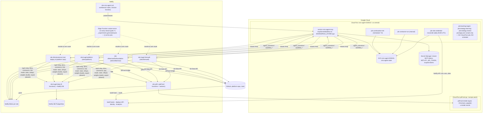
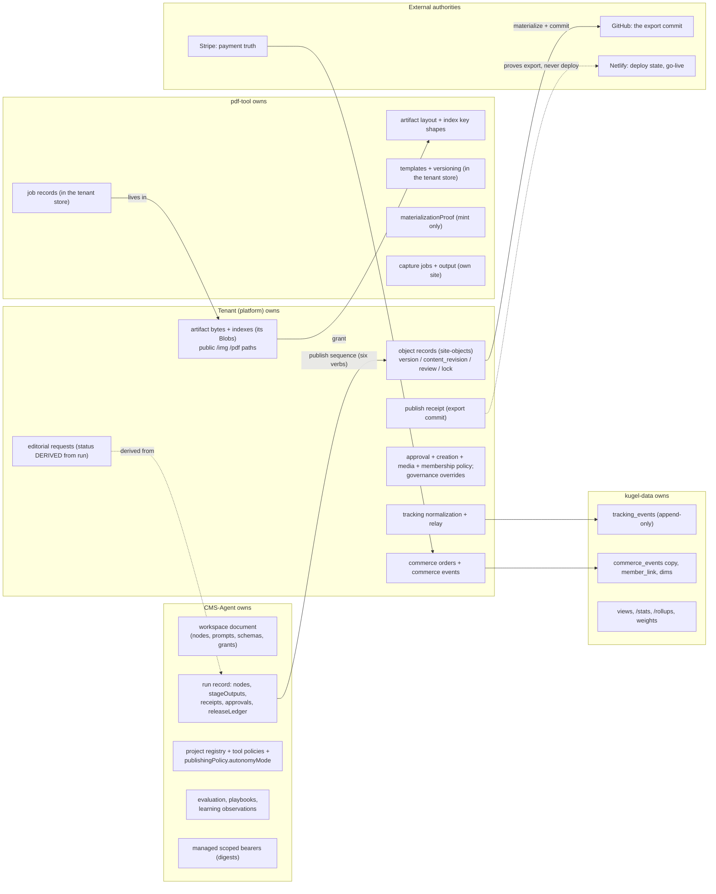
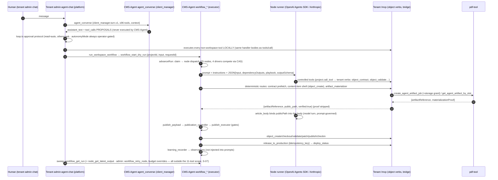

# Kugel — system architecture (cross-repository, CURRENT state)

> Pins: `CMS_AGENT_SHA=44acb04a1f54281761ab3c34219913198d117950` · `PLATFORM_SHA=d5845dd6e855b434547430d6b0bb4d60b9f60a3c` · `PDF_TOOL_SHA=2c28a4b6430a9589b384dd634f08e9ace5c4e84b` · `KUGEL_DATA_SHA=d9723664521c97be87934874927e9e4603da68ba`.
> Everything in this file describes the system **at those pins**. Future shape lives only in [SYSTEM-FUTURE-EXTENSIONS.md](SYSTEM-FUTURE-EXTENSIONS.md). Labels: VERIFIED-BOTH-SIDES / -PRODUCER-ONLY / -CONSUMER-ONLY / CONTRADICTED / UNKNOWN.

## 0. Where this documentation lives, and why

Decision: **the `platform` repository, `docs/system/`**. The other three repositories carry `docs/SYSTEM.md`, a one-page pointer with the pins.

Evidence for the choice, not preference:

1. Three of the four cross-repository edges terminate at platform. Platform is the MCP server CMS-Agent and every plugin call (`packages/core/server/functions/mcp.ts`), the only producer to kugel-data (`track-ingest.ts`, `commerce-events.ts`, `tracking-dims-push.mjs`, `member-link.ts`), and the only bridge to pdf-tool that mints storage grants (`pdf-tool-storage-grant.ts`). CMS-Agent's only cross-repo edge that bypasses platform is the kugel-data `/rollups` read.
2. Platform already runs repo-wide invariant tests under `npm test` (`tests/scripts/*.test.mjs`), so a drift gate for these documents can run in the CI that guards the most contracts.
3. The other candidates fail a concrete test: CMS-Agent's docs set is at `40424c4` and silent on the W21 tracking consumer; pdf-tool and kugel-data are leaf systems whose docs are still unmerged PRs; a fifth repository would have no CI and cannot be pushed from cloud sessions.

Not implied by the choice: platform code is not "the system". The authority matrix, not the docs location, says who owns what.

## 1. Identity of each system (CURRENT responsibility)

| System | Repository / runtime | Owns (canonical) | Explicitly does not own |
|---|---|---|---|
| **CMS-Agent** | `vreich-ui/CMS-Agent`; Google Cloud Run service `cms-agent-mcp` + jobs (`continuation-tick` every 2 min, `site-credential-reconciler` daily, `conductor-run` on demand); GCS bucket `cms-agent-503015-cms-agent-state`; two static SPAs on Netlify site `cms-agent` | Workspace (node definitions/prompts/schemas/tool grants), workflow runs, stage outputs, receipts, evaluations, playbooks, learning observations, project (tenant) registry, tenant chat scoped bearers, the `client_manager.turn.v1` chat contract, site genesis | Published content, artifact bytes, deploy state, tracking data (CMS-Agent audit `PUBLISHING_ARCHITECTURE.md` §1; verified against code) |
| **Publishing Conductor** | CMS-Agent `src/agent/workspace/executor.ts` + node literals (`nodes.ts`, 25 nodes) — not a service, a module driven by the MCP `workflow_*` tools, the tick and the conductor job | The run lifecycle: dispatch, gates, deterministic routes (`publish_payload`, `publication_controller`*, `publish_executor`*, `release_executor`, `artifact_materializer`), retries, claims | Which path `publish_executor` takes is a **store metadata flag**, not code (CMS-Agent K-A1); UNKNOWN in production |
| **Workspace MCP** | CMS-Agent `POST /mcp` on Cloud Run: 151 tools (`docs/mcp-tool-manifest.json`), OAuth 2.1 AS, sessions | The API through which humans, connectors, the tenant admin chat and the SPAs program the workspace and drive runs | It is not the content surface; content is meant to go through the tenant admin chat (server `instructions`) |
| **Tenant / project MCP** | the `platform` repository `packages/core/server/functions/mcp.ts`, deployed **once per tenant** Netlify site (drlurie root-deployed; `sites/{platform,zilberman,fernwell}`); 100 tools (97 + three `analytics_*` server-side sink proxies since #694), 66 visible to a shared-token caller | Canonical content objects (per-tenant Netlify Blobs `site-objects`), object verbs, publish → git export, release → Netlify build, artifact ingress/serving, membership, plugin façade, tracking relay, experiment arm serving at the edge (`variant-serve`, inert with `experiments: []`), admin UI | Reasoning (delegated to CMS-Agent `agent_converse`), rendering bytes (pdf-tool), analytics storage (kugel-data) |
| **Platform** (the engine) | `packages/core/**` = fleet law; `sites/<client>/**` = per-tenant data + bindings; Astro build reads committed exports | One implementation for every tenant | Nothing in `packages/core` may hard-code a tenant (`tests/scripts/core-no-site-literals.test.mjs`) |
| **pdf-tool** | `vreich-ui/pdf-tool`; Netlify site `pdf-x` (32 MCP tools + HTTP mirrors + background workers); Cloud Run `pdf-tool-render` (typst, Chromium, poppler) | Turning intent into **bytes** (images, PDFs, imports, rasterization, capture), the artifact layout `{kind}/{safeRequestId}/{sha256}{ext}`, index records, job records, template versioning, `materializationProof` minting, capture jobs and capture output | Tenant credentials (uses the per-call storage grant), workflow JSON, publishing, public URLs (`workflowPatchStatus: "skipped_by_design"` on every job) |
| **kugel-data** | `vreich-ui/kugel-data`; Netlify site `kugel-data`, 9 functions, one Netlify DB (PostgreSQL), migrations 001–005 | Raw tracking events, commerce-event copies, member links, content dimensions, rollup views, `/stats`, `/rollups`, `/weights`, the nightly `experiment-weights` job | Event vocabulary (accepts any non-empty `event`/`kind` string), normalization (done by platform), consent enforcement, retention (none) |
| **Netlify** | Hosting for every tenant site, pdf-tool, kugel-data, the CMS-Agent SPAs; Netlify Blobs; Netlify DB; build hooks; deploys API; Identity (GoTrue); Analytics add-on | Deploy state and go-live | Nothing else; every Kugel system only reports what Netlify says |
| **Cloud Run** | CMS-Agent service + jobs (`cms-agent-503015`, us-central1); pdf-tool render service (`pdf-tool-gc`, europe-west1) | Compute for the two non-Netlify planes | State (GCS for CMS-Agent; pdf-tool render service is stateless) |
| **GCS** | `cms-agent-503015-cms-agent-state` | Every CMS-Agent record (`workspace/`, `runs/`, `projects/`, `evaluation/`, `improvement/`, `auth/`, `mcp/`…) | — |
| **Netlify Blobs** | Per-tenant stores (17 core + 4 pdf-tool-only = 21 namespaces per fully provisioned tenant); pdf-tool's own site stores (`mcp-sessions`, `mcp-session-grants`, `mcp-oauth`, `agent-artifact-jobs`, `artifacts`, `artifact-index`) | Tenant content, artifacts, governance, users, chats, requests; pdf-tool sessions, OAuth, capture output | "Blobs" is ambiguous across repos — always name the site (conflict ledger L-18) |
| **GitHub** | the `platform` repository's `main` is the **export** target (`GITHUB_REPOSITORY`, per-tenant env; all four tenants' exports live in this one repo) | The committed, derived content export `sites/<client>/data/site/**` and the build input | Truth for content (that is the Blobs object record) |
| **External model providers** | OpenAI (Agents SDK and Chat Completions), Anthropic Messages, Google — called by CMS-Agent runners and `agent_converse`; OpenAI image models, fal.ai FLUX, Qwen — called by pdf-tool; Anthropic/OpenAI keys optionally on tenants for `admin-ask-ai-object` | Nothing; stateless calls | — |
| **External media providers** | Openverse, Pexels, Unsplash, Google CSE — called only by pdf-tool image search; Stripe — called only by platform commerce; Netlify Analytics — read only by platform | — | — |

\* deterministic only when the live store row carries the flag (CMS-Agent K-A1).

## 2. System context (CURRENT)

```mermaid
flowchart LR
  subgraph People["Humans"]
    Wolf["Operator"]
    Editor["Tenant editors / owners<br/>(Netlify Identity)"]
    Reader["Readers (browser)"]
  end
  subgraph Agents["LLM agents outside the repos"]
    Conn["Claude / ChatGPT connectors<br/>(OAuth 2.1)"]
    Plugin["Publishing plugins<br/>(ChatGPT Agent Studio, Claude skill)"]
  end
  subgraph CMS["CMS-Agent (Cloud Run + GCS)"]
    WMCP["Workspace MCP /mcp<br/>151 tools"]
    Cond["Publishing Conductor<br/>executor.ts + tick + conductor-run"]
    Learn["W21 jobs: tracking-ingest,<br/>strategy-learning, strategy-review<br/>(no deploy artifact)"]
  end
  subgraph Tenant["One tenant Netlify site (×4: drlurie, platform, zilberman, fernwell)"]
    TMCP["/mcp (100 tools) + /api/plugin/*"]
    Admin["/admin (React) + admin-* functions"]
    Chat["admin-agent-chat → client_manager"]
    Store[("Netlify Blobs: site-objects,<br/>artifacts, artifact-index, …")]
    Site["Astro site (CDN)"]
    Ingest["/api/t track-ingest"]
  end
  subgraph PDF["pdf-tool (Netlify pdf-x + Cloud Run render)"]
    PMCP["/mcp (32 tools)"]
    Own[("pdf-x Blobs: sessions,<br/>OAuth, capture output")]
  end
  subgraph Data["kugel-data (Netlify + Netlify DB)"]
    Sink["/api/tracking-sink{,/commerce,/dims,/link}"]
    Read["/stats (no auth) · /rollups (bearer) · /weights (no auth)<br/>/export — does not exist"]
    PG[("PostgreSQL")]
  end
  GH[("GitHub: platform repo, main<br/>sites/&lt;client&gt;/data/site/** [GENERATED]")]
  NL["Netlify build hook + deploys API"]
  Models["OpenAI · Anthropic · Google · fal.ai · Qwen"]
  Media["Openverse · Pexels · Unsplash · Google CSE"]
  Stripe["Stripe"]

  Wolf --> WMCP
  Conn --> WMCP
  Conn --> TMCP
  Plugin -- "object verbs + release" --> TMCP
  Editor --> Admin
  Editor --> Chat
  Chat -- "agent_converse (scoped bearer, 11 tools)" --> WMCP
  Admin -- "workflow_get_run(_cost) / cancel / node_get_latest_output / retry + budget (S-07)" --> WMCP
  Admin -. "Insights: feedback_list / playbook_get / optimizer_status /<br/>learning_list_observations — refused on the 11-tool bearer (S-07)" .-> WMCP
  Cond -- "object_* / artifact / capture / release tools<br/>(&lt;CLIENT&gt;_MCP_TOKEN)" --> TMCP
  WMCP --> Cond
  Cond --> Models
  Chat --> Models
  TMCP -- "tools/call + storage grant (tenant PAT)" --> PMCP
  PMCP -- "writes bytes + indexes via grant" --> Store
  PMCP --> Own
  PMCP --> Models
  PMCP --> Media
  TMCP -- "publish: Git Data API [skip netlify]" --> GH
  TMCP -- "release: POST build hook; poll deploys" --> NL
  GH -- "build reads exports" --> Site
  NL --> Site
  Reader --> Site
  Site -- "/api/t batches (same origin)" --> Ingest
  Ingest -- "NDJSON, bearer, 2 s, at-most-once" --> Sink
  Site -- "postbuild dims" --> Sink
  Stripe -- "webhook" --> TMCP
  TMCP -- "commerce_event copy" --> Sink
  Sink --> PG
  PG --> Read
  Admin -- "/stats?from&to (sink reads days only — S-23) · /rollups?by=object · export (404)" --> Read
  Site -. "build: /weights (envelope mismatch — S-24)" .-> Read
  Learn -- "/rollups?by=producer|object|strategy" --> Read
```

Edges that a reader might expect and that do **not** exist at the pins: CMS-Agent → pdf-tool for jobs (all artifact/capture/template work goes through the tenant bridge; CMS-Agent's `pdf-tool` project is read-only and unused — VERIFIED-BOTH-SIDES); platform → CMS-Agent feedback/learning tools as a **working** edge (the admin Insights tab calls `feedback_list`, `playbook_get`, `optimizer_status`, `learning_list_observations` since #694, but with the genesis-minted 11-tool bearer every call is refused before dispatch — S-07; the edge is drawn dashed); kugel-data → anything (it never calls out; the `pg_notify` trigger has no listener); any system → Netlify Analytics except the admin dashboard.

## 3. Deployment / runtime topology (CURRENT)

Facts that matter for operations (evidence in [SYSTEM-OPERATIONS.md](SYSTEM-OPERATIONS.md)): CMS-Agent has two deploy artifacts that disagree (memory, min-instances, env sets); the three W21 learning jobs have no deploy artifact; pdf-tool has no CI test gate and auto-deploys from `main`; kugel-data applies migrations on every deploy and has no retention job; the four tenant sites share one `GITHUB_REPOSITORY` and one `TRACKING_SINK_TOKEN`; every tenant now runs the `variant-serve` Edge Function on every request, which returns `context.next()` at module scope while its generated map is empty.

## 4. Authority boundaries (CURRENT)

Rules the diagram encodes (each verified in [SYSTEM-AUTHORITY-MATRIX.md](SYSTEM-AUTHORITY-MATRIX.md)):

- Content is canonical **only** on the tenant, from the moment `object_create` succeeds; the CMS-Agent run keeps receipts, never content (VERIFIED-BOTH-SIDES).
- The tenant's approval policy is the last gate on a publish; CMS-Agent's five gates decide only whether CMS-Agent *attempts* one (VERIFIED-BOTH-SIDES).
- pdf-tool writes into the tenant's stores with the tenant's credential and keeps nothing about the tenant except session grants (whose persistence is pdf-tool KI-01) — VERIFIED-BOTH-SIDES.
- kugel-data trusts `project_id` from the body under one fleet-wide token (kugel-data KI-13) — VERIFIED-BOTH-SIDES.
- A publish receipt proves an export commit; a deploy receipt proves a Netlify deploy; only `productionConfirmed:true` proves "live" (VERIFIED-BOTH-SIDES; CMS-Agent reads exactly that flag, `releaseExecution.ts:492-504`).

## 5. Agent workflow (CURRENT) — where reasoning happens vs where tools execute

Three distinct agent planes exist and must not be conflated ([SYSTEM-AGENT-ARCHITECTURE.md](SYSTEM-AGENT-ARCHITECTURE.md)): (1) the **conductor** (CMS-Agent nodes execute tools themselves through `ProjectMcpAdapter`); (2) the **client_manager chat** (CMS-Agent reasons, platform executes); (3) **publishing plugins** (an external LLM calls tenant object verbs directly over OAuth; CMS-Agent is not involved — ruling ART-1).

## 6. What is implemented vs planned (system level)

| Capability | State at the pins |
|---|---|
| Conductor article publishing to dr-lurie and platform tenants | IMPLEMENTED (`projectHooks.ts` hard-wires the two; fernwell/zilberman/minted tenants get `no_publish_executor`) |
| Clone/capture publishing of `page`/`navigation` objects | IMPLEMENTED (`objectPublishExecution.ts`) |
| Plugin publishing over tenant `/mcp` | IMPLEMENTED (three `req_plugin_*` articles carry a producer context authored by the plugin) |
| Two-step go-live (publish = export commit; release = build hook) | IMPLEMENTED, both repos agree |
| Artifact generation via tenant bridge + grant | IMPLEMENTED |
| Site capture via tenant bridge → pdf-tool own storage | IMPLEMENTED (snapshot JSON only; screenshot bytes have no export path) |
| First-party tracking → kugel-data → admin dashboard | IMPLEMENTED for drlurie (only tenant with a committed `tracking.json` and `own.enabled`) |
| Commerce → revenue in kugel-data | NOT WORKING (two independent key/vocabulary mismatches; no tenant live on Stripe) |
| Experiments / variants / `exposure` | Producer side IMPLEMENTED since #694 (edge arm serving, `exposure` event, build-time weights read) but every tenant ships `experiments: []`, and the producer and the sink do not agree on the arm key or the weights envelope (S-24, S-25) — treat as NOT OPERATIONAL |
| Tracking → CMS-Agent learning | CODE EXISTS in CMS-Agent, UNSCHEDULED, joins broken — **no closed feedback loop** (SYSTEM-TRACKING-AND-ATTRIBUTION.md §7) |
| Promotion / campaigns | NOT IMPLEMENTED anywhere; not canonical anywhere |
| Genesis conductor (agentic onboarding) | ASPIRATIONAL |
