# System artifact semantics — bytes, indexes, references, proofs, paths

> Pins: `CMS_AGENT_SHA=44acb04a1f54281761ab3c34219913198d117950` · `PLATFORM_SHA=d5845dd6e855b434547430d6b0bb4d60b9f60a3c` · `PDF_TOOL_SHA=2c28a4b6430a9589b384dd634f08e9ace5c4e84b` · `KUGEL_DATA_SHA=d9723664521c97be87934874927e9e4603da68ba`.
> Both producer and consumer implementations were read for every transformation below. Nothing named "ArtifactReference" is collapsed into anything else.

## 1. The nine things and where each lives

| # | Thing | Owner | Where | Shape (literal) | Mutable? |
|---|---|---|---|---|---|
| 1 | **Artifact bytes** | tenant data, pdf-tool layout | tenant Netlify Blobs `artifacts` → `{image\|pdf\|binary}/{safeRequestId}/{sha256}{ext}` | bytes; blob metadata `{requestId, sha256, contentType, artifactKind}` | write-once, content-addressed; only delete path is `update_image_search_candidate{deleteArtifact}` (leaves index records — pdf-tool KI-16) |
| 2 | **Artifact sidecar** | pdf-tool | `artifacts` → `{blobKey}.json` | full layer-A record | write-once; no shipped reader |
| 3 | **Artifact indexes** | pdf-tool key shapes; **two writers** (pdf-tool `artifact-index.ts:68-98`, platform `artifact-index.ts:56-82`) | tenant `artifact-index` → `request-artifacts/{enc(requestId)}/{sha256}.json` (full A, authoritative "made for request R"), `by-slot/{projectId}/{enc(requestId)}/{slot}.json` (overwritten by the next artifact in the slot), `by-filename/{projectId}/{enc(requestId)}/{filename}.json` (`-2`, `-3` suffixes), `by-tag/{tag}/{sha256}.json` (pointer; read by the `library` image-search provider), `by-kind/`, `by-request/` (pointers; platform reads `by-request`, pdf-tool does not), `latest-by-slot/` (no reader) | full A or pointer `{requestId, sha256, artifactKind}` | pointer keys overwritten; reference keys write-once |
| 4 | **pdf-tool metadata — layer A `ArtifactReference`** | pdf-tool `artifact-core/artifacts.ts:6-28` | returned by every job/lookup/import; persisted as 2 and 3 | `{blobKey, sha256, contentType, sizeBytes?, createdAtISO?, artifactKind?, originalFilename?, filename?, label?, tags, metadata?, deletedAtISO?, deletedBy?}` + declared-never-set aliases `projectId, requestId, artifactId, slot, size, createdAt` | — |
| 5 | **pdf-tool response wrapper — layer B** | pdf-tool `agent-artifact-mcp.ts:215,227,237` | computed per call | `{jobId, projectId, requestId, artifactKind, status, slot, filename, selectedModel, costEstimate?, costReceipt?, requirements, workflowPatchStatus:"skipped_by_design", adapterVersion, executor, requiresAI, requiresModel, renderer?, style?, styleSource?, artifactReference, artifact (alias), materializationProof?, blocked?, error?, errorCode?, errorDetail?, warnings?, qualityGate?}`; by-slot/by-filename: `{artifactReference, materializationProof?}` | — |
| 6 | **Project-native ArtifactReference (platform)** | platform `server/lib/artifacts.ts:32-56` | inside tool results and `verifiedMediaRefs`; durable only as 3 and 8 | the 13-key allowlist `blobKey, sizeBytes, sha256, contentType, createdAtISO, artifactKind, originalFilename, filename, label, tags, metadata, deletedAtISO, deletedBy` — **any other key rejects the whole reference** (`artifacts.ts:336-351`); `artifactKind` widened to 8 values (`image, pdf, video, doc, audio, data, attachment, other`) — `binary` is not one of them | — |
| 7 | **Materialization proof — layer D** | pdf-tool `artifact-attestation.ts` | nowhere durable | `v1.<b64url({typ:"artifact-materialization", v:1, projectId, requestId, blobKey, sha256, sizeBytes?, contentType?, createdAtISO?})>.<b64url(hmac)>`; secret chain `ARTIFACT_ATTESTATION_SECRET → MCP_OAUTH_SIGNING_SECRET → AGENT_RUN_TOKEN` (last: forgeable by any authorised caller) | re-minted on every read |
| 8 | **Workflow reference (CMS-Agent)** | CMS-Agent `artifactMaterialization.ts:219-231,477-539` | run record `stageOutputs["artifact_materializer:jobs"]` per slot, and `artifact_plan.v1` (`stageOutputs.artifact_materializer`) | `SlotJobState {slotId, phase:'adopted'\|'materialized'\|'running'\|'blocked', status, jobId?, attempts, createdAt, updatedAt, artifactReference?: {...ref, blobKey}, publicPath?, verification?: {source:'adopted'\|'job', verifiedAt, jobId?, key, sha256?, contentType?, size?, publicPath}, error?}`; plan entries `{slotId, verified:true, publicPath, artifactReference, verification?}` | rewritten on every poll dispatch; `resetRun` deletes the run's artifact blobs, never the bytes (orphan risk) |
| 9 | **Public path** | platform `artifact-trust.ts:17-23` | inside `content_item` bodies (`node.public.media.src`, `node.public.images[].src`, `body.image.src`) and the rendered HTML | `/img/{requestId}/{sha256}.{ext}`, `/pdf/{requestId}/{sha256}.pdf`; served by `get-public-image/pdf` reading store 1 with `Cache-Control: immutable` | — |
| 10 | **Content-node image field** | platform `bodies/content-item-v1.ts:73-83,147-152` | object record body | `contentItemNodeMediaSchema {type:'image'\|'video'\|'audio'\|'embed'\|'document', title?, contentType?, src: z.string(), alt?, caption?, sizeBytes?}`; hero `contentItemImageSchema {src, alt?}`; **`src` is a bare string in the schema** — the `/img`/`/pdf` grammar and existence are enforced only by `object-validate.ts` (`article_media`, `render_image_ref`, `checkArtifactTrust`) | patch ops |
| 11 | **Capture artifact** | pdf-tool (**own site**) | pdf-x Blobs `artifacts`/`artifact-index`, kind `binary`, tags `capture` + `snapshot\|screenshot\|asset` | same layer A, `contentType application/json` for the snapshot | write-once; **no export path** for screenshot/asset bytes; snapshot JSON readable ≤ 8 MiB via `get_capture_snapshot` |

## 2. Transformations between them (every arrow verified on both sides)

```mermaid
flowchart LR
  BYTES["1 bytes<br/>(tenant artifacts store)"] -- "saveArtifactBytes: sha256 recomputed,<br/>%PDF- check, collision suffix" --> A["4 layer A ArtifactReference"]
  A -- "setJSON blobKey+.json" --> SIDE["2 sidecar"]
  A -- "writeArtifactReferenceIndexes (7 keys)" --> IDX["3 index records"]
  A -- "attestArtifactReference (HMAC)" --> PROOF["7 proof"]
  A -- "spread + proof" --> B["5 wrapper (per call)"]
  B -- "platform: parseArtifactReference<br/>13-key allowlist, rejects extra keys;<br/>verifyBridgeArtifact → verified:true;<br/>sanitizePdfToolPayload strips storage/token/proof;<br/>+ public_path = publicPathForArtifactRef(blobKey)" --> P["6 platform reference<br/>{artifactReference, public_path, verified}"]
  P -- "CMS-Agent: readReference {...ref, blobKey};<br/>readPublicPath; verification{}<br/>(credential-shaped keys stripped)" --> W["8 workflow reference<br/>SlotJobState / artifact_plan.v1"]
  W -- "article_body MODEL turn:<br/>{src: publicPath, alt} into the body;<br/>raw ref into the contract's reference field" --> NODE["10 content-node media field"]
  NODE -- "object_validate: /img|/pdf grammar,<br/>existence via request-artifacts index,<br/>media budget; raw Major Key in a rendered field = block" --> REC[("object record")]
  REC -- "materialize (src verbatim)" --> EXPORT["export JSON"]
  EXPORT -- "render-nodes.ts: <img src> / document figure (verbatim)" --> HTML["page HTML"]
  HTML -- "/img/* → get-public-image?blobKey=image/:splat" --> BYTES
  PATH["9 public path"] -. "pdf-tool parsePublicArtifactPath → request-artifacts key<br/>(no shipped caller)" .-> IDX
  CAP["11 capture artifact (pdf-x own site)"] -. "get_capture_snapshot JSON only" .-> CMSC["CMS-Agent capture engine"]
```

| From → To | Transformation | Loss / risk | Label |
|---|---|---|---|
| 1 → 4 | pdf-tool `saveArtifactBytes` (`artifact-layout.ts:112-124`): recompute sha256 and refuse a mismatching caller digest; PDF must start `%PDF-`; `filename` collision-suffixed | `requestId` in the key is lossy (`safePathSegment`) | VERIFIED |
| 4 → 3 | seven index keys written in parallel after the bytes | crash between bytes and job update leaves an indexed artifact with an auto-failed job (pdf-tool KI-07) | VERIFIED |
| 4 → 7 | HMAC over the canonical tuple; only `ARTIFACT_ATTESTATION_SECRET`/`MCP_OAUTH_SIGNING_SECRET` are forgery-resistant | proof has no expiry or nonce; secret rotation invalidates all | VERIFIED |
| 5 → 6 | platform `pdf-tool-client.ts:136-139` extracts the proof to an internal field; `sanitizePdfToolPayload` (`:55-68`) drops `storage`, `token`, `materializationProof`, `materialization_proof` and redacts secret strings; `parseArtifactReference` enforces the 13-key allowlist; `verifyBridgeArtifact` round-trips to pdf-tool `verify_agent_artifact` and requires `verified === true`, else `artifact_materialization_unverified`; `public_path` derived | **a new pdf-tool field breaks every consumer until allowlisted** (`filename` incident, `artifacts.ts:40-50`); `binary` kind rejected (capture never reaches here) | VERIFIED-BOTH-SIDES |
| 6 → 8 | CMS-Agent tolerant readers (`artifactReference\|artifact_reference\|artifact\|reference`; requires `blobKey\|blob_key\|key`; `publicPath\|public_path\|url`); `readTerminal` requires **both** a reference and a public path; `verification` built from the reference + job; credential-shaped keys (`storage, storageGrant, grant, token, blobsToken, blobs_token, materializationProof`) stripped | proof discarded — CMS-Agent can never re-verify later without re-asking the bridge | VERIFIED-BOTH-SIDES |
| 8 → 10 | **no deterministic function**: the `article_body` node's prompt (`nodes.ts:2896`) instructs the model to bind `{src: publicPath, alt}` and to put the raw `artifactReference` only in the contract's raw-reference field; `article_body` output schema has no `media`/`images` field — media lives in the free-form `body` | a model can bind a `needs_generation` slot or a raw key; the publisher's extractor (`readinessContentChecks.ts:68-108`) and gates (`raw_image_artifact_public_url`, `unverified_media`) catch the two forbidden forms before publish | VERIFIED (both prompt and gate code read) |
| 10 → record | platform `object-validate.ts`: `classifyArticleImageSrc/DocumentSrc` (`:2002-2084`), `checkContentItemMedia` (`:2086-2140`, criterion `article_media`: missing at publish, warning while drafting), `checkRenderableImageRefs` (raw Major Keys blocked outside `*AssetRef`/`artifact_ref` keys), `checkArtifactTrust` (`*AssetRef` must be index-trusted), `checkMediaBudget`; existence via `resolveArtifactRef(blobKey)` → `request-artifacts` index | existence check depends on the index a pdf-tool write may not have completed | VERIFIED |
| record → 9 → 1 | `materialize` copies `src` verbatim; `render-nodes.ts:134-146` emits it verbatim (`SAFE_HREF_RE`); `netlify.toml:64-73` maps `/img/*` to `get-public-image?blobKey=image/:splat`; serving regex accepts `[a-z0-9._-]+` ids and 7 image extensions (looser than the write grammar) | a path validated at write time can be served for an id `validateRequestId` would refuse — no defect, a grammar divergence | VERIFIED |
| 11 → CMS-Agent | `get_capture_snapshot` returns the snapshot JSON (≤ 8 MiB, sha256 re-checked); the bridge strips credential-shaped fields | screenshot/asset bytes have **no export path**; the tenant cannot read pdf-x's store | VERIFIED-BOTH-SIDES |

## 3. What "verified" means on each side (three different predicates)

| Side | Predicate | Code |
|---|---|---|
| pdf-tool | `safety` + `blobKeyBinding` pass AND (`persisted` index hit OR forgery-resistant `attestation`); `bytesHash` re-hash reported | `agent-artifact-verification.ts:190-198` |
| platform bridge | pdf-tool said `verified:true` for a `complete` job carrying a proof; `verified:true` is then **asserted** on every `create`/`status`/`by_slot` response it returns | `mcp-tool-handlers.ts:1753-1762, 1830-1834, 1850-1858` |
| platform `object_validate` (later) | the `/img`/`/pdf` path parses, the `request-artifacts/{requestId}/{sha}` record exists and is not `deletedAtISO`, size within budget | `object-validation-context.ts:140-162`, `object-validate.ts` |
| CMS-Agent | slot `has_trusted_artifact` ⇔ phase `adopted`/`materialized` from a response carrying **both** a reference and a public path; at publish, a media ref is verified ⇔ it is in the union of `readiness.verifiedMediaRefs` (caller), envelope `artifactReferences[].verified === true`, and the plan's trusted slots — matched exactly or by the trailing `<request>/<file>` tail, case-insensitive | `artifactMaterialization.ts:657-658, 940-946`; `publisher.ts:316-331`; `readinessContentChecks.ts:118-175` |

None of the three re-checks bytes. Only pdf-tool's `bytesHash` does, and only when asked.

## 4. Proof handling — the system-level fact

The materialization proof is minted by pdf-tool, consumed once by pdf-tool (through the platform bridge) at job completion, and **stored by nobody**: platform strips it (`sanitizePdfToolPayload`), CMS-Agent strips it (credential-shaped), the object record never carries it. The durable evidence that "pdf-tool made these bytes for this request" is the `request-artifacts/{requestId}/{sha256}.json` index record in the tenant's store, which both pdf-tool and platform can write. pdf-tool's own recommendation to persist the proof (its `ARTIFACT_CONTRACT.md` §G) is unimplemented on both consumers — VERIFIED-BOTH-SIDES.

## 5. Scope and grant

- Scope: platform `resolveArtifactBridgeScope` requires `site_id` = this deployment's site and `request_id` = an existing `content_item` on it (`artifact_scope_required`, `artifact_site_mismatch`, `artifact_request_not_found`, `artifact_request_scope_mismatch`); CMS-Agent supplies `site_id` from `objectDialect.siteObjectId` only (`artifact_site_scope_missing` otherwise) and `request_id` from the shell or the plan.
- Grant: platform mints per call (`PDF_TOOL_STORAGE_TOKEN` PAT + `PDF_TOOL_STORAGE_SITE_ID`, `projectId = pdfToolProjectId`, TTL 60 min, six store names, `limits{maxImageBytes, preferredImageFormat, overBudget}`); pdf-tool binds it in `AsyncLocalStorage` and writes into the **tenant's** stores; `overBudget` and `grantVersion` are ignored (VERIFIED-PRODUCER-ONLY). CMS-Agent never sees a grant (VERIFIED-BOTH-SIDES). `set_storage_grant` (session persistence on pdf-tool) is unused by platform and misroutes its own record to the tenant site (pdf-tool KI-01) — cross-system significance: only direct connector clients of pdf-tool.
- `projectId` on pdf-tool is the grant's `projectId`; nothing verifies that the site behind `siteId` belongs to it. `PDF_TOOL_PROJECT_ID` per tenant is UNKNOWN; the fallback is the site slug.

## 6. Two implementations of one layout (drift register)

| Concern | pdf-tool | platform | Divergence |
|---|---|---|---|
| Blob key builder | `artifact-layout.ts` | `artifacts.ts:427-455` | platform lowercases in its `safePathSegment`; pdf-tool does not |
| Blob key parser | `parseArtifactBlobKey` (`/^([a-z]+)\/(.+)\/([a-f0-9]{64})(\.[a-z0-9]+)?$/`) | `MAJOR_KEY_ARTIFACT_REF_RE` (`/^(image\|pdf)\/[^/]+\/[0-9a-f]{64}\.[a-z]+$/i`) | kinds (`binary`), extension optionality |
| Index keys | `artifact-index.ts:19-62` (9 templates) | `artifact-index.ts:26-54` (4 templates) | platform never writes `by-slot`/`by-filename`/`latest-by-slot` |
| Reference shape | 19-field interface | 13-key allowlist | aliases rejected; `binary` kind rejected |
| Public path | `parsePublicArtifactPath` (8 kinds) | `PUBLIC_ARTIFACT_PATH_RE` (2 kinds) | pdf-tool's is unused |

A generated fixture (a real layer-A reference + its index keys) replayed through platform's parser is the cheapest guard — SYSTEM-CONTRACTS.md §F item 2.
