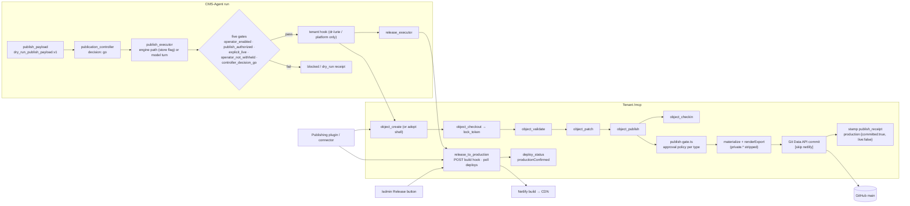
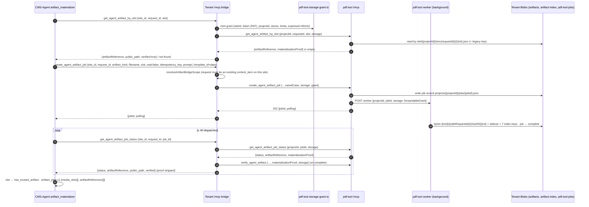
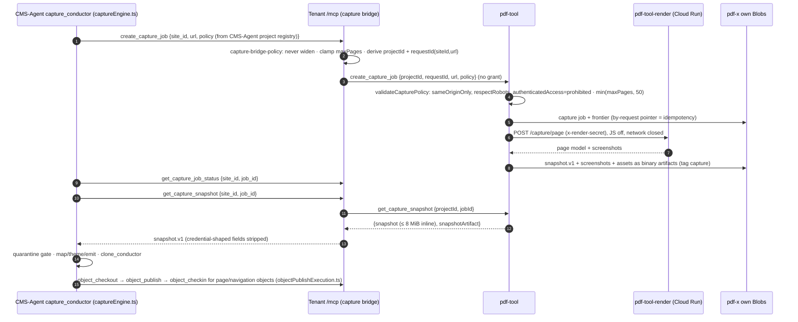
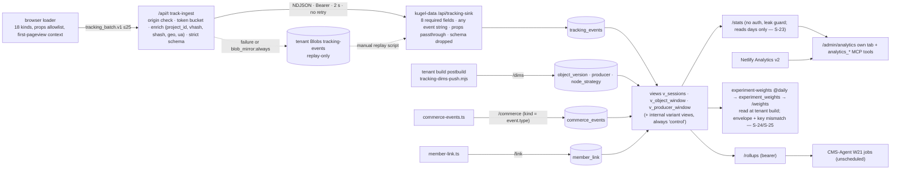
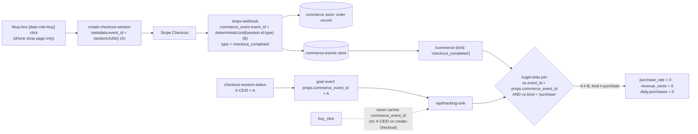

# System data flow — one article through the whole system, and the six flow diagrams

> Pins: `CMS_AGENT_SHA=44acb04a1f54281761ab3c34219913198d117950` · `PLATFORM_SHA=d5845dd6e855b434547430d6b0bb4d60b9f60a3c` · `PDF_TOOL_SHA=2c28a4b6430a9589b384dd634f08e9ace5c4e84b` · `KUGEL_DATA_SHA=d9723664521c97be87934874927e9e4603da68ba`.
> All diagrams are CURRENT. Nothing here is a design.

## 1. The representative article

`req_conductor_n_acetylcysteine_nac_benefits_ri_ymcn47_20260904_01` on tenant **drlurie** — a conductor-published article (CMS-Agent `publishing_conductor`), committed export `sites/drlurie/data/site/articles/req_conductor_n_acetylcysteine_nac_benefits_ri_ymcn47_20260904_01.json`:

- `__generated = {from: "objects/content_item/by-id/req_conductor_…_01.json", at: "2026-09-04T18:20:30.272Z", record_version: 53}` at the audit; at `PLATFORM_SHA` the same export was re-published (`d5845dd`, `at: 2026-09-06T16:34:33.086Z`, `record_version: 55`) with an identical body — a live instance of S-13: the next dims push writes a new `object_version` row and `v_producer_window` re-keys the article's history to it — **no `producer`, no `surface`, no `attribution`** (the dr-lurie hook sends none; see transition 13).
- one media node: `/pdf/req_conductor_n_acetylcysteine_nac_benefits_ri_ymcn47_20260904_01/fd360cf7…f42b0a.pdf`; no hero `image`; no `private` on any node; `tracking` absent.
- The id is a **conductor-style publish id** (`req_conductor_<topic≤32>_<run-tail 6>_<yyyymmdd>_01`, `publishRequestId.ts:66-104`): `ymcn47` is the last six characters of the CMS-Agent run id. It is therefore **not** a platform-minted editorial request id (`req_agent_<slug>_<date>_<nn>`). Because the article carries a materialized PDF, `artifact_materializer` ran — and a content-item shell would have bound the artifacts and the publish to `run.requestId` (`artifactMaterialization.ts:772-779`) had one existed and matched the pattern. The id form therefore proves the shell path did **not** apply: the run held no `requestId` (a start outside the chat path — operator MCP call or conductor-job CLI) or the shell creation was skipped/failed (`contentItemShell.ts:81-98`). Which of these, and whether `artifact_plan` or a later `publishRequestId` authored the id, cannot be read from the export (the run record lives in GCS) — UNKNOWN. What is certain: no platform editorial request can point at this article by its own id (S-06).

Where the export is silent, the trace below follows the code path a live `openai` run takes at the pins. Each transition carries the evidence label for the boundary it crosses.

## 2. End-to-end transitions

| # | Caller → callee | Tool / endpoint | Schema | Correlation id(s) | Storage mutation | Idempotency | Retry | Failure | Authority | Label |
|---|---|---|---|---|---|---|---|---|---|---|
| 1 | Human → tenant `admin-agent-chat` (drlurie) | `admin-agent-chat` `send` | `ChatDoc` (Blobs `agent-chats`) | chat id; `turn_id` minted by platform | `agent-chats` | — | — | Identity JWT required | INTENT: the human | VERIFIED |
| 2 | platform `loop.ts` → CMS-Agent | `agent_converse` (`client_manager.turn.v1`) | C-01 | `(conversation_id, turn_id)` CAS claim on CMS-Agent | CMS-Agent `conversations/{id}.json`, `conversation-turn-claims/…`, `usage/` | claim replay for duplicate `(conversation, turn)` | none; `conversation_needs_reset` after one flattened retry | chat fails closed when CMS-Agent unreachable | reasoning: CMS-Agent; execution: platform | VERIFIED-BOTH-SIDES |
| 3 | platform `run_workspace_workflow` → CMS-Agent | `workflow_start_dry_run {projectId:'dr-lurie', input, requestId: 'req_agent_<slug>_<date>_<nn>'}` | C-02 | `requestId` (platform-minted, bumped while a content_item with that id exists — `tools.ts:1069-1083`); CMS-Agent returns `runId = run_<epochMs>_<6 base36>` | CMS-Agent `runs/{runId}.json` (`publishingPolicySnapshot` taken here), `run-index/dr-lurie.json`; platform `editorial-requests/by-id/<requestId>.json` | none (a second call starts a second run) | — | `request_id_required` / `invalid_request_id` for pattern projects on live runs | INTENT recorded on both sides | VERIFIED-BOTH-SIDES |
| 4 | CMS-Agent drivers (request window 45 s → tick every 2 min → conductor job) → executor | `advanceRun` / `runNextNode` | `WorkflowExecutionRecord` | `runId`; per node `dispatch{dispatchedAt, timeoutMs, driver}` | `runs/{runId}.json` (CAS on `rev`), `node_timings/`, `usage/by-run/`, `ticks/` | CAS claim; reclaim after `timeout + 90 s` (double-dispatch risk, CMS-Agent K-D1) | node retry ≤2, backoff 60 s·2ⁿ⁻¹ | `blocked` (approval / budget / client auth), `failed` | CMS-Agent | VERIFIED |
| 5 | ideation → research → draft → reviews (model nodes) | OpenAI Agents SDK / Anthropic; controlled tools incl. `project.call_read_tool` → tenant `object_contract`, `object_validate` (read allowlist of 15 verbs) | node `outputSchema` (store overlay) | `runId`, `nodeId`, `provenance.promptVersion` (hash) | `run.nodes[].output`, `stageOutputs{}`, workspace mirror, `artifacts/{id}.json` | — | as 4 | output validation (home-grown JSON-Schema subset, CMS-Agent K-A5) | CMS-Agent | VERIFIED |
| 6 | `contract_intelligence` (deterministic) → tenant | `object_contract` (read) | platform `lib/registry/object-contract.ts` (derived, never hand-authored) | — | `reducedContractCache` in `workspace/current.json` | — | — | — | contract shape: platform | VERIFIED-BOTH-SIDES |
| 7 | executor (before `artifact_materializer`) → tenant | `object_create {object_type:'content_item', site:'site_drlurie', requested_id: run.requestId, body:{slug,title,nodes:[]}}` — the **content-item shell** | C-07 | object id = `run.requestId` (only when live + pattern-valid) | tenant `site-objects` (`version 1`) | "already exists" tolerated (`contentItemShell.ts:126`) | — | `content_item_shell_failed:<code>` warning, never a failed node | CONTENT MUTATION: platform verb | VERIFIED-BOTH-SIDES |
| 8 | `artifact_plan` (model, zero tools) | emits `materialization_spec.v1` (slots, prompts, templateId, renderData, requestId derivation) | CMS-Agent node schema (`nodes.ts:2248-2320`) | `slotId` (free-form; brief_architect's), `requestId` (derived) | stage output | — | — | slot without executable spec → `blockers[]` | CMS-Agent | VERIFIED |
| 9 | `artifact_materializer` (deterministic) → tenant bridge | `get_agent_artifact_by_slot {site_id:'site_drlurie', request_id, slot}` (adopt) then `create_agent_artifact_job {site_id, request_id, artifact_kind:'pdf', filename, slot, wait:false, idempotency_key:'artifact:<runId>:<requestId>:<slotId>', template_id, data, assets?}` | C-08 | `request_id` = shell id when a shell exists (`artifactMaterialization.ts:772-779`), else the plan's; `job_id` | CMS-Agent `stageOutputs["artifact_materializer:jobs"]` (per-slot `SlotJobState`) | platform idempotency store `(create_agent_artifact_job, key)` | poll ≤ 40 dispatches; terminal statuses `complete\|completed\|succeeded\|success` / `failed\|cancelled\|canceled\|error` | `artifact_site_scope_missing`, `artifact_tool_policy_blocked`, `artifact_materialization_poll_budget_exhausted` | CMS-Agent decides *what*; platform decides scope (`resolveArtifactBridgeScope`: `artifact_request_not_found`, `artifact_site_mismatch`) | VERIFIED-BOTH-SIDES |
| 10 | platform bridge → pdf-tool | `create_agent_artifact_job {projectId:'drlurie'?, requestId, artifactKind:'pdf', templateId, data, assets, storage: grant, descriptor?}` then `get_agent_artifact_job_status`, `verify_agent_artifact` | C-12, C-13, C-15 | pdf-tool `jobId`; grant `projectId = pdfToolProjectId` (env `PDF_TOOL_PROJECT_ID`, else site slug — value UNKNOWN) | tenant Blobs `pdf-tool-jobs/projects/{projectId}/jobs/{jobId}.json`, `pdf-render-data/`, then bytes `artifacts/pdf/{req}/{sha}.pdf` + sidecar + index records (`artifact-index/request-artifacts/…`, `by-slot/…`, `by-filename/…`, `by-tag/…`) | pdf-tool: **none** for artifact jobs (a new job per call — pdf-tool AI_CONTEXT); platform's idempotency store is the only guard | job auto-fails after 12 min `running`; worker triggered once per create/resume | grant expired → `storage grant expired`; `RENDERER_MISMATCH`; quality gate is warn-only | bytes: pdf-tool under the tenant's grant | VERIFIED-BOTH-SIDES |
| 11 | pdf-tool → platform → CMS-Agent | job status `{status:'complete', artifactReference (layer A), materializationProof}` → platform verifies with pdf-tool, strips the proof, returns `{artifactReference, public_path:'/pdf/<req>/<sha>.pdf', verified:true}` → CMS-Agent stores `{artifactReference, publicPath, verification{source:'job', key, sha256…}}`, slot `has_trusted_artifact` | C-14, C-15 | `blobKey`, `sha256` | as 9 | — | — | `artifact_materialization_unverified` (platform) when the proof is missing on a complete job | verification: pdf-tool (HMAC + index); trust decision: platform | VERIFIED-BOTH-SIDES |
| 12 | `article_body` (model) | binds `publicPath` into the client-shaped body (`{src: publicPath}`) per prompt instruction; raw `artifactReference` into the contract's reference field; `object_validate` loop via `project.call_read_tool` | CMS-Agent `client_object.v1` envelope; platform `content_item.v1` (`media.src` bare string; path grammar enforced only by `object-validate.ts:1961-2140`) | — | stage output | — | validation loop with re-stamped claim | `no_valid_article_body` at publish if the canonical schema disagrees with the store overlay (CMS-Agent C-7) | body shape: platform; binding: a model turn | VERIFIED (no deterministic binding function exists on either side) |
| 13 | `publish_payload` → `publication_controller` → `publish_executor` (engine path **only if** the store row carries `metadata.publishExecutorDeterministic:"execute"` — UNKNOWN in production) → `publisher.ts` five gates → dr-lurie hook | `object_create` (adopted shell or `requested_id: publishRequestId`) → `object_checkout {agent_name:'cms-agent'}` → `object_validate` → `object_patch {ops:[set_article_meta, upsert_node…], lock_token, expected_record_version}` → `object_publish {object_type, object_id, lock_token}` (**no `producer`, no `idempotency_key`**) → `object_checkin` | C-05 | `objectId`, `lock_token`, `record_version`; CMS-Agent `PublishExecutionReceipts{requestId, objectId, commitSha, contentRevision, publishedTime, artifactDigests, toolSequence, steps}` | tenant `site-objects` (versions 2..N), GitHub commit (transition 14), CMS-Agent `stageOutputs.publish_executor` (`publish_execution.v1`, `status:'published_pending_release'`), observation `publish_executed` | platform idempotency only if `idempotency_key` were sent — it is not; the committer no-ops on identical content (deterministic materialization) | `content_changed_during_publish` etc. surface as CMS-Agent `error` result | media gates first: `raw_image_artifact_public_url`, `unverified_media`; `no_publish_executor` for other tenants | PUBLISH: CMS-Agent gates → platform `publish-gate.ts` (drlurie: `content_item` is not `require-approval`) | VERIFIED-BOTH-SIDES |
| 14 | platform `object-publish.ts` → GitHub | Git Data API: ref → commit → blobs → tree → commit → `PATCH refs/heads/main` (`force:false`), message ends `[skip netlify]` | `MaterializedFile[]`; export `{__generated{from, at, record_version}, …body minus private}` | `commit_sha`, `tree_sha`; receipt `{kind:'object_export_commit', content_revision, exported_at, files[]}` | `sites/drlurie/data/site/articles/<id>.json` on `main`; then the record: `publication.published_time`, `publish_receipt`, `history[]`, `version+1` (`content_revision` unchanged) | identical content ⇒ identical blob sha ⇒ `noOp` | ×4 on non-fast-forward, 250 ms·2ⁿ⁻¹, then `non_fast_forward_exhausted` | `stamp_failed_export_committed` → `reconciliation:'retry_publish'` (record never stamped before the commit) | GitHub holds the commit; platform holds the receipt | VERIFIED |
| 15 | `release_executor` (deterministic, engine-only caller of this verb in CMS-Agent) → tenant | `release_to_production {idempotency_key:'release:<runId>:<commitSha>', timeout_seconds:40}` then `deploy_status {commit}` (≤ 8 polls) | C-06 | `releaseLedger['<runId>:<requestId>']`, Netlify `deployId`, `targetCommit` = branch HEAD unless `commit` given (CMS-Agent gives none → **HEAD**, which may include other tenants'/agents' exports) | CMS-Agent `run.releaseLedger`; platform idempotency store; Netlify build | platform `(release_to_production, key)` → first result replayed (marker shape drift, S-11) | CMS-Agent polls; platform poll budget clamped to the Lambda deadline | `build_hook_not_configured` / `deploy_lookup_not_configured` are tool errors; `productionConfirmed:false` with `released:true` is ambiguous (platform #5) | RELEASE: whoever calls; DEPLOYMENT: Netlify | VERIFIED-BOTH-SIDES |
| 16 | Netlify → CDN | build of `main` (all accumulated exports, every tenant that shares the branch) | — | `deployId`, `commit_ref` | production deploy | — | — | locked deploy ⇒ `build_ready_not_published` | Netlify | VERIFIED |
| 17 | CMS-Agent → tenant (drlurie only) | `verify_article_images {url, expectedImages, expectedDocuments?, commit}` (optional handler; not in the clone/capture path) | platform `verify-article-images.ts:66-94` | `commit` | — | — | waits for the published deploy to reflect `commit` | `verify_article_images_not_configured` | platform | VERIFIED-PRODUCER-ONLY (CMS-Agent has no engine call site; the dr-lurie project allowlist names the tool and the readiness contract's `verifiedMediaRefs` expects its result — a model node may call it) |
| 18 | Reader browser → tenant `/api/t` | `tracking_batch.v1` ≤ 25 events (`sendBeacon` → `fetch keepalive`) | platform `clientTrackingEventSchema` | `event_id` (browser uuid), `object.object_id` — for this article: `node_impression`, `node_dwell`, `completion`, `read_progress` carry `req_conductor_…`; **`pageview`, `engagement`, `scroll_depth`, `cta_click` carry `page_article`** (S-08) | — | — | — | foreign origin rejected; token bucket 60/10 s per warm instance | — | VERIFIED |
| 19 | tenant `track-ingest` → kugel-data | NDJSON → `POST /api/tracking-sink` | C-19 | `event_id`, `project_id:'drlurie'`, `vhash`, `shash` | `tracking_events` rows (`ON CONFLICT (event_id) DO NOTHING`); mirror `tracking-events/events/<date>/…` on failure | `event_id` | none (at-most-once) | 2 s timeout → mirror → manual `tracking-mirror-replay.mjs` | normalization: platform; store: kugel-data | VERIFIED-BOTH-SIDES |
| 20 | tenant build → kugel-data | `POST /dims {project_id, object_version:[{object_id:'req_conductor_…', version:53, published_at, route:'/n-acetylcysteine-…', variant_of:null, surface:undefined, attribution:undefined}], producer:[] (no `__generated.producer` for this article), node_strategy:[{node_id, strategy:null, intent:null, node_kind, position}…]}` | C-20 | `(drlurie, req_conductor_…, 53)` | `object_version`, `node_strategy` upserts; **no `producer` row** | keyed upsert | — | `\|\| true` | platform | VERIFIED-BOTH-SIDES |
| 21 | kugel-data views | `v_object_window` for `req_conductor_…`: `pageviews 0, exposures 0, sessions n, completion_rate (node_impression on highest-position node ÷ sessions), cta_ctr 0, …` ; `v_producer_window`: **no row** (no producer) | C-25 | `object_id`, `day` | — | — | — | — | kugel-data | VERIFIED-BOTH-SIDES (S-08 denominators) |
| 22 | admin → kugel-data | `/stats?project_id=drlurie&from=…&to=…&exclude_test=1` (platform) — the sink reads `project_id` and `days` only and answers its 7-day default (S-23) → `top_objects` lists `page_*` objects only; `publishingSurfaces()` joins receipts locally | C-23 | `object_id` | 5-min memo | — | — | silent: the UI labels the requested window | platform | VERIFIED-BOTH-SIDES (response); CONTRADICTED (request) |
| 23 | conversion / revenue | **not applicable** — no tenant is live on Stripe; even with orders, the `buy_click`/`goal` → `commerce_events` join and the `kind='purchase'` filter are both broken (S-01, S-02) | — | — | — | — | — | — | — | CONTRADICTED |
| 24 | CMS-Agent W21 `job:tracking-ingest` → kugel-data | `GET /rollups?by=producer&project_id=<TRACKING_PROJECT_ID>&from&to` | C-25 | `(run_id, node_id, prompt_version)` | would write `evaluation/feedback/fb_….json` `{kind:'outcome', nodeId, runId, outcome:{source:'tracking:engagement.v1', metrics}}` | `feedbackId` random | — | job has **no deploy artifact**; for this article there is **no producer row** → nothing to ingest | CMS-Agent | VERIFIED-BOTH-SIDES; **no observation is produced for this article by any implemented path** |

Transitions that cannot be correlated (each is a finding in [SYSTEM-KNOWN-ISSUES.md](SYSTEM-KNOWN-ISSUES.md)):

- 3 ↔ 13: the platform request id (`req_agent_…`) and the published object id (`req_conductor_…`) coincide only through the shell adoption path; the platform sweep records `object_id = requestId` unconditionally (S-06).
- 13 ↔ 20 ↔ 24: no `producer` on dr-lurie publishes ⇒ no producer row ⇒ no `by=producer` rollup ⇒ no feedback record. The article is invisible to the only implemented learning path (S-05).
- 18 ↔ 21: page-level events name `page_article`, not the article ⇒ per-article denominators are zero (S-08).
- 14 ↔ 18: no revision (`record_version`) travels on any event; a republish re-attributes history (S-13).
- 15: `targetCommit` = branch HEAD ⇒ a release can ship exports the releasing run never produced (platform #3; cross-repo because CMS-Agent never passes `commit`).

## 3. Content publication (CURRENT)

## 4. Artifact generation (CURRENT)

## 5. Site capture (CURRENT)

Screenshot and asset bytes never leave pdf-x (no export path) — VERIFIED-BOTH-SIDES.

## 6. Tracking ingestion (CURRENT)

## 7. Conversion / revenue path (CURRENT — broken in two places, no live tenant)

