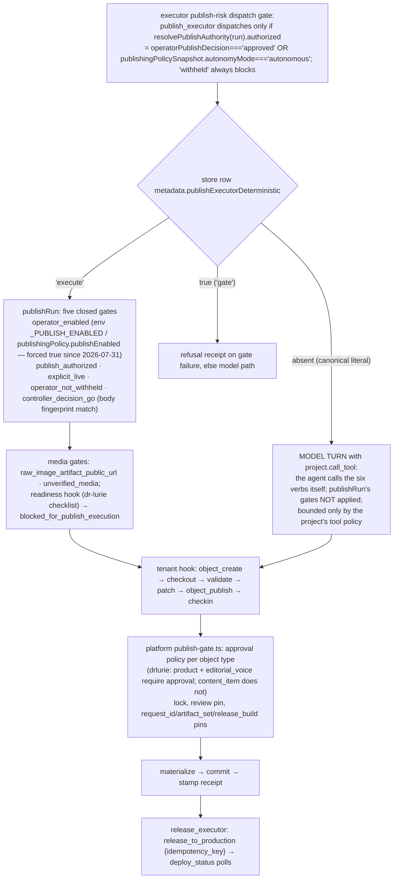

# System publishing semantics — what each word means, and who holds which authority

> Pins: `CMS_AGENT_SHA=44acb04a1f54281761ab3c34219913198d117950` · `PLATFORM_SHA=d5845dd6e855b434547430d6b0bb4d60b9f60a3c` · `PDF_TOOL_SHA=2c28a4b6430a9589b384dd634f08e9ace5c4e84b` · `KUGEL_DATA_SHA=d9723664521c97be87934874927e9e4603da68ba`.
> "A tool being callable is not the same as authority being granted." Every row names the code that decides.

## 1. Vocabulary — the eight things that are not the same

| Word | Means exactly | System · code | Proof it produces | What it does NOT mean |
|---|---|---|---|---|
| **draft / update** | a write to the object record body (`object_patch` under a lock) bumping `version` and `content_revision` | platform `object-verbs.ts`, `object-patch-apply.ts` (44 invertible ops) | new `record_version` | anything visible outside the tenant store |
| **validate** | write-time guardrails against the body schema and validation context (media paths, hotlinks, private leak, taxonomy refs); `publishIntent:true` turns warnings into blockers | platform `object-validate.ts` (`validateObject`); CMS-Agent nodes call it read-only through `project.call_read_tool` | `{valid, errors[], warnings[]}` | approval; existence of artifacts beyond the index check |
| **publish** (tenant) | `object_publish`: gate → materialize → **commit the export to GitHub with `[skip netlify]`** → stamp `publication.published_time` + `publish_receipt` | platform `object-publish.ts:239-390`, `publish-gate.ts`, `object-git-committer.ts` | `publish_receipt {kind:'object_export_commit', commit_sha, tree_sha, content_revision, exported_at, files[]}`; MCP wrapper adds `production:{committed:true, live:false, deploy_deferred:true, requires_explicit_release:true}` | live; deployed; visible to readers |
| **publish** (CMS-Agent) | the `publish_executor` node succeeded in running the tenant hook's six verbs; `publish_execution.v1` with `status:'published_pending_release'`, `publishCommitted:true`; a claimed `executed` without deploy evidence is downgraded to `blocked` + `go_live_unconfirmed` | CMS-Agent `publisher.ts`, `publishExecution.ts:33-45,305-337` | `stageOutputs.publish_executor.receipts{objectId, commitSha, contentRevision, publishedTime}` | release; go-live |
| **materialize** | deterministic rendering of an object record into export files (`canonicalJsonStringify`; `at` = effective `published_time`; `private.*` stripped) so a retried publish produces identical blob shas | platform `materialize.ts`, `materializers/*`, `materializers/shared.ts` | `MaterializedFile[]` | a commit (that is the next step); a deploy |
| **git commit** (export commit) | Git Data API sequence onto `refs/heads/<branch>` (default `main`), `force:false`, retry ×4 on non-fast-forward | platform `object-git-committer.ts:186-302` | `commit_sha` | a build (`[skip netlify]` suppresses it) |
| **publish receipt** | the stamped record of the export commit | platform `object-record-v1.ts:150-180` | see publish | a deploy receipt |
| **release_to_production** | `POST NETLIFY_BUILD_HOOK_URL` (no body) then poll the deploys API until the **target commit** (given `commit`, else **branch HEAD**) is terminal; returns `{released, status, productionConfirmed, deploy?}` | platform `production-release.ts` (one path, two front doors: MCP tool and `admin-release`); CMS-Agent `release_executor` calls it with `idempotency_key`, no `commit` | `ReleaseToProductionResult`; CMS-Agent `releaseLedger` entry | that only this run's export went live — HEAD carries every accumulated export of every tenant sharing the branch |
| **Netlify build** | Netlify builds the branch; `astro build` reads the committed exports | Netlify | `deployId`, `deploy_state` | — |
| **production confirmation** | the published production deploy's `commit_ref` is the target commit or a descendant (`isCommitAncestorOrEqual`) | platform `production-release.ts:174-212`, `deploy-status.ts:148-151` | `productionConfirmed:true` | — `false` means either "not live" or "lookup unavailable" (platform #5) |

CMS-Agent reads exactly `deployStatus === "ready" && productionConfirmed === true` as "live" (`releaseExecution.ts:492-504`) — VERIFIED-BOTH-SIDES.

## 2. The gates, in order, for a conductor publish

Which branch production takes at `B` is a **live store fact** (CMS-Agent K-A1) — UNKNOWN from the repositories; query `workspace_get_node {"id":"publish_executor"}`.

## 3. Reconciling CMS-Agent's gates with platform's gates

| Question | CMS-Agent answers | Platform answers | Reconciled |
|---|---|---|---|
| May this **run** publish? | `resolvePublishAuthority` (operator decision or autonomous policy snapshot) + five gates + media gates + readiness hook | — | CMS-Agent-internal; platform never sees it |
| May this **object** be published now? | — | `checkPublishGate`: type governed? approval pin matches `content_revision`? lock held? `publish_role_required` for humans; `publish_request_id_mismatch`, `publish_artifact_set_*`, `publish_release_build_*` when pinned | platform is the final arbiter for the object |
| May this **caller** publish? | project tool policy (`allowed / needs_approval / blocked` per tool) before transport; `needs_approval` is a hold with no approval flow | auth path (agent key / OAuth / shared token), per-member write budget (skipped for the shared token — platform #7), governance kill switch per surface, plugin charter on `/api/plugin/*` | independent layers; neither knows the other's verdict |
| May the **admin chat** publish without a human click? | — | `loop.ts`: tool class `publication` ⇒ `ask` floor; promotable only when `activeAutonomyMode() === 'autonomous'`, which is never configured | always a human click in chat today |
| Who records the approval? | `workflow_set_operator_publish_decision` on the run (only writer) | `object_review_decide` → `review.decisions[]` + `approval_pin`; chat approval → `ChatDoc` | two records, not linked by id |
| Which **tenant** may approve or publish a run? | none beyond the tool allowlist: a scoped bearer's project binding is checked only on a `projectId` argument; `workflow_get_run`, `workflow_set_operator_publish_decision` and `workflow_publish_run` accept any `runId`, and `publishRun` takes `input.projectId ?? run.projectId` without comparing the two (`mcpEndpoint.ts:98-123`, `publisher.ts:250`) | the tenant's own `/mcp` accepts whatever its `<CLIENT>_MCP_TOKEN` presents; it has no notion of which run or tenant a call came from | a tenant bearer can approve another tenant's run and, through platform's approve-and-publish tool, publish that run's body into its own site (S-26) — INTENT and PUBLISH authority are per-project only when the caller says which project |

## 4. Authority map (CURRENT)

| Authority | Held by | Evidence | Note |
|---|---|---|---|
| **INTENT** | the human in the tenant admin chat (Identity JWT), an operator on CMS-Agent's MCP, or an external plugin actor (OAuth) | platform `admin-agent-chat`; CMS-Agent `workflow_start_dry_run`; plugin `object_create` | recorded on the platform request doc (chat path) and on the run (`requestId`, `initialInput`) |
| **CONTENT MUTATION** | platform object verbs — the only writer of canonical content | `handleObjectVerb` | CMS-Agent, plugins and the admin UI are callers; CMS-Agent's run holds drafts, never canonical content |
| **PUBLISH** | split: CMS-Agent decides whether to *attempt* (gates above); platform decides whether the object *is* publishable (approval policy); for a plugin or connector there is only the platform side | `publisher.ts`, `publish-gate.ts` | for `content_item` on every committed tenant policy the platform side is autonomous ⇒ CMS-Agent's gate is the effective human gate for conductor content |
| **RELEASE** | anyone holding a tenant credential that can see `release_to_production`: CMS-Agent `release_executor`, the `/admin` Release button (admin role), plugins (it is the one privileged tool in the plugin charter), connectors | platform `mcp-tool-definitions` (`privileged`, floor `ask` in chat only); CMS-Agent `releaseExecution.ts` (engine-only caller) | nothing records that a release is owed; HEAD-targeting means one caller ships everyone's dark exports (platform #3) |
| **DEPLOYMENT** | Netlify | build hook, deploys API, Auto Publishing lock | Kugel systems only trigger and report |

## 5. The three autonomy switches (none synchronised)

1. CMS-Agent project record `publishingPolicy.autonomyMode` (`autonomous` ⇒ conductor publishes without an operator decision; absent ⇒ `operator-gated`). Set only by `project_update`; which tenants have it is a live-registry fact — UNKNOWN.
2. Platform `lib/publishing-policy.ts` `autonomyMode` — no tenant registers a provider ⇒ always `operator-gated`; affects only the chat approval floor.
3. Platform approval policy per object type (`sites/*/config/approval-policy.ts` + governance overrides) — decides whether an object needs a human review decision before `object_publish`.

Wolf's stated intent (autonomous publishing by default, per-client `auto / manual / block` per tool) maps today onto: (1) for conductor runs, (3) for objects, and CMS-Agent's per-tool `allowed / needs_approval / blocked` project policy for calls — with `needs_approval` having no approval flow. No single view shows all three.

## 6. Publishing paths that exist besides the conductor

| Path | Publish authority | Release authority | Producer context | Status |
|---|---|---|---|---|
| Conductor (CMS-Agent) → dr-lurie / platform hooks | CMS-Agent gates + platform gate | CMS-Agent `release_executor` | platform hook sends it; dr-lurie hook does **not** | IMPLEMENTED |
| Clone/capture → `objectPublishExecution` (`page`, `navigation`) | CMS-Agent (publishable types snapshot, quarantine) + platform gate | `release_to_production` forbidden on this path (`OBJECT_PUBLISH_FORBIDDEN_VERBS`) | none | IMPLEMENTED |
| Plugin (ChatGPT Agent Studio / Claude skill) → tenant `/mcp` directly | platform gate + plugin charter | plugin may call `release_to_production` | authored by the LLM per skill text (`plugin_<actor>_<request_id>`, `plugin:<actor>`) | IMPLEMENTED (three `req_plugin_*` articles) |
| Admin UI (`admin-object` + `admin-release`) | platform gate; human roles | admin role | none | IMPLEMENTED |
| `run-publisher-agent.ts` (platform, OpenAI Agents SDK) | platform gate | — | — | DEPLOYED, NO CALLER (legacy) |
| CMS-Agent `/api/agent` base agent | — | — | — | LEGACY, never publishes (`project_mcp_publish_not_implemented`) |
| `object-store` REST with `x-publish-key` (scripts) | platform gate | — | none | IMPLEMENTED (operator scripts) |

## 7. Idempotency and retries across the boundary

| Step | Producer key | Consumer behaviour | Gap |
|---|---|---|---|
| `object_create` (shell) | none; `requested_id` | "already exists" tolerated by CMS-Agent | — |
| `object_publish` from CMS-Agent | **no `idempotency_key` sent** | platform commits; identical content ⇒ committer `noOp` ⇒ same receipt shape | a retried publish after a `stamp_failed_export_committed` re-runs the six verbs; safe by content addressing, not by key |
| `create_agent_artifact_job` | `artifact:<runId>:<requestId>:<slotId>` | platform idempotency store returns the original `jobId` | pdf-tool itself is non-idempotent (pdf-tool KI-08); only the platform layer protects |
| `release_to_production` | `release:<runId>:<commitSha\|objectId\|requestId>` | platform replays the first result | replay marker unreadable by CMS-Agent (S-11); ledger still prevents a second hook per run/request key |
| node re-dispatch after claim expiry | none | the publish hook may run twice concurrently (CMS-Agent K-D1) | second run fails at `object_checkout` (lock) or at CAS save; cost stands |
