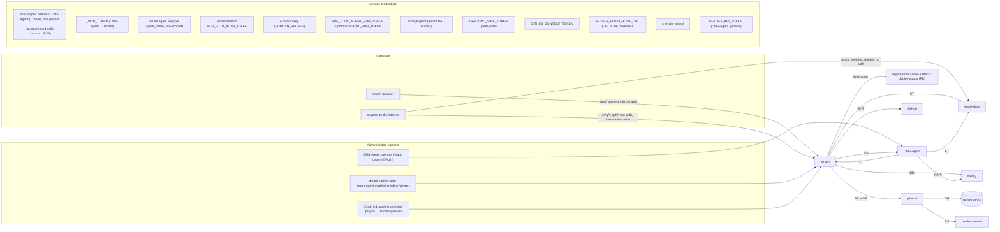

# System security boundaries — credentials, trust, and what each hop actually checks

> Pins: `CMS_AGENT_SHA=44acb04a1f54281761ab3c34219913198d117950` · `PLATFORM_SHA=d5845dd6e855b434547430d6b0bb4d60b9f60a3c` · `PDF_TOOL_SHA=2c28a4b6430a9589b384dd634f08e9ace5c4e84b` · `KUGEL_DATA_SHA=d9723664521c97be87934874927e9e4603da68ba`.

## 1. Trust boundary diagram (CURRENT)

## 2. Hop-by-hop: who authenticates whom, and what is actually enforced

| Hop | Credential | Verified how | Scope enforced | Attribution recorded | Label |
|---|---|---|---|---|---|
| tenant admin chat → CMS-Agent | site-scoped bearer (`CMS_AGENT_MCP_TOKEN`), minted by CMS-Agent genesis/reconciler, digest in `auth/managed-scoped-bearers.v1.json` | sha256 digest lookup on every request (2 GCS reads) | tool allowlist (11) + `projectId`/`project_id` must be in the bearer's projects **when present** — a call that names no project passes, and run-addressed tools (`workflow_get_run`, `workflow_set_operator_publish_decision`, `workflow_publish_run` with a foreign `runId`) are not bound to the run's project (S-26); `tools/list` reduced | `x-workspace-actor` header is **self-asserted** and honoured for any bearer (CMS-Agent K-M4) | VERIFIED-BOTH-SIDES |
| CMS-Agent → tenant `/mcp` | `<CLIENT>_MCP_TOKEN` (env or Secret Manager, 5-min cache) | tenant auth chain: agent key (sha256, memoized 60 s) → OAuth → shared token | if it is an agent key: site-scoped, attributed `agent_name`; if the shared token: no write budget, attribution `unattributed-agent` + declared label `cms-agent` | tenant `history[]` actor; export `attribution` | **UNKNOWN** which kind the secret is (ledger L-23) |
| CMS-Agent nodes → tenant (controlled `project.call_tool`) | same token | same | CMS-Agent project tool policy (`allowed/needs_approval/blocked`) before transport; per-project executable-policy hooks **not** applied on this path | same | VERIFIED |
| plugin / connector → tenant `/mcp` | OAuth 2.1 access token from the tenant's own AS (Netlify Identity consent) | never memoized (immediate revocation) | scopes `mcp`, `offline_access`; membership tools only for OAuth humans; write budget 60/10 min | human principal `{kind:'human', id, email, client_id, surface}` on `x-cms-caller-actor` (set only by `/mcp`) | VERIFIED |
| ChatGPT Actions → `/api/plugin/<tool>` | same OAuth header forwarded untouched | charter check (403) **before** auth | promoted manifest = charter; `pluginSurface` stamped in-process, not from a header | `surface: plugin:openai-gpt` | VERIFIED |
| tenant `/mcp` → object-store / save-artifact / deploy-status | `x-publish-key` (`PUBLISH_SECRET`) injected in-process; scripts over HTTPS | constant-time compare (except `admin-get-blob-pdf.ts:23-30`, platform #9) | — | `x-cms-caller-actor` honoured only with the publish key | VERIFIED |
| tenant → pdf-tool | `PDF_TOOL_AGENT_RUN_TOKEN` bearer + storage grant in the body | pdf-tool `isAuthorized` (`timingSafeEqual` against `AGENT_RUN_TOKEN`) | one token for all tenants; the grant selects the tenant's stores; **nothing checks that `siteId` belongs to `projectId`** | job records carry `agentName`/`promptId`/`model` if sent | VERIFIED-BOTH-SIDES |
| pdf-tool → tenant Blobs | grant `token` (Netlify PAT of a machine account scoped to the site/team) via `AsyncLocalStorage` | `@netlify/blobs` 401 on first use if invalid | six named stores; TTL 60 min | — | VERIFIED |
| pdf-tool → render service | `x-render-secret` (sha256 + `timingSafeEqual`; fails closed when unset) | — | JS off, network closed in the print browser; fetched content treated as data | — | VERIFIED |
| pdf-tool own state | `PDF_TOOL_SITE_ID` / `PDF_TOOL_BLOBS_TOKEN` | — | sessions, OAuth, capture output; `set_storage_grant` misroutes a tenant token into the **tenant's** site (pdf-tool KI-01) | — | VERIFIED |
| tenant → kugel-data (writes, `/rollups`) | `TRACKING_SINK_TOKEN` — one value for every tenant and for CMS-Agent | `requireBearer` string compare | **none**: `project_id` is taken from the body/query; a holder can write or read any project (kugel-data KI-13) | — | VERIFIED-BOTH-SIDES |
| anyone → kugel-data `/stats`, `/weights`, `/health` | none | — | `project_id` enumerable; `/stats` leak guard (banned keys, sha256-shaped, URL-shaped) | — | VERIFIED |
| CMS-Agent W21 jobs → kugel-data | `TRACKING_SINK_TOKEN` (not in any CMS-Agent deploy artifact) | as above | as above | — | VERIFIED-CONSUMER-ONLY (runtime presence UNKNOWN) |
| tenant → GitHub | `GITHUB_CONTENT_TOKEN` + `GITHUB_REPOSITORY` (all four tenants: same repo; values UNKNOWN) | GitHub | three APIs, one env contract, three failure postures (platform #19) | commit author from env or site identity | VERIFIED |
| tenant → Netlify | build hook URL; `NETLIFY_AUTH_TOKEN`/`NETLIFY_BLOBS_TOKEN` + `NETLIFY_SITE_ID` | Netlify | — | — | VERIFIED |
| CMS-Agent → Netlify API | `NETLIFY_API_TOKEN` (Secret Manager) | Netlify | can mint sites and set env vars fleet-wide (genesis, reconciler) | — | VERIFIED |
| reader → tenant `/api/t` | none (same-origin check, token bucket per warm instance) | — | `/admin` paths dropped; batch ≤ 25 / 64 KB | — | VERIFIED |
| CMS-Agent SPAs → CMS-Agent `/mcp` | pasted bearer in browser storage; Netlify Identity only gates rendering | — | — | — | VERIFIED |

## 3. Cross-repo authentication mismatches and gaps (both sides read)

| # | Gap | Evidence | Significance |
|---|---|---|---|
| SEC-1 | The tenant chat bearer's 11-tool scope does not include nine tools platform calls with that bearer: `node_get_latest_output`, `workflow_retry_node`, `workflow_set_node_budget_override`, `workspace_update_node_model_config`, `workflow_cancel_run`, and the Insights tab's `feedback_list`, `playbook_get`, `optimizer_status`, `learning_list_observations` | `siteGenesis.ts:123-138`; `publication-outputs.ts:57`; `budget-override.ts:47-60`; `admin-requests.ts:107`; `analytics-insights.ts:184-343`; `mcpEndpoint.ts:119` | publication evidence silently degraded; budget-raise, cancel and the whole Insights tab refused (S-07). Widening the scope to the two `workspace_*`/`workflow_set_*` mutators is a reviewed decision — they change node defaults for every future run; the four Insights reads expose cross-run learning state that is not project-partitioned |
| SEC-1a | The scope check binds a call to the bearer's project only when the call names one; run-addressed calls pass on `runId` alone and `publishRun` trusts `input.projectId` over `run.projectId` | CMS-Agent `mcpEndpoint.ts:98-123`, `publisher.ts:250`, K-M9 (reproduced); platform `agent/tools.ts:1271,1347-1349,1356-1358` | a tenant bearer reads, approves and publishes another tenant's run; the tenant boundary drawn in §1 is a per-argument check, not a per-resource one (S-26) |
| SEC-2 | CMS-Agent's identity on the tenant is unknowable from code; if it is the shared token, CMS-Agent publishes with no write budget and as `unattributed-agent` | `mcp.ts:733-783`, `caller-actor.ts:16-23` | attribution and rate limiting differ by a secret's *kind* |
| SEC-3 | One `TRACKING_SINK_TOKEN` for every writer and reader; no project binding | kugel-data `_shared/http.ts:14`; platform `tracking-events.ts:198-199`; CMS-Agent `trackingIngest.ts:24-28` | a leaked tenant env exposes every tenant's analytics and lets it be written |
| SEC-4 | Storage grant is not an identity: `projectId` optional, no `siteId`↔`projectId` binding, `expiresAt` unparseable ⇒ never expires | pdf-tool `storage-grant.ts:128,164-170` | a grant for tenant A with `projectId` B is accepted; platform always sends both, so exposure is on direct callers |
| SEC-5 | `materializationProof` is forgeable when only `AGENT_RUN_TOKEN` is set on pdf-tool; platform treats `verified:true` as trust | `artifact-attestation.ts:54-70`; `mcp-tool-handlers.ts:1753-1762` | which secret is set on `pdf-x` is UNKNOWN |
| SEC-6 | `x-workspace-actor` self-assertion on CMS-Agent | `mcpEndpoint.ts:56-68` | a scoped bearer can make change history read as a human |
| SEC-7 | Tool-grant widening over MCP (`workspace_update_node_tools` → `project.call_tool` on any node) with change history as the only guard | CMS-Agent K-M5 | a full bearer (including an agent) can turn any node into a publisher on the model path, where `publishRun`'s gates never run |
| SEC-8 | Shared-token callers on the tenant skip the per-member write budget | `mcp.ts:1544-1545` | the credential most likely to be pasted into a script has no runaway protection |
| SEC-9 | pdf-tool has no CI test gate and auto-deploys from `main`; pdf-tool image jobs run an LLM loop with tool access before rendering (pdf-tool KI-28) | pdf-tool `AI_CONTEXT.md` "Current deployments"; `agent-image-generation.ts` (not re-read here) | supply-chain and prompt-injection surface on the bytes plane — UNKNOWN beyond the audit's statement |
| SEC-10 | Legacy authenticated write surfaces with no caller: platform `run-publisher-agent.ts` (`x-publish-key`, writes `content_item`), CMS-Agent Netlify `agent`/`mcp` functions (`AGENT_API_TOKEN`), pdf-tool `agent-artifact-job*` (bearer, bypass budget/routing) | each audit; grep across the four repos | three extra credentials to rotate, three dead doors to close |

## 4. Secrets that never appear in code, records or responses (verified)

CMS-Agent: names/refs only in records; redaction on outputs; `.dockerignore` excludes `.env*`. Platform: `sanitizePdfToolPayload` and `sanitizeCmsAgentPayload` before any log/response; grant never returned to agents. pdf-tool: grant token never in a job record, log or error (`redactGrant`), except the `set_storage_grant` persistence path. kugel-data: no secrets beyond the bearer and DB URL.

## 5. What a compromised credential reaches (blast radius)

| Credential | Reaches |
|---|---|
| tenant chat bearer | 11 CMS-Agent tools; starts runs for its project — and reads, approves and publishes **any** run whose `runId` it learns (S-26) |
| `<CLIENT>_MCP_TOKEN` | that tenant's full `/mcp` (66–100 tools) including publish and release |
| CMS-Agent full bearer / OAuth | the whole workspace, every tenant's runs, tool-grant widening |
| `PDF_TOOL_AGENT_RUN_TOKEN` | pdf-tool compute for any grant a caller supplies; with the `AGENT_RUN_TOKEN` fallback also proof minting |
| storage grant (within 60 min) | six stores of one tenant site |
| `TRACKING_SINK_TOKEN` | every project's events, dims, commerce, links; `/rollups` for all |
| `GITHUB_CONTENT_TOKEN` | the shared content repository |
| `NETLIFY_API_TOKEN` (CMS-Agent) | fleet-wide site and env-var control |
